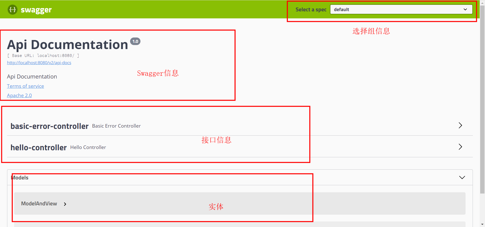

# 目标

1.   了解swagger的作用和概念；
2.   了解前后端分离；
3.   在SpringBoot中集成swagger；


# Swagger简介

## 前后端分离

Vue+SpringBoot

## 前后端分离

早些年前端测试后端接口：postman，后端只需要提供接口，需要实时更新最新的消息及改动；目前来说swagger使用的比较多一些。


## swagger

-   swagger号称是世界上最流行的API框架；
-   RestFUL API文档在线自动生成工具=>API文档与API定义同步生成（更新）；
-   直接可以测试在线的API接口（这里的接口就是SpringBoot中的RequestMapping注解的方法）；
-   支持多种语言（Java，PHP）；


官网：https://swagger.io/


# 使用swagger

在项目中使用swagger需要先导入响应的依赖包；

-    swagger2；

    ```xml
    <dependency>
        <groupId>io.springfox</groupId>
        <artifactId>springfox-swagger2</artifactId>
        <version>2.9.2</version>
    </dependency>
    ```

-   ui

    ```xml
    <dependency>
        <groupId>io.springfox</groupId>
        <artifactId>springfox-swagger-ui</artifactId>
        <version>2.9.2</version>
    </dependency>
    ```

1、新建SpringBoot Web项目；

2、导入相关依赖；

3、编写一个Hello工程；

4、配置Swagger==>Config文件

```java
@Configuration
@EnableSwagger2 // 开启Swagger
public class SwaggerConfig {
}
```

5、测试运行

http://localhost:8080/swagger-ui.html

如果不能够正常访问，需要在application.yaml文件当中添加如下配置：

```properties
spring.profiles.active=dev
```




## 配置Swagger信息

```java
@Configuration
@EnableSwagger2 // 开启Swagger2
public class SwaggerConfig {

    @Bean
    public Docket docket(){
        return new Docket(DocumentationType.SWAGGER_2)
                .apiInfo(apiInfo());
    }

    private ApiInfo apiInfo(){
        Contact contact = new Contact("zhangsan", "http://www.baidu.com/", "zhangsan@zn.com");
        return new ApiInfo(
            "Swagger测试",
            "Swagger测试项目-demo",
            "v1.0",
            "urn:tos",
            contact,
            "Apache 2.0",
            "http://www.apache.org/licenses/LICENSE-2.0",
            new ArrayList()
        );
    }
}
```


## 配置扫描接口及开关

```java
public Docket docket(){
    return new Docket(DocumentationType.SWAGGER_2)
        .apiInfo(apiInfo())
        //设置不启用Swagger（设置之后不能再浏览器当中进行访问），默认为true，即启用状态
        .enable(false)
        //下面的是一条链，只能使用指定方法
        .select()
        /*
         * basePackage("com.example.controller")基于包来扫描
         * any() 所有的RequestHandler都满足
         * none() 与any()相反
         * withMethodAnnotation(RestController.class) 扫描方法上面有RestController注解的类
         * withClassAnnotation()扫描类上...
         */
        .apis(RequestHandlerSelectors.basePackage("com.example.controller"))
        /*
         * paths()过滤请求路径
         * /kuangs/** 只会匹配/kuangs/**这个路径的方法
         */
        .paths(PathSelectors.ant("/kuangs/**"))
        .build();
}
```

如何根据生产环境自动配置enable？

```java
// 设置要显示的Swagger环境
Profiles profiles = Profiles.of("dev", "test"); // 根据properties文件来匹配
boolean flag = environment.acceptsProfiles(profiles);
System.out.println(false);
return new Docket(DocumentationType.SWAGGER_2)
    .apiInfo(apiInfo())
    //设置不启用Swagger，默认为true，即启用状态
    .enable(flag)
    //...
```


## 配置API分组

```java
.groupName("name")
```

如何配置多个组？配置多个`Docket`即可：

```java
public class SwaggerConfig {	
	//配置多个分组
    @Bean
    public Docket docket1(){
        return new Docket(DocumentationType.SWAGGER_2).groupName("A");
    }
    @Bean
    public Docket docket2(){
        return new Docket(DocumentationType.SWAGGER_2).groupName("B");
    }
    @Bean
    public Docket docket3(){
        return new Docket(DocumentationType.SWAGGER_2).groupName("C");
    }
}
```


## Swagger测试

实体类：

```java
package com.example.pojo;

import io.swagger.annotations.Api;
import io.swagger.annotations.ApiModel;
import io.swagger.annotations.ApiModelProperty;

/**
 * 只要我们的接口返回值中存在实体类，它就会被扫描到Swagger中。
 */
@Api    //将一个类标记为Swagger资源
@ApiModel("用户类") // 在Swagger显示为：用户类
public class User {
    @ApiModelProperty("用户名")
    private String username;
    @ApiModelProperty("用户密码")
    private String password;

    @Override
    public String toString() {
        return "User{" +
                "username='" + username + '\'' +
                ", password='" + password + '\'' +
                '}';
    }

    public String getUsername() {
        return username;
    }

    public void setUsername(String username) {
        this.username = username;
    }

    public String getPassword() {
        return password;
    }

    public void setPassword(String password) {
        this.password = password;
    }

    public User(String username, String password) {
        this.username = username;
        this.password = password;
    }

    public User() {
    }
}
```


controller：

```java
package com.example.controller;

import com.example.pojo.User;
import io.swagger.annotations.Api;
import io.swagger.annotations.ApiOperation;
import io.swagger.annotations.ApiParam;
import org.springframework.web.bind.annotation.GetMapping;
import org.springframework.web.bind.annotation.PostMapping;
import org.springframework.web.bind.annotation.RestController;

/**
 * SpringBoot默认包含一个/error请求
 */
//@Api(tags = "Controller 测试")
@RestController
public class HelloController {
    @GetMapping("/hello")
    public String hello(){
        return "hello";
    }

    @ApiOperation("获取用户信息")
    @PostMapping("/user")
    //只要我们的接口返回值中存在实体类，它就会被扫描到Swagger中。
    public User getUser(){
        return new User();
    }

    @ApiOperation("根据用户名返回用户信息")
    @PostMapping("/getUserByName")
    public User getUserByName(@ApiParam("根据用户名获取用户") User user){
        return user;
    }
}
```

