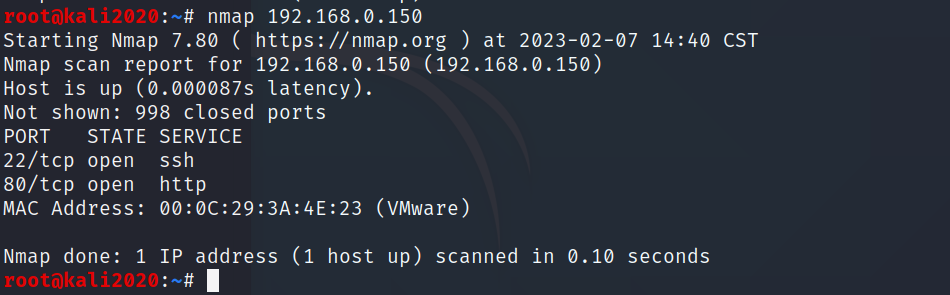
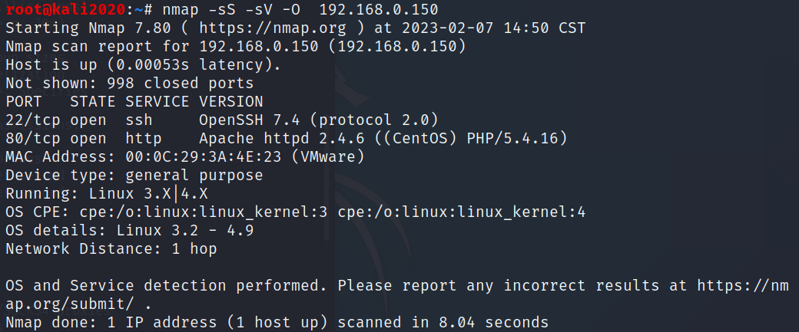
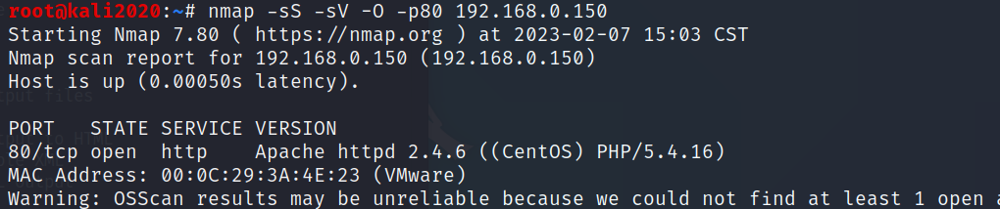
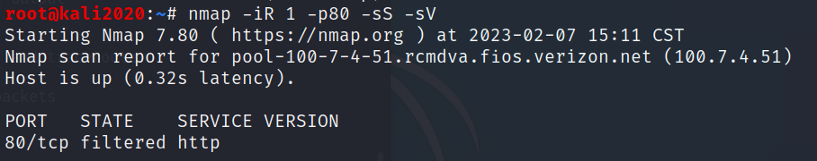
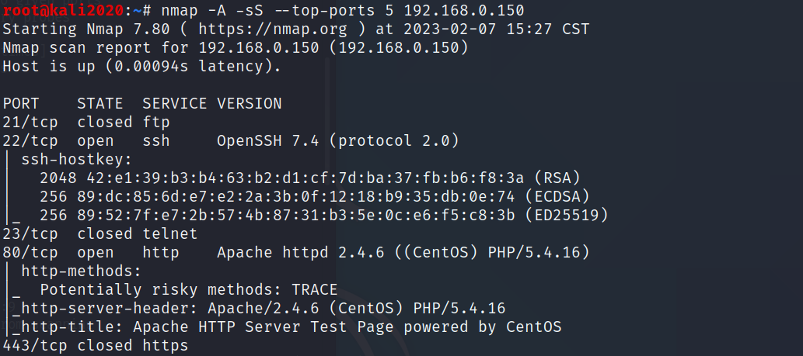
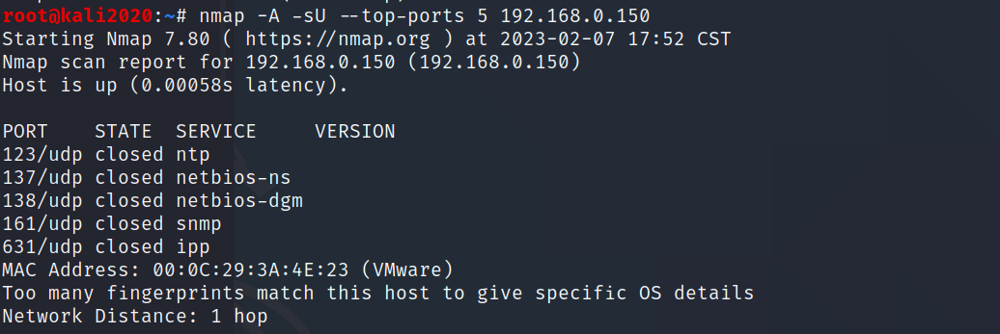
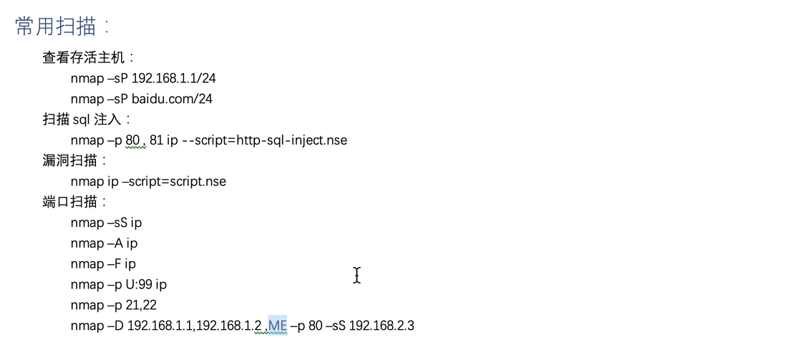

# Nmap详解

主要是运用与信息的收集。

## 英文文档：

```
TARGET SPECIFICATION:
  Can pass hostnames, IP addresses, networks, etc.
  Ex: scanme.nmap.org, microsoft.com/24, 192.168.0.1; 10.0.0-255.1-254
  -iL <inputfilename>: Input from list of hosts/networks
  -iR <num hosts>: Choose random targets
  --exclude <host1[,host2][,host3],...>: Exclude hosts/networks
  --excludefile <exclude_file>: Exclude list from file
HOST DISCOVERY:
  -sL: List Scan - simply list targets to scan
  -sn: Ping Scan - disable port scan
  -Pn: 将所指定主机视为在线，直接跳过主机发现
  -PS/PA/PU/PY[portlist]: TCP SYN/ACK, UDP or SCTP discovery to given ports
  -PE/PP/PM: ICMP echo, timestamp, and netmask request discovery probes
  -PO[protocol list]: IP Protocol Ping
  -n/-R: Never do DNS resolution/Always resolve [default: sometimes]
  --dns-servers <serv1[,serv2],...>: Specify custom DNS servers
  --system-dns: Use OS's DNS resolver
  --traceroute: Trace hop path to each host
SCAN TECHNIQUES:
  -sS/sT/sA/sW/sM: TCP SYN/Connect()/ACK/Window/Maimon scans
  -sU: UDP Scan
  -sN/sF/sX: TCP Null, FIN, and Xmas scans
  --scanflags <flags>: Customize TCP scan flags
  -sI <zombie host[:probeport]>: Idle scan
  -sY/sZ: SCTP INIT/COOKIE-ECHO scans
  -sO: IP protocol scan
  -b <FTP relay host>: FTP bounce scan
PORT SPECIFICATION AND SCAN ORDER:
  -p <port ranges>: Only scan specified ports
    Ex: -p22; -p1-65535; -p U:53,111,137,T:21-25,80,139,8080,S:9
  --exclude-ports <port ranges>: Exclude the specified ports from scanning
  -F: Fast mode - Scan fewer ports than the default scan
  -r: Scan ports consecutively - don't randomize
  --top-ports <number>: Scan <number> most common ports
  --port-ratio <ratio>: Scan ports more common than <ratio>
SERVICE/VERSION DETECTION:
  -sV: Probe open ports to determine service/version info
  --version-intensity <level>: Set from 0 (light) to 9 (try all probes)
  --version-light: Limit to most likely probes (intensity 2)
  --version-all: Try every single probe (intensity 9)
  --version-trace: Show detailed version scan activity (for debugging)
SCRIPT SCAN:
  -sC: equivalent to --script=default
  --script=<Lua scripts>: <Lua scripts> is a comma separated list of
           directories, script-files or script-categories
  --script-args=<n1=v1,[n2=v2,...]>: provide arguments to scripts
  --script-args-file=filename: provide NSE script args in a file
  --script-trace: Show all data sent and received
  --script-updatedb: Update the script database.
  --script-help=<Lua scripts>: Show help about scripts.
           <Lua scripts> is a comma-separated list of script-files or
           script-categories.
OS DETECTION:
  -O: Enable OS detection
  --osscan-limit: Limit OS detection to promising targets
  --osscan-guess: Guess OS more aggressively
TIMING AND PERFORMANCE:
  Options which take <time> are in seconds, or append 'ms' (milliseconds),
  's' (seconds), 'm' (minutes), or 'h' (hours) to the value (e.g. 30m).
  -T<0-5>: Set timing template (higher is faster)
  --min-hostgroup/max-hostgroup <size>: Parallel host scan group sizes
  --min-parallelism/max-parallelism <numprobes>: Probe parallelization
  --min-rtt-timeout/max-rtt-timeout/initial-rtt-timeout <time>: Specifies
      probe round trip time.
  --max-retries <tries>: Caps number of port scan probe retransmissions.
  --host-timeout <time>: Give up on target after this long
  --scan-delay/--max-scan-delay <time>: Adjust delay between probes
  --min-rate <number>: Send packets no slower than <number> per second
  --max-rate <number>: Send packets no faster than <number> per second
FIREWALL/IDS EVASION AND SPOOFING:
  -f; --mtu <val>: fragment packets (optionally w/given MTU)
  -D <decoy1,decoy2[,ME],...>: Cloak a scan with decoys
  -S <IP_Address>: Spoof source address
  -e <iface>: Use specified interface
  -g/--source-port <portnum>: Use given port number
  --proxies <url1,[url2],...>: Relay connections through HTTP/SOCKS4 proxies
  --data <hex string>: Append a custom payload to sent packets
  --data-string <string>: Append a custom ASCII string to sent packets
  --data-length <num>: Append random data to sent packets
  --ip-options <options>: Send packets with specified ip options
  --ttl <val>: Set IP time-to-live field
  --spoof-mac <mac address/prefix/vendor name>: Spoof your MAC address
  --badsum: Send packets with a bogus TCP/UDP/SCTP checksum
OUTPUT:
  -oN/-oX/-oS/-oG <file>: Output scan in normal, XML, s|<rIpt kIddi3,
     and Grepable format, respectively, to the given filename.
  -oA <basename>: Output in the three major formats at once
  -v: Increase verbosity level (use -vv or more for greater effect)
  -d: Increase debugging level (use -dd or more for greater effect)
  --reason: Display the reason a port is in a particular state
  --open: Only show open (or possibly open) ports
  --packet-trace: Show all packets sent and received
  --iflist: Print host interfaces and routes (for debugging)
  --append-output: Append to rather than clobber specified output files
  --resume <filename>: Resume an aborted scan
  --stylesheet <path/URL>: XSL stylesheet to transform XML output to HTML
  --webxml: Reference stylesheet from Nmap.Org for more portable XML
  --no-stylesheet: Prevent associating of XSL stylesheet w/XML output
MISC:
  -6: Enable IPv6 scanning
  -A: Enable OS detection, version detection, script scanning, and traceroute
  --datadir <dirname>: Specify custom Nmap data file location
  --send-eth/--send-ip: Send using raw ethernet frames or IP packets
  --privileged: Assume that the user is fully privileged
  --unprivileged: Assume the user lacks raw socket privileges
  -V: Print version number
  -h: Print this help summary page.
EXAMPLES:
  nmap -v -A scanme.nmap.org
  nmap -v -sn 192.168.0.0/16 10.0.0.0/8
  nmap -v -iR 10000 -Pn -p 80
SEE THE MAN PAGE (https://nmap.org/book/man.html) FOR MORE OPTIONS AND EXAMPLES

```

## nmap使用流程：

活跃ip，端口，应用程序，操作系统探测；

1. 目标确认；

2. 主机发现；

3. 端口扫描；

4. 扫描技术；

5. 探测服务；

6. 探测防火墙；

7. 性能优化；

8.   输出报告；


## 实例

nmap在console终端使用回车可以查看扫描的进度；

常用参数：

```
-e eth0  # 指定网卡
-F  # 快速模式，快速扫描端口，比默认扫描时指定的端口要少一些
-n  # 不使用dns解析，默认要解析
-PN # 如果远程主机有防火墙，IDS和IPS系统，你可以使用-PN命令来确保不ping远程主机，因为有时候防火墙会组织掉ping请求.-PN命令告诉Nmap不用ping远程主机。使用-PN参数可以绕过PING命令,但是不影响主机的系统的发现。-Pn参数则是直接跳过主机发现。
-T <0~5> # 设置事件模板，默认为3，使用0和1级别可以躲避IDS
-D decoy1,decoy2,ME    # 使用诱饵隐蔽扫描，用法-D1.1.1.1,2.2.2.2 即使用指定的ip来困惑防护设备
-g     # 使用指定源端口
```


**1. 简单扫描主机信息**

```
nmap ip地址或域名   # nmap 192.168.0.240
```




**2. 使用半开扫描(syn)主机上服务的版本信息(-sV)以及操作系统(-O)的信息**




**3. 指定端口扫描**

这里的-sV，-O，可以使用-A进行一个替换。

注：如果没有指定端口，则默认扫描所有的端口；




**4. 随机选择一个主机进行探测**

```
nmap -iR 1 -p80 -sS -sV
```




**5. 常用端口的扫描--top-ports** 

```
--top-ports <number>  # 设定扫描常见端口的数量
```




**6. 更换扫描方式**

```
nmap -A -sU --top-ports 5 192.168.0.150  # 使用udp扫描技术
```




**7. 保存扫描结果**

```
nmap -iR 1 -p80 -sS -sV -oN ./t1.txt
```


**8. 使用脚本扫描**

```
nmap --script=/root/Desktop/scipag_vulscan/vulscan.nse www.gzqy.cn  # --script=这里跟上nse文件的路径
```


**性能控制，规避防火墙，简单学习原理：**

**T 设置时间模板来控制性能：**

```
nmap -sS -T<0-5> 192.168.1.134
```

优化时间控制选项的功能很强大也很有效，但有些用户会被迷惑。此外， 往往选择合适参数的时间超过了所需优化的扫描时间。因此，Nmap提供了一些简单的 方法，使用6个时间模板，使用时采用-T选项及数字(0 - 5) 或名称。模板名称有paranoid (0)、sneaky (1)、polite (2)、normal(3)、 aggressive (4)和insane (5).

-   paranoid、sneaky模式用于IDS躲避；
-   Polite模式降低了扫描 速度以使用更少的带宽和目标主机资源；
-   Normal为默认模式，因此-T3 实际上是未做任何优化；
-   Aggressive模式假设用户具有合适及可靠的网络从而加速 扫描；
-   nsane模式假设用户具有特别快的网络或者愿意为获得速度而牺牲准确性；


## 规避防火墙：

```
nmap -F -O -D1.1.1.1,2.2.2.2 -g996 -n 8.8.8.8

-D # 加入混淆源ip
-g # 指定源端口
-n  #不进行dns的解析
```


**简单学习原理：**

一个主机发现为什么会用那么多的字段，比如像：PS/PA/PU，其实是控制的是数据报文当中指定字段的值。


## MAC欺骗/空闲扫描/脚本扫描/简单总结

```
--spoof-mac 48-89-E7-31-58-F3
```


**一般情况下，使用空闲扫描的目的是发现网络上存在的僵尸主机，这个扫描一个都是配合脚本扫描进行。**

```
nmap --script=ipidseq -iR 1000 -oN ipidseq.txt   # 使用脚本扫描发现满足条件的主机
nmap -Pn -sI ip:port 8.8.8.8   # 扫描指定主机是否满足条件
```

上面两条命令的扫描结果是一样的，但是一般情况下都是使用脚本扫描，因为使用起来更加的方便；

脚本扫描具体可以参考：https://nmap.org/nsedoc/scripts/ipidseq.html


**总结：**

nmap的功能非常的强大，使用的方法也比较多样，一般情况下面两条命令就够了：

```
nmap --top-ports 10 -sS -A 192.168.0.11
nmap -iR 10000 -p 3389 -sS -A  -Pn -n -oN ./result.txt
```


## 入门Nmap

**Nmap功能：**

-   端口扫描；
-   版本探测；
-   漏洞扫描；
-   防火墙规避；
-   输出报告；

简单命令：

```
nmap -iL 文件名  # 从指定文件中读取指定的主机进行信息的探测
-iR <number> # 随机生成指定的number个ip进行测试
--exclude 192.168.0.1 # 排除目标，这里也可以是一个网段。--excludefile排除指定的文件
-v  # 输出详细信息
```


