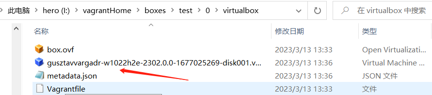
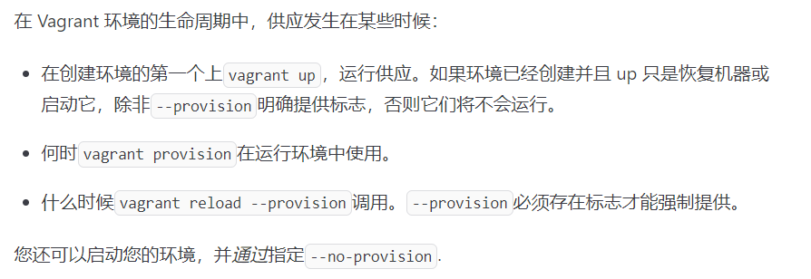
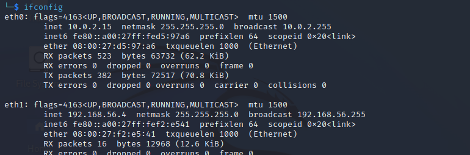

# Vagrant

官网：https://www.vagrantup.com/

虚拟机（镜像）下载：https://app.vagrantup.com/boxes/search


```
Usage: vagrant [options] <command> [<args>]

    -h, --help                       Print this help.

Common commands:
     autocomplete    manages autocomplete installation on host
     box             manages boxes: installation, removal, etc.
     cloud           manages everything related to Vagrant Cloud
     destroy         删除vagrant在电脑上创建box所占用的资源，该命令可能不会执行成功可以使用remove进行清理
     global-status   输出所有的虚拟机的状态的详细信息
     halt            关机
     	  	-f 		 强制关机
     help            shows the help for a subcommand
     init            initializes a new Vagrant environment by creating a Vagrantfile
     login
     package         packages a running vagrant environment into a box
     plugin          manages plugins: install, uninstall, update, etc.
     port            displays information about guest port mappings
     powershell      connects to machine via powershell remoting
     provision       provisions the vagrant machine
     push            deploys code in this environment to a configured destination
     rdp             connects to machine via RDP
     reload          restarts vagrant machine, loads new Vagrantfile configuration
     resume          resume a suspended vagrant machine
     serve           start Vagrant server
     snapshot        manages snapshots: saving, restoring, etc.
     ssh             connects to machine via SSH
     ssh-config      outputs OpenSSH valid configuration to connect to the machine
     status          outputs status of the vagrant machine
     suspend         suspends the machine
     up              starts and provisions the vagrant environment
     upload          upload to machine via communicator
     validate        validates the Vagrantfile
     version         prints current and latest Vagrant version
     winrm           executes commands on a machine via WinRM
     winrm-config    outputs WinRM configuration to connect to the machine

For help on any individual command run `vagrant COMMAND -h`

Additional subcommands are available, but are either more advanced
or not commonly used. To see all subcommands, run the command
`vagrant list-commands`.
        --[no-]color                 Enable or disable color output
        --machine-readable           Enable machine readable output
    -v, --version                    Display Vagrant version
        --debug                      Enable debug output
        --timestamp                  Enable timestamps on log output
        --debug-timestamp            Enable debug output with timestamps
        --no-tty                     Enable non-interactive output
```


## 操作box

```shell
I:\vagrantSys>vagrant box --help
Usage: vagrant box <subcommand> [<args>]

Available subcommands:
     add
     list
     outdated
     prune
     remove
     repackage
     update

For help on any individual subcommand run `vagrant box <subcommand> -h`
        --[no-]color                 Enable or disable color output
        --machine-readable           Enable machine readable output
    -v, --version                    Display Vagrant version
        --debug                      Enable debug output
        --timestamp                  Enable timestamps on log output
        --debug-timestamp            Enable debug output with timestamps
        --no-tty                     Enable non-interactive output
```


1、添加一个box，并命名：vmware_win10_desktop

```shell
set VAGRANT_HOME d:\MYVagrant    # 设置vagrant新建虚拟机的保存路径，必要。
vagrant box add vmware_windows10_desktop.box --name "vmware_win10_desktop"
```


2、查看所有的box

```shell
vagrant box list
```


3、在指定的目录下面创建一个Vagrantfile文件（注：vagrantfile所在的文件夹会被映射到虚拟机内部，这样可以实现文件的共享），并使用该文件启动上面新建的box

```shell
Vagrant.configure("2") do |config|
	config.vm.define "vmware_win10_desktop"   # 必须加上这个
	config.vm.box="vmware_win10_desktop"
	config.vm.guest=:windows
	config.vm.communicator="winrm"
	config.vm.network "forwarded_port", guest:3389, host:53389 # 这里的guest表示box虚拟机，host表示物理机
	config.vm.provider "virtualbox" do |v|
		v.gui = false  # 不要以ui
	end
end
```

```
vagrant init [box name]
vagrant up [box name] # 启动虚拟机
```


4、连接虚拟机

```shell
vagrant ssh   # 以ssh的方式进行连接，默认vagrant/vagrant
vagrant rdp   # 以rdp方式连接，默认密码也是vagrant/vagrant
```


## 常见问题解决

### 无法通过网络连接box

如果通过ssh或rdp无法连接box时，这是我们去存放虚拟机的路径下面手动的启动该虚拟机即可。




## vagrant常见配置

### vagrant Provisioning 




```shell
Vagrant.configure("2") do |config|
  # ... other configuration
  
  config.vm.provision "shell", path: "test.ps1"
  # config.vm.provision "shell", inline: "echo hello"
  # config.vm.provision "file", source: "~/.gitconfig", destination: ".gitconfig"
  
end
```


### Providers

指定以哪个软件（virtualbox|vmware|hyper-v）启动该box，用法如下：

```
vagrant up --provider=virtualbox  
```

默认情况下vagrant会自动识别。


### 网络配置

专用网：

```
config.vm.network "private_network", type: "dhcp"  # 给虚拟机添加了一张网卡，默认为仅主机模式
```




公共网：

```
config.vm.network "public_network"  # 给虚拟机又添加了一张网卡，默认为桥接模式
```


### 磁盘快照配置

拍摄快照：

```
vagrant snapshot save vb-kali2022 init-system
					  拍摄的box     时间节点的描述
vagrant snapshot delete [vm-name]  NAME-description
```

请注意：在使用`vagrant snapshot save | restore`时，就不要使用`vagrant snapshot push | pop`，这样是不安全的。这里要求我们会操作save|restore就可以了。


添加磁盘：

```
config.vm.disk :disk, size: "100GB", primary: true  # 设置主磁盘的大小为100GB

h.vm.disk :disk, size: "10GB", name: "extra_storage"  # 附加一个10GB的扩展磁盘
```


### 打包虚拟机

```
vagrant package --output [name.box]  # 默认输出package.box 
```

如果要将虚拟机iso文件打包为vagrant box，请使用packer进行。


### Multi-Machine

直接看官网：https://developer.hashicorp.com/vagrant/docs/multi-machine
