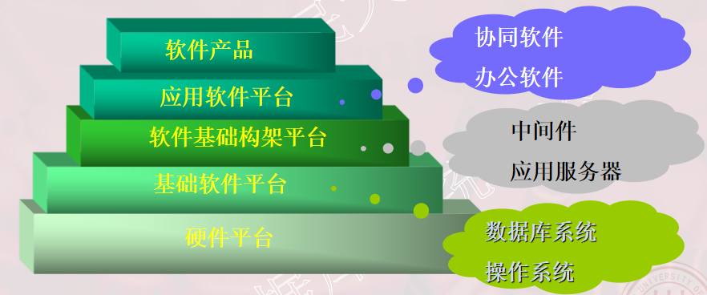
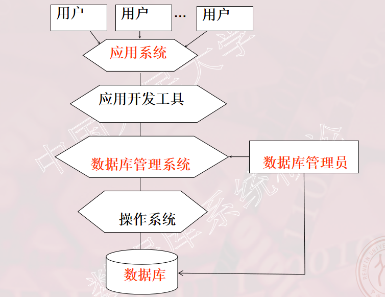
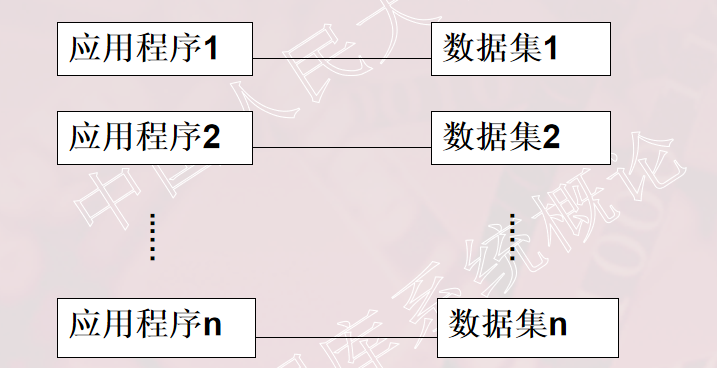
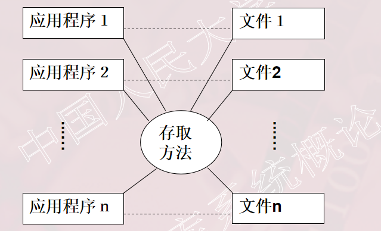
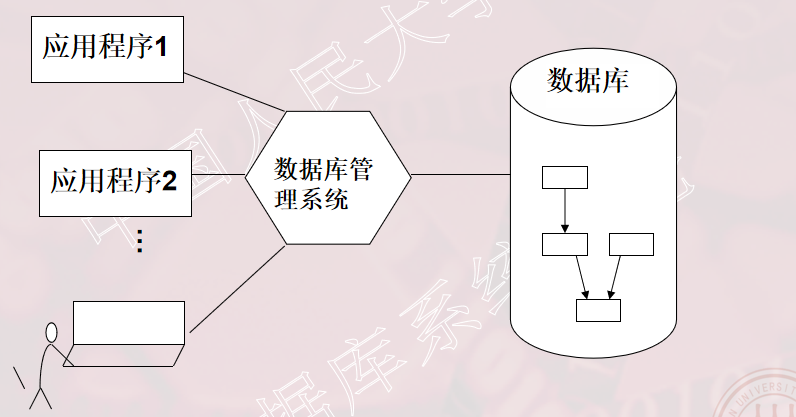
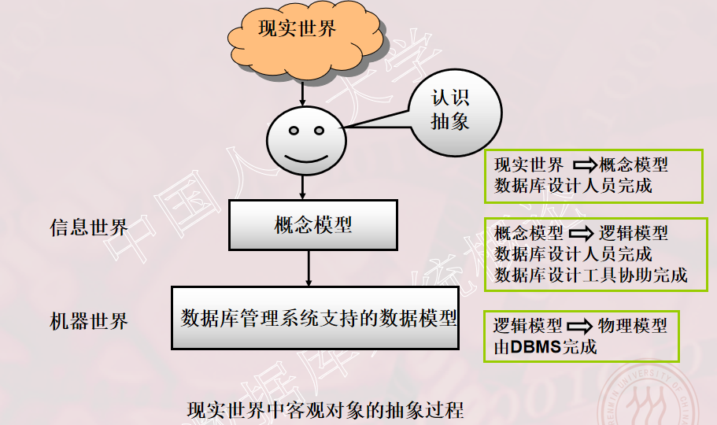
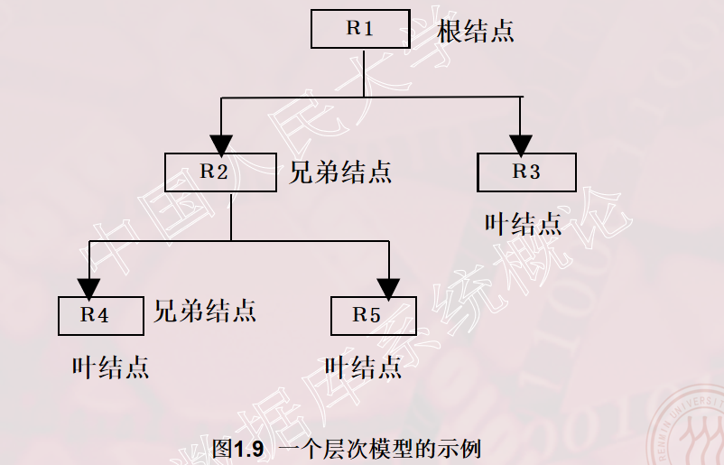
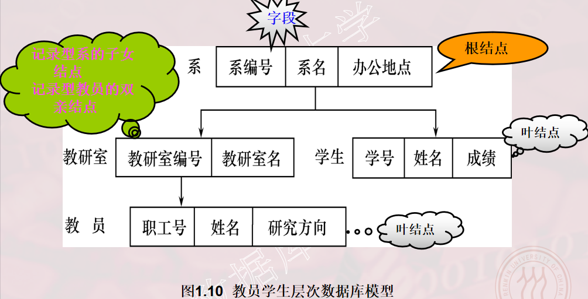

# 第一章 绪论

## 1.1 数据库系统概述

### 数据库的地位

1.  数据库技术产生于六十年代末，是数据管理的有效技术，是计算机科学的重要分支。
2.  数据库技术是信息系统的核心和基础，它的出现极大地促进了计算机应用向各行各业的渗透。
3.  数据库已经成为每个人生活中不可缺少的部分。


### 1.1.1 数据库的4个基本概念

数据（Data）

-   数据（Data）：数据库中存储的基本对象；

-   数据的定义：描述事物的符号记录；

-   数据的种类：数字、文字、图形、图像、音频、视频、学生的档案记录等

-   数据举例：数据的含义称为数据的语义，数据与其语义是不可分的；

    -   ```
        例如  93是一个数据
            语义1：学生某门课的成绩
            语义2：某人的体重
            语义3：计算机系2013级学生人数
            语义4：请同学给出……
        
        ```

        

数据库（Database）

-   数据库（Database，简称DB）是**长期储存**在计算机内、**有组织**的、**可共享**的**大量**数据的集合;
-   数据库的基本特征
    -   数据按一定的数据模型组织、描述和储存
    -   可为各种用户共享
    -   冗余度较小
    -   数据独立性较高
    -   易扩展


数据库管理系统（DBMS）

-   什么是DBMS：
    -   全称为：DataBase Management System
    -   位于用户与操作系统之间的一层数据管理软件
    -   是基础软件，是一个大型复杂的软件系统 
-   数据库管理系统的用途：科学地组织和存储数据、高效地获取和维护数据

-   数据库在计算机系统中的位置
    -   
-   数据库管理系统的主要功能
    -   数据定义功能
        -   提供数据定义语言（DDL）：定义数据库中的数据对象；
        -   数据组织、存储和管理
            -   分类组织、存储和管理各种数据
            -   确定组织数据的文件结构和存取方式
            -   实现数据之间的联系
            -   提供多种存取方法提高存取效率
    -   **数据操纵功能**
        -   提供数据操纵语言（DML）：实现对数据库的基本操作  （查询、插入、删除和修改）
        -   数据库的事务管理和运行管理
            -   数据库在建立、运行和维护时由数据库管理系统统一管理和控制
            -   保证数据的安全性、完整性、多用户对数据的并发使用
            -   发生故障后的系统恢复
    -   数据库的建立和维护功能
        -   数据库初始数据的装载和转换
        -   数据库转储、恢复功能
        -   数据库的重组织
        -   性能监视、分析等
    -   其它功能
        -   数据库管理系统与网络中其它软件系统的通信
        -   数据库管理系统系统之间的数据转换
        -   异构数据库之间的互访和互操作


数据库系统（DBS）

-   数据库系统（Database System，简称DBS）
-   数据库系统的构成
    -   数据库
    -   数据库管理系统（及其应用开发工具）
    -   应用程序
    -   数据库管理员  
-   

### 1.1.2 数据管理技术的产生和发展

-   什么是数据管理
    -   对数据进行分类、组织、编码、存储、检索和维护
    -   数据处理的中心问题
-   数据管理技术的发展过程
    -   人工管理阶段（20世纪50年代中之前）
    -   文件系统阶段（20世纪50年代末--60年代中）
    -   数据库系统阶段（20世纪60年代末--现在）
-   数据管理技术的发展动力
    -   应用需求的推动
    -   计算机硬件的发展
    -   计算机软件的发展


**人工管理阶段：**

-   时期
    -   20世纪50年代中之前
-   产生的背景
    -   应用背景	科学计算	
    -   硬件背景	无直接存取存储设备
    -   软件背景	没有操作系统	
    -   处理方式	批处理
-   特点
    -   数据的管理者：用户（程序员），数据不保存
    -   数据面向的对象：某一应用程序   
    -   数据的共享程度：无共享、冗余度极大
    -   数据的独立性：不独立，完全依赖于程序
    -   数据的结构化：无结构
    -   数据控制能力：应用程序自己控制
-   应用程序与数据的对应关系
    -   


**文件系统阶段：**

-   时期
    -   20世纪50年代末--60年代中
-   产生的背景
    -   应用背景	科学计算、数据管理	
    -   硬件背景	磁盘、磁鼓	
    -   软件背景	有文件系统	
    -   处理方式	联机实时处理、批处理
-   特点
    -   数据的管理者：文件系统，数据可长期保存
    -   数据面向的对象：某一应用   
    -   数据的共享程度：共享性差、冗余度大
    -   数据的结构化：记录内有结构，整体无结构
    -   数据的独立性：独立性差
    -   数据控制能力：应用程序自己控制
-   应用程序与数据的对应关系
    -   


**数据库系统阶段：**

-   时期
    -   20世纪60年代末以来
-   产生的背景
    -   应用背景	大规模数据管理	
    -   硬件背景	大容量磁盘、磁盘阵列	
    -   软件背景	有数据库管理系统	
    -   处理方式	联机实时处理,分布处理,批处理
-   文件系统到数据库系统，标志着数据管理技术的飞跃


### 1.1.3 数据库系统的特点 

-   数据结构化
-   数据的共享性高，冗余度低且易扩充
-   数据独立性高
-   数据由数据库管理系统统一管理和控制


**数据结构化：**

-   数据的整体结构化是数据库的主要特征之一    
-   整体结构化
    -   不再仅仅针对某一个应用，而是面向全组织
    -   不仅数据内部结构化，整体是结构化的，数据之间具有联系
    -   数据记录可以变长
    -   数据的最小存取单位是数据项

-   数据的用数据模型描述，无需应用程序定义


**数据的共享性高，冗余度低且易扩充：**

-   数据面向整个系统，可以被多个用户、多个应用共享使用。
-   数据共享的好处
    -   减少数据冗余，节约存储空间
    -   避免数据之间的不相容性与不一致性 
    -   使系统易于扩充


**数据独立性高：**

-   物理独立性：指用户的应用程序与数据库中数据的物理存储是相互独立的。当数据的物理存储改变了，应用程序不用改变。
-   逻辑独立性：指用户的应用程序与数据库的逻辑结构是相互独立的。数据的逻辑结构改变了，应用程序不用改变。 
-   数据独立性由数据库管理系统的二级映像功能来保证。


**数据由数据库管理系统统一管理和控制：**

数据库管理系统提供的数据控制功能

（1）数据的安全性（Security）保护

​	保护数据以防止不合法的使用造成的数据的泄密和破坏。
（2）数据的完整性（Integrity）检查

​	保证数据的正确性、有效性和相容性。

（3）并发（Concurrency）控制

​	对多用户的并发操作加以控制和协调，防止相互干扰而得到错误的结果。

（4）数据库恢复（Recovery）

​	将数据库从错误状态恢复到某一已知的正确状态。


**应用程序与数据的对应关系（数据库系统阶段）**




### 1.1.4 数据库概念小结

-   数据库是长期存储在计算机内有组织的大量的共享的数据集合。
-   可以供各种用户共享，具有最小冗余度和较高的数据独立性。
-   数据库管理系统在数据库建立、运用和维护时对数据库进行统一控制，以保证数据的完整性、安全性，并在多用户同时使用数据库时进行并发控制，在发生故障后对数据库进行恢复。


## 1.2  数据模型

-   数据模型是对现实世界数据特征的抽象。
-   通俗地讲数据模型就是**现实世界的模拟**。
-   数据模型应满足三方面要求
    -   能比较**真实**地模拟现实世界
    -   **容易**为人所**理解**
    -   便于在计算机上实现
-   数据模型是数据库系统的**核心和基础**


### 1.2.1  两类数据模型

**数据模型分为两类（两个不同的层次）**

（1） 概念模型   也称信息模型，它是按用户的观点来对数据和信息建模，用于数据库设计。 

（2） 逻辑模型和物理模型   

-   逻辑模型主要包括网状模型、层次模型、关系模型、面向对象数据模型、对象关系数据模型、半结构化数据模型等。按计算机系统的观点对数据建模，用于DBMS实现。
-   物理模型是对数据最底层的抽象，描述数据在系统内部的表示方式和存取方法，在磁盘或磁带上的存储方式和存取方法


**客观对象的抽象过程---两步抽象**

-   现实世界中的客观对象抽象为概念模型；
    -   将现实世界抽象为信息世界
-   把概念模型转换为某一数据库管理系统支持的数据模型。
    -   将信息世界转换为机器世界




### 1.2.2  概念模型

-   概念模型的用途
    -   概念模型用于信息世界的建模
    -   是现实世界到机器世界的一个中间层次
    -   是数据库设计的有力工具
    -   数据库设计人员和用户之间进行交流的语言
-   对概念模型的基本要求
    -   较强的语义表达能力
    -   简单、清晰、易于用户理解


**1. 信息世界中的基本概念**

（1）实体（Entity） 

​	客观存在并可相互区别的事物称为实体。

​	可以是具体的人、事、物或抽象的概念。

（2）属性（Attribute） 

​	实体所具有的某一特性称为属性。

​	一个实体可以由若干个属性来刻画。 

（3）码（Key） 

​	**唯一标识**实体的属性集称为码。

（4）实体型（Entity Type） 

​	用实体名及其属性名集合来抽象和刻画同类实体称为实体型

（5）实体集（Entity Set） 

​	同一类型实体的集合称为实体集

（6）联系（Relationship）

-   现实世界中事物内部以及事物之间的联系在信息世界中反映为实体（型）内部的联系和实体（型）之间的联系。
-   实体内部的联系通常是指组成实体的各属性之间的联系
-   实体之间的联系通常是指不同实体集之间的联系
-   实体之间的联系有一对一、一对多和多对多等多种类型


**2. 概念模型的一种表示方法：实体-联系方法**

实体-联系方法（Entity-Relationship Approach）

-   用E-R图来描述现实世界的概念模型
-   E-R方法也称为E-R模型


### 1.2.3  数据模型的组成要素

-   数据结构 
-   数据操作 
-   数据的完整性约束条件


（1）数据结构

-   数据模型的数据结构：描述数据库的组成对象，以及对象之间的联系

-   描述的内容

    -   与对象的类型、内容、性质有关

    -   与数据之间联系有关

-   数据结构是对系统静态特性的描述


（2）数据操作

-   数据操作
    -   对数据库中各种对象（型）的实例（值）允许执行的操作的集合，包括操作及有关的操作规则

-   数据操作的类型

    -   查询

    -   更新（包括插入、删除、修改）

-   数据模型对操作的定义

    -   操作的确切含义
    -   操作符号
    -   操作规则（如优先级，如运算符加减乘除 ）
    -   实现操作的语言

-   数据操作是对系统动态特性的描述


（3）数据的完整性约束条件

-   数据的完整性约束条件
    -   一组完整性规则的集合
    -   完整性规则：给定的数据模型中数据及其联系所具有的制约和依存规则
    -   用以限定符合数据模型的数据库状态以及状态的变化，以保证数据的正确、有效和相容
-   数据模型对完整性约束条件的定义
    -   反映和规定必须遵守的**基本的通用的**完整性约束条件。
    -   提供定义完整性约束条件的机制，以反映具体应用所涉及的数据必须遵守的特定的语义约束条件。


### 1.2.4  常用的数据模型

-   层次模型（Hierarchical Model）
-   网状模型（Network Model）
-   关系模型（Relational Model）
-   面向对象数据模型（Object Oriented Data Model）
-   对象关系数据模型（Object Relational Data Model）
-   半结构化数据模型（Semistruture Data Model）


### 1.2.5  层次模型

层次模型是数据库系统中最早出现的数据模型 

层次数据库系统的典型代表是IBM公司的IMS（Information Management System）数据库管理系统

层次模型用==树形结构==来表示各类实体以及实体间的联系  


(1)层次模型的数据结构

-   层次模型，满足下面两个条件的基本层次联系的集合为层次模型
    -   有且只有一个结点没有双亲结点，这个结点称为根结点
    -   根以外的其它结点有且只有一个双亲结点
-   层次模型中的几个术语
    -   根结点，双亲结点，兄弟结点，叶结点




-   层次模型的特点：
    -   结点的双亲是唯一的
    -   只能直接处理一对多的实体联系
    -   每个记录类型可以定义一个排序字段，也称为码字段
    -   任何记录值只有按其路径查看时，才能显出它的全部意义
    -   没有一个子女记录值能够脱离双亲记录值而独立存在




### 1.2.6  网状模型

### 1.2.7  关系模型


## 1.3  数据库系统的结构

## 1.4  数据库系统的组成

## 1.5  小结