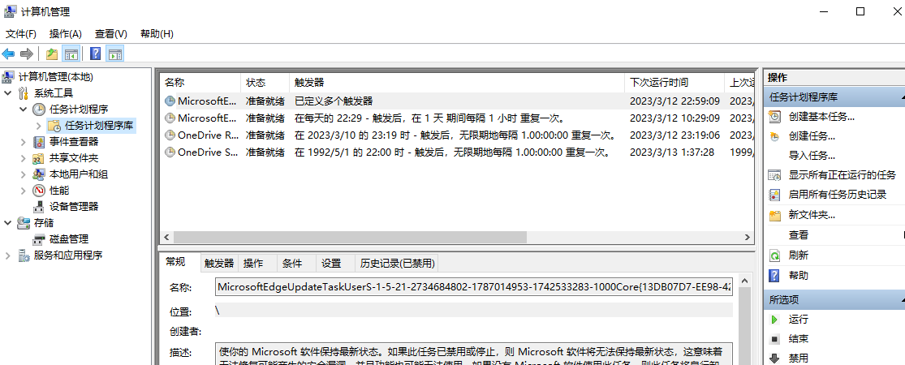
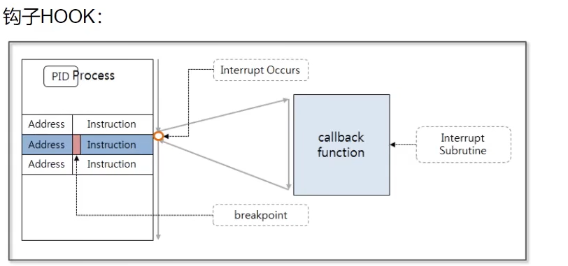
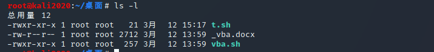

# 流氓&病毒

什么是流氓？

什么是病毒？

## 感染途径

-   百度搜索
-   外挂
-   私服
-   贪婪
-   等等

如何解决？

## 讲解内容

-   手工清理工具讲解
-   内网渗透
-   动态分析
-   如何避免
-   杀毒软件都在做什么
-   为以后的免杀做准备

## 工具介绍

### SysTracer

分析流氓软件的神器

### autoruns

分析注册表，自启项等

### SpaceSniffer

空间清理神器

### ARK

类似底层的东西，比如像驱动这种。

### PowerTools

对付病毒时使用的比较多，这个文件能够删除一些提示被占用不能删除的文件或文件夹。这个工具一般是对win7/32为使用的比较多。

### 火绒剑

pchunter，powertools这些软件都是比较通用的

### SysinternalsSuite

微软下的一个工具集，工具非常丰富，病毒分析较为常见的是procexp.exe、procmon.exe这两个工具

### 杀毒软件

杀毒软件不一定会杀流氓软件，所以要从根源上避免下载到流氓软件；

研究病毒时，一定要将杀软的上传样本按钮关闭；

### wannacry

连接：https://github.com/DeeLMind/anVirus/blob/master/PE/wcry/wcry.84c82835a5d21bbcf75a61706d8ab549.exe.v，提示：一定要在断网的虚拟机里面执行。

著名的勒索软件，该软件会根据系统文件的后缀给文件加密。

注意，在测试勒索软件时，虚拟机（要提前拍摄快照）一定要断网，避免这个木马在内网当中横向移动，对物理机造成影响。

在线解密：https://www.nomoreransom.org/zh/decryption-tools.html

360勒索病毒：https://lesuobingdu.360.cn/

### 挖矿病毒 - 任务计划

查看计划任务的工具：TaskSchedulerView

windows->右键我的电脑->管理->计划任务

### 挖矿病毒 - 白加黑

连接：https://github.com/DeeLMind/anVirus/tree/master/NOPE/powershell-eternelBlue

这里的白加黑表示使用一个正常的软件去调用一个非正常的文件（动态链接库），类似dll的劫持。

### 挖矿病毒 - procmon工具

主要是讲解procmon工具的使用。

### 挖矿病毒 - 内核&钩子

### 事件日志

需要记住常见的事件id：

4624，表示**成功登陆**的用户，用来筛选该系统的用户登陆成功情况。

4625，表示**登陆失败**的用户，用来判断RDP爆破的情况。

4672，表示授予了**特殊权限**

### BIOS & 硬盘病毒

涉及的两个工具：

-   Bus Hound；
-   RWEverythings；

### 脚本病毒 - Powershell&宏

工具：

-   Cerbero Suite Advanced 5.0
-   oltools

### WMI & HTA

wmi可以理解为windows提供给程序员操作电脑的一个接口；

hta就是html，只不过它是直接跑在windows电脑上的；

工具：SimpleWMIView

### office注入

主要是利用office在启动时，会自动去对应目录（AddIns）下面加载插件，但是没有对这些插件做出相应的过滤所导致的。

这里需要会写dll。

### 其它脚本病毒

-   JavaScript
-   vbs
-   powershell
-   bat
-   shell
-   Python
-   CAD
-   ActionScript Flash
-   PHP
-   SQL
-   ASP
-   ASPX
-   Lua
-   Perl
-   JSP
-   JSPX
-   NSI
-   Autolt3

可以去研究一下windows系统中的一些常见的服务，如system32目录下面的配置文件。

### 防火墙

### 用户权限

### 用户组

## Linux

Linux操作文档：https://linuxtools-rst.readthedocs.io/zh_CN/latest/base/index.html

### Linux 挖矿病毒

病毒执行的机制可以参考windows的，Linux上的病毒rookit，其分析原理与windows的ark进行比较。

### Linux 权限管理

前面的第一个“-”表示普通的文件

主要命令：

-   chmod
-   chown
-   sudo
-   umask
-   su
-   等等

### Linux 进程管理

ProcMon-for-Linux：https://github.com/Sysinternals/ProcMon-for-Linux

ProcDump-for-Linux：https://github.com/Sysinternals/ProcDump-for-Linux

### Linux rootkit其他操作

自启动：

1.  service
2.  systemctl
3.  /etc/init.d
4.  crontab
5.  /etc/rc.d/rc.local

日志

历史命令

网络通信，驱动（chkrootkit，rkhunter）

apt install chkrootkit -y

apt install rkhunter -y

防火墙

云安全：https://hackingthe.cloud/

苹果 virusTotal：https://objective-see.org/malware.html

## 总结

windows 域办公

Linux 云

windows+linux

